# ThumbyOne

## The One Firmware

> *One firmware to rule them all, one lobby to find them.*
> *One file to bring them all, and in the Thumby bind them.*

ThumbyOne is a unified multi-boot firmware for the [TinyCircuits Thumby Color](https://thumby.us/) — the tiny colour handheld with a 128×128 screen, dual-core Arm Cortex-M33, 520 KB SRAM, and 16 MB of on-board flash. One flash gives you **NES**, **Master System**, **Game Gear**, **Game Boy**, **Mega Drive (Genesis)**, **PC Engine / TurboGrafx-16**, **PICO-8**, **DOOM**, **Monkey Island / Indiana Jones (SCUMM)**, **ThumbyCraft** (a bare-metal Minecraft-style voxel world with biomes, cave lava and redstone), **ThumbyRogue** (an endless isometric hack-n-slash roguelike built on the ThumbyCraft engine), **ThumbyElite** (a bare-metal Elite-style space sim — an infinite procedural galaxy with real-time 3D dogfighting, trading, missions, salvage and a MechWarrior-grade outfitting game), and the full **MicroPython + Tiny Game Engine** experience, each optimized to run perfectly on the device.

<p align="center">
  
  
  
</p>

<p align="center">
  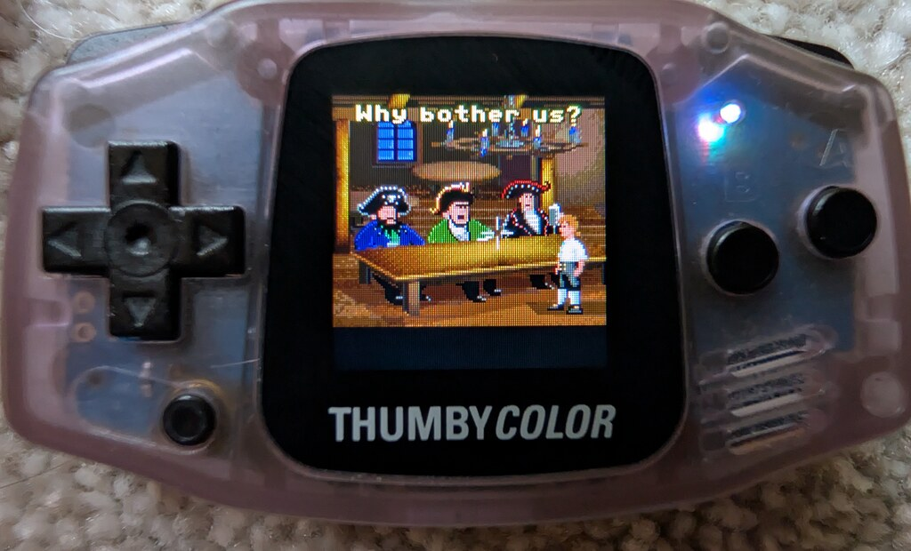
  
  
</p>

---

## Contents

- [What you get](#what-you-get)
- [Quickstart](#quickstart)
- [The lobby](#the-lobby)
- [Transferring files](#transferring-files)
- [Defragmenting the shared FAT](#defragmenting-the-shared-fat)
- [Wiping / recovery](#wiping--recovery)
- [The systems](#the-systems)
  - [ThumbyNES](#thumbynes--nes--master-system--game-gear--game-boy)
  - [ThumbyP8](#thumbyp8--pico-8)
  - [ThumbyDOOM](#thumbydoom--shareware-doom)
  - [MicroPython + Tiny Game Engine](#micropython--tiny-game-engine)
  - [ThumbyScummby](#thumbyscummby--scumm-adventures)
  - [ThumbyCraft](#thumbycraft--voxel-survival)
  - [ThumbyRogue](#thumbyrogue--endless-iso-roguelike)
  - [ThumbyElite](#thumbyelite--bare-metal-space-sim)
- [Changelog](#changelog)
- [Tips and troubleshooting](#tips-and-troubleshooting)
- [Technical specifications](#technical-specifications)

---

## What you get

| System | What it plays | Content goes in |
|---|---|---|
| **ThumbyNES** | `.nes` (NES), `.sms` (Master System), `.gg` (Game Gear), `.gb` / `.gbc` (Game Boy + Color), `.md` / `.gen` / `.bin` (Mega Drive / Genesis), `.pce` (PC Engine / TurboGrafx-16 HuCard) | `/roms/` |
| **ThumbyP8** | `.p8.png` PICO-8 carts | `/carts/` |
| **ThumbyDOOM** | Shareware DOOM I — WAD baked into the firmware | *(none — embedded)* |
| **MicroPython + Engine** | Python games written against the [Tiny Game Engine](https://github.com/austinio7116/TinyCircuits-Tiny-Game-Engine) | `/games/<name>/` |
| **ThumbyScummby** | SCUMM v4 / v5 adventures — Monkey Island 1, Monkey Island 2, Indiana Jones 4 (Fate of Atlantis), and the original LucasArts `.img` install disks | `/scumm/<game>/` or drop `.img` files into `/scumm/` |
| **ThumbyCraft** | Bare-metal Minecraft-style voxel game — an infinite procedural world with biomes, mining, crafting, redstone, mobs, and lava-filled caves; six control schemes and four save slots with full chest + furnace persistence | `/thumbycraft/` (managed by the game; back up the whole tree) |
| **ThumbyRogue** | Endless isometric hack-n-slash roguelike on the ThumbyCraft voxel engine — procedural dungeons, real-time combat, Diablo-style loot + affixes, five depth bands; one suspended run auto-saves so you can resume | `/thumbyrogue/run.sav` (managed by the game) |
| **ThumbyElite** | Bare-metal Elite-style space sim — an infinite procedural galaxy (every playthrough unique), real-time 3D dogfighting with 14 weapon families, trading, missions, bounties, salvage, per-dockyard procedural ships and MechWarrior-grade outfitting | `/thumbyelite/run.sav` (managed by the game) |

All eight systems share one FAT drive, visible over USB when you're in the lobby. Size depends on the build:

- **8.0 MB** in the default (MD-enabled) layout (`firmware_thumbyone.uf2`)
- **9.0 MB** in the backward-compat `THUMBYONE_WITH_MD=OFF` build
- Up to **15.0 MB** in the slimmer SCUMM-only / minimal presets — see [Build matrix](#build-matrix).

**Note on the ThumbyCraft + ThumbyRogue slots:** they ship in the
default `firmware_thumbyone.uf2`, its `_nomd` sibling, and (as of
1.19) the `_nodoom` preset. The remaining slimmer presets
(`_scummonly`, `_retro` etc.) are older builds on the original
systems — flash one of the current three if you want ThumbyCraft or
ThumbyRogue.

---

## Quickstart

> ### ⚠️ Before you flash — please read
>
> Flashing ThumbyOne **replaces the stock TinyCircuits firmware** with a completely different system. This is a full takeover, not an overlay:
>
> - **The TinyCircuits launcher, stock games, and system files will be gone.** ThumbyOne's shared FAT (8.5 MB in the default MD-enabled build with ThumbyCraft, 9.5 MB with `THUMBYONE_WITH_MD=OFF`, up to 15 MB on the slimmer presets that don't include ThumbyCraft — see [Build matrix](#build-matrix)) sits at a different flash offset than stock — first boot will need to format a fresh volume, and anything you had on the device (saves, scores, installed games) is wiped at that point.
> - The device is easy to flash back to stock afterwards — see instructions below. But stock firmware **doesn't expose a USB drive** — to back up anything from stock first (e.g. save files under `/Saves/`), connect via [Thonny](https://color.thumby.us/pages/getting-started-with-thonny/getting-started-with-thonny/) or `mpremote` and pull files over the REPL. Do that **before** flashing ThumbyOne.
> - ThumbyOne uses its own filesystem layout (`/roms/`, `/carts/`, `/games/`) — stock `/Games/` Python games won't be visible until you move them into `/games/`.
> - There is **no going back to stock with your data intact unless you back it up first** once ThumbyOne has first-booted.
>
> If that all sounds fine, carry on.

---

### 1. Flash the firmware

**Download** [`firmware_thumbyone.uf2`](https://github.com/austinio7116/ThumbyOne/blob/main/firmware_thumbyone.uf2) from the root of this repo (or the latest [release](https://github.com/austinio7116/ThumbyOne/releases)) — or [build from source](#build-matrix).

> **Upgrading from 1.14–1.17.x?** 1.18 adds the ThumbyRogue slot (512 KB) to the default firmware, which moves the shared FAT forward and shrinks it from 8.5 MB to **8.0 MB** (default MD-enabled build) / 9.5 MB to **9.0 MB** (`WITH_MD=OFF` build). The lobby shows an **`FS BAD / A=FORMAT  B=ABORT`** prompt on first boot at the new offset — **hold A for one second** to confirm the reformat; everything on the old volume is wiped. **Back up `/roms/`, `/carts/`, `/games/`, `/scumm/`, `/thumbycraft/`, `/Saves/` first** (USB MSC works as usual under the old firmware), then flash, reformat, and copy back as much as fits in the new (slightly smaller) volume.
>
> **Upgrading from any pre-1.14 build?** You cross two slot additions at once — 1.14's ThumbyCraft (512 KB) and 1.18's ThumbyRogue (512 KB) — so the default FAT shrinks from 9.0 MB straight to **8.0 MB** (`WITH_MD=OFF`: 10.0 MB → **9.0 MB**). Same reformat prompt and back-up advice as above. *The `_nodoom` preset is current as of 1.19 and includes everything except DOOM (its own FAT offset — same reformat prompt applies when upgrading it). The `_scummonly` / `_retro` presets remain older and keep the 1.13 FAT sizes.*
>
> If you only want a subset of systems and don't need the migration prompt at all, flash one of the slimmer preset UF2s — see [Build matrix](#build-matrix). `firmware_thumbyone_scummonly.uf2` for example gives 15 MB FAT for SCUMM-only setups.

1. Power off the Thumby Color.
2. Hold **DOWN** on the d-pad and plug in USB.
3. The device appears as an `RPI-RP2350` drive on your computer.
4. Drag `firmware_thumbyone.uf2` onto it.
5. The device reboots into ThumbyOne. If this is your first time flashing ThumbyOne, or you're switching between WITH_MD=ON and WITH_MD=OFF layouts, the lobby finds no valid FAT at the new offset and shows an `FS BAD / no filesystem / A=FORMAT  B=ABORT` prompt. **Hold A for one second** to confirm the format — the lobby creates the shared FAT and continues to the home screen. Re-flashing the same layout you already have won't show this prompt; the existing FAT mounts as-is.

### 2. Upload ROMs / carts / games

With ThumbyOne running, plug the device in (while sitting in the **lobby**). It enumerates as a USB drive called **ThumbyOne Storage**. Copy files into the right folder:

| Content | Folder | File types |
|---|---|---|
| NES / SMS / GG / GB / MD / PCE ROMs | `/roms/` | `.nes`, `.sms`, `.gg`, `.gb`, `.gbc`, `.md`, `.gen`, `.bin`, `.pce` |
| PICO-8 carts | `/carts/` | `.p8.png` |
| MicroPython games | `/games/<Name>/` | Folder per game with `main.py`, `icon.bmp`, `arcade_description.txt`, assets |
| SCUMM adventures (pre-extracted data) | `/scumm/<game>/` | `DISK*.LEC` + `*.LFL` (MI1), `monkey2.000/001` (MI2), `atlantis.000/001` (Indy 4), or `NN.LFL` (Indy 3) |
| SCUMM adventures (original install floppies) | `/scumm/` | `.img` — the device walks each `.img`, extracts the PCV/LFG! archive inside, and writes the result into `/scumm/<game>/` automatically.  Slow (10–30 min for v5 games) and needs a post-install `defrag fat` from the lobby; pre-extracted is faster.  See [ThumbyScummby section](#thumbyscummby--scumm-adventures) for the full how-to. |

**Example:**
```
/roms/
    Super Mario Bros.nes
    Sonic.gg
    Tetris.gb
/carts/
    celeste.p8.png
    delunky.p8.png
/games/
    DeepThumb/
        main.py
        icon.bmp
        arcade_description.txt
        assets/
/scumm/
    monkey1-disk1.img       (drop .img files at the root for on-device install)
    monkey1-disk2.img
    ...
    mi1/
        *.LFL               (pre-extracted MI1 data — DISK*.LEC + 000.LFL + 90n.LFL)
        *.LEC
    indy4/
        atlantis.*          (pre-extracted Indy 4 data — atlantis.000 + atlantis.001)
```

When you're done copying, **eject the drive** (Windows: right-click → Eject; macOS: drag to Trash; Linux: `sync && umount`). The on-screen USB dot turns from blue back to dim-grey; the physical LED goes back to green. Now pick a system with the d-pad and press **A**.

To transfer more files later: from inside any running system, **hold MENU** → back to lobby → plug USB → repeat. See [Transferring files](#transferring-files) for more on the USB state machine and LED indicators.

### 3. Returning to stock

Want to go back to TinyCircuits stock firmware later? You can — see [Returning to stock](#returning-to-stock) under Tips and troubleshooting. It's a single drag-and-drop with the bundled `firmware_thumbyone_revert.uf2`, after which the device is back to factory state and behaves like any other stock Thumby Color.

---

## The lobby

The lobby is the home screen. It's a 2×2 grid of system icons: NES, PICO-8, DOOM, and MicroPython. Move with the **d-pad**, press **A** to launch.

<p align="center">
  
  
</p>

**Controls:**

| Button | Action |
|---|---|
| D-pad | Move selection between the four tiles |
| **A** | Launch the selected system |
| **MENU** | Open the lobby overlay (volume + brightness sliders, battery, disk, USB, firmware, set-time, **defrag fat**) |
| **MENU** (held at boot) | Force lobby (bypass any pending slot chain) |
| **LB + RB** (held at boot) | Wipe and reformat the shared FAT |

Inside the MENU overlay, **LEFT / RIGHT** adjusts the highlighted slider (brightness or volume). Changes apply live — the backlight dims as you scrub — and persist to the shared FAT so every slot picks them up on the next launch.

**Defrag fat** in the menu opens a cluster-level FAT defragmenter with a preview-then-confirm UX (see [Defragmenting the shared FAT](#defragmenting-the-shared-fat) below). Useful after a heavy install pass — particularly the SCUMM `.img` workflow, which scatters extracted game data across the volume.

**Getting back to the lobby** depends on which slot you're in — each system has a native pause / picker menu with a **Back to lobby** item:

| Slot | Return gesture |
|---|---|
| ThumbyNES (NES / SMS / GG / GB / MD / PCE) | **MENU** (hold ~0.5 s in-game) → pause menu → **Back to lobby** |
| ThumbyP8 (PICO-8) | **MENU** (hold ~0.5 s in-game) → PICO-8 pause menu → **Back to lobby** |
| ThumbyDOOM | In-game Main Menu → **Quit Game** (no confirm dialog in slot mode) |
| MicroPython + Engine | **MENU** held ~5 s in-game — direct reboot to the lobby (no on-screen prompt; game state is lost, so the hold is deliberately long to prevent accidents) |
| ThumbyScummby (SCUMM adventures) | **MENU** (hold ~0.5 s in-game) → save menu → **LOBBY** |
| ThumbyCraft | In-game **pause menu** → **Back to lobby** |
| ThumbyRogue | **MENU** held ~1.2 s in-game — direct reboot to the lobby (short MENU taps open the inventory; the run auto-saves on descent so it resumes next launch) |

A small **USB** label + LED dot in the top-right corner of the lobby — and the device's physical RGB LED — both show the USB state:

| On-screen dot | Physical LED | Meaning |
|---|---|---|
| green | green | USB cable not connected (idle) |
| blue  | blue  | Host has mounted the drive — safe to drop files |
| red   | red   | Transfer in flight — **do not unplug** |

The physical LED mirrors the on-screen dot so you can see at a glance whether a transfer is still happening even without looking at the screen. When a copy finishes the LED settles back to blue; when you eject or unplug, it goes back to green.

Slot-launch is held off while USB is active: if you're mid-copy and press A, ThumbyOne waits for the FAT to go quiet before handing off, so a half-written file never turns into a corrupt one on the slot.

---

## Transferring files

ThumbyOne exposes a **single** USB drive, and only while you're **in the lobby**. Sub-systems don't have their own USB drives — this is deliberate, and it's what "One firmware, one lobby" means:

- There is never a moment where both a host and a running slot are writing to the FAT.
- Windows / macOS / Linux see one device, with one drive letter, one identity.
- "Did I land in NES's drive or P8's drive?" is a question that no longer exists.

**Workflow:**

1. Boot into the lobby.
2. Plug in USB. A drive appears named **ThumbyOne Storage**.
3. Drop files into the right folder:
   - ROMs into `/roms/` (any of `.nes`, `.sms`, `.gg`, `.gb`, `.gbc`, `.md`, `.gen`, `.bin`, `.pce`)
   - PICO-8 carts into `/carts/` (`.p8.png`)
   - MicroPython games into `/games/<GameName>/` (a folder per game with `main.py` + assets)
   - SCUMM adventures: either pre-extracted data into `/scumm/<game>/` (`.LEC` + `.LFL` for MI1, `.000` / `.001` for MI2 / Indy 4, `NN.LFL` for Indy 3 — fast, recommended), or original `.img` install floppies dropped at `/scumm/` for the device to extract on first boot (slow — 10–30 min for v5 games, plus a `defrag fat` pass afterwards)
4. Eject the drive (Windows: right-click → Eject; macOS: drag to Trash; Linux: `sync && umount`).
5. Pick a system with the d-pad, press A.

To transfer more later: pick MENU inside any system → **Back to lobby** → plug in → repeat.

---

## Defragmenting the shared FAT

`MENU → defrag fat` in the lobby compacts the shared volume so files sit in contiguous clusters again.  Slots read game data straight out of flash, which works fastest (and in a few cases, *only*) when files are contiguous.  Run a defrag pass after a big upload session — particularly after a SCUMM `.img` install (atlantis.001 / monkey2.001 come out heavily fragmented).  It's a no-op on an already-clean volume, so running it "just in case" is cheap.

<p align="center">
  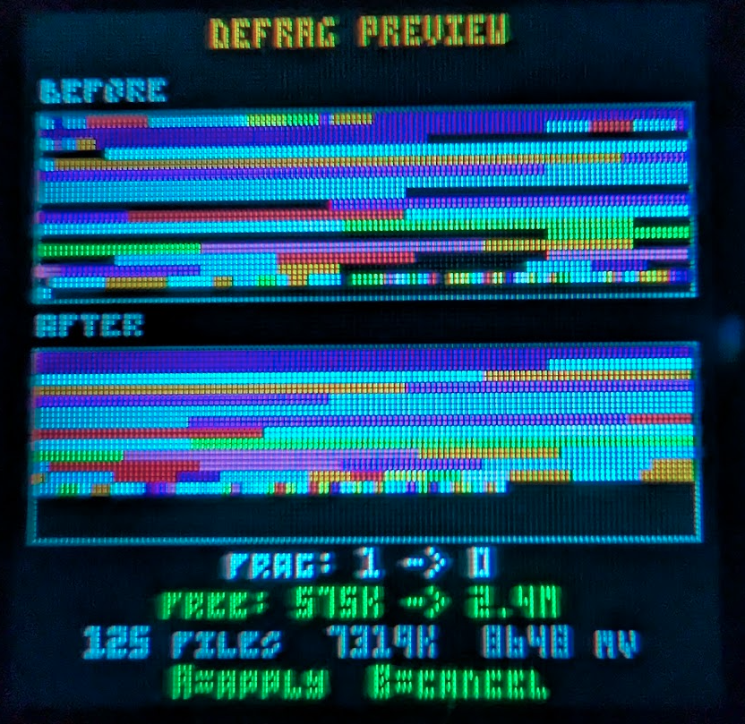
  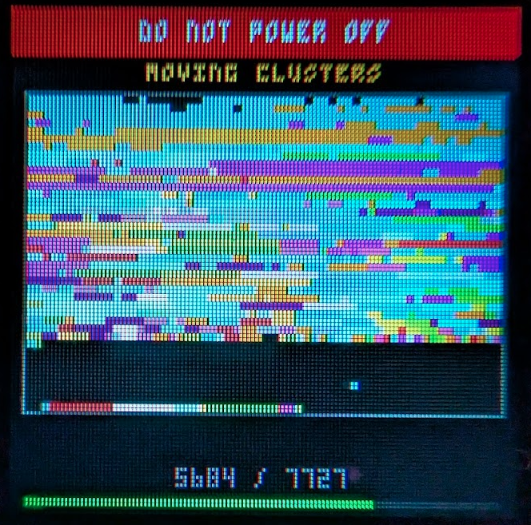
</p>

The full how-and-why — preview UI, planner weights, flash-wear note — is in [Tips and troubleshooting → FAT defragmenter](#fat-defragmenter).

---

## Wiping / recovery

Two escape hatches for when something goes wrong:

**Hold MENU at boot** → forces the lobby even if a pending slot-chain would otherwise try to start a broken slot. Useful after a bad flash or a hang.

**Hold LB + RB at boot** → the lobby prompts you to keep both held for a one-second countdown, then wipes and reformats the whole shared FAT (size depends on the build — 8.5 MB in the default 1.14 MD+CRAFT-enabled build, 9.5 MB without MD, up to 15 MB on the slimmer presets that drop ThumbyCraft and other systems). Erases all ROMs, carts, games, saves, and any extracted SCUMM / ThumbyCraft data. Only needed if the FAT itself is corrupt (no slot can read it, or the PC says "unformatted disk").

No driver weirdness, no Windows Format dialog, no `mpremote` incantations. LB + RB at boot is the canonical wipe.

---

## The systems

### ThumbyNES — NES / Master System / Game Gear / Game Boy / Mega Drive / Genesis / PC Engine

*Based on [ThumbyNES](https://github.com/austinio7116/ThumbyNES) — see that repo for the standalone firmware, the full feature list, and detailed docs.*

<p align="center">
  
  
  
</p>

A six-in-one retro emulator running Nofrendo for NES, smsplus for Master System + Game Gear, Peanut-GB (fhoedemakers' CGB fork + minigb_apu) for Game Boy DMG and Color, PicoDrive for Sega Mega Drive / Genesis, and HuExpress (ODROID-GO fork of Hu-Go!) for PC Engine / TurboGrafx-16 HuCards. Drop `.nes`, `.sms`, `.gg`, `.gb`, `.gbc`, `.md`, `.gen`, `.bin`, or `.pce` into `/roms/`; the tabbed picker groups them by system, shows thumbnails and metadata, and lets you favourite.

**MD note:** PicoDrive adds ~850 KB of precomputed flash tables (FAME jumptable + YM2612 + cz80 SZHVC), pushing the NES slot past the default 1 MB partition. ThumbyOne's default build (`THUMBYONE_WITH_MD=ON`) grows the NES partition to 2 MB to hold it, shifting every downstream partition and the shared FAT up by 1 MB. Build with `-DTHUMBYONE_WITH_MD=OFF` for the backward-compatible 1 MB layout (NES / SMS / GB only, original 9.6 MB FAT).

**PCE note:** The PC Engine core is the smallest of the six in flash terms — about **70 KB code + 5 KB BSS + 97 KB working heap** after a HuCard-only trim (CD support, the 74 KB CD-track table, Arcade Card, netplay, and the SDL / Haiku / iniconfig frontends are all stripped at vendor time). It fits comfortably inside the existing slot in **both** the `WITH_MD=ON` and `WITH_MD=OFF` builds, so adding PCE in 1.08 doesn't change the partition layout — the 8.6 MB / 9.6 MB FAT stays exactly where it was in 1.07, with no migration on upgrade. PCE rendering is done with a custom per-scanline compositor that writes straight into the LCD framebuffer (the upstream `XBUF` / `SPM` / `VRAM2` / `VRAMS` scratch buffers were 568 KB combined and didn't fit on Thumby Color); the h6280 dispatcher runs from static IRAM for performance; PSG audio mixes mono through the same PWM mixer as the other cores with a single-pole low-pass matching the analog DAC rolloff. Six-emulator coexistence in the slot also drove a heap-leak audit in HuExpress and (incidentally) smsplus — see the [ThumbyNES v1.08 changelog](https://github.com/austinio7116/ThumbyNES#v108--pc-engine--turbograf16-tab-strip-facelift-lcd-reliability) for the full technical write-up.

<p align="center">
  
  
</p>

<p align="center">
  
  
  
</p>

<!-- TODO: PCE shot row — capture once 1.08 is flashed -->

**Features:**

- Per-ROM save states, per-ROM settings, favorites
- In-game pause menu (MENU button)
- Fast-forward, palette switching, idle sleep
- Live-pan read mode for Game Boy / GG (the 128×128 screen is narrower than the native output; pan to see the edges)
- Play-while-cropped pan chord (LB + d-pad) for MD and PCE — pan the source viewport without losing game control
- Game Boy Color carts run with their native CGB palette (DMG carts use the six built-in shade palettes)
- **Cart-RTC support for Pokemon Crystal / Gold / Silver** (new in 1.11) — the GB cart's MBC3 real-time clock is driven from the lobby-set BM8563, so day-night cycle, time-of-day-only encounters, and berry growth all work correctly. Other GBC RTC carts (Harvest Moon GB 2, etc.) get the same fix for free
- Chained-XIP fallback — fragmented NES / SMS / GB / PCE ROMs still map from flash and run full-speed without a defrag (MD carts use the contiguous-only path and need a defrag if fragmented — see lobby's `defrag fat`)
- Configurable CPU clock per-ROM
- Hand-painted 12×8 tab icons in the picker (new in 1.08) — same bitmaps drive the no-screenshot placeholder thumbnails

**ThumbyOne differences:**

- ROMs live in **`/roms/`** on the shared FAT (stock ThumbyNES puts them at the root).
- USB transfers happen in the ThumbyOne lobby, not here — returning to the lobby is the "drop a new ROM" workflow.
- The standalone ThumbyNES logo splash and file-scan diagnostic are skipped — you go straight from the lobby's handoff into the picker.
- The in-game menu's **Back to lobby** item cleanly unmounts the FAT and hands off.

**Controls:**

| Button | Action |
|---|---|
| D-pad | Navigate picker / drive in-game |
| LB / RB | Switch tabs (picker) / shoulder buttons (in-game) |
| A / B | Launch / in-game A & B |
| MENU (tap) | Open picker menu |
| MENU (held ~0.5 s, in-game) | Open the in-game pause menu (contains **Back to lobby**, save-state, palette, fast-forward, etc.) |
| Hold B (on picker) | Toggle favourite for the highlighted ROM |

### ThumbyP8 — PICO-8

*Based on [ThumbyP8](https://github.com/austinio7116/P8Thumb) — a clean-room PICO-8 runtime. PICO-8 is a trademark of [Lexaloffle](https://www.lexaloffle.com/pico-8.php); if you enjoy playing carts, **please buy PICO-8** to support the creators and the community.*

<p align="center">
  
  
  
</p>

A full PICO-8 fantasy console with 4-channel audio, the native 128×128 display, and cart conversion that runs on-device. Drop `.p8.png` cart files into `/carts/`; the next boot converts them into playable bytecode (one cart per reboot cycle, a few seconds each), and you're off.

<p align="center">
  
</p>

**Features:**

- Favorites + most-played sort modes
- In-game pause menu with brightness, volume, save-state
- Multi-cart chain (PICO-8's `load()` call works across reboots)
- On-device `.p8.png` → bytecode conversion — no host tools

**ThumbyOne differences:**

- Carts live in **`/carts/`** on the shared FAT (same as standalone P8).
- The standalone "welcome, drop carts" lobby screen is skipped — direct to picker.
- Menu has a **Back to lobby** entry.

**Controls:**

| Button | Action |
|---|---|
| D-pad | D-pad |
| A | X / confirm |
| B | O / cancel |
| MENU (tap, in picker) | Open the picker menu (sort, favourites, back to lobby) |
| MENU (held ~0.5 s, in-game) | Open PICO-8 pause menu (save state, back to lobby, cart `menuitem()` entries) |

### ThumbyDOOM — shareware DOOM

*Based on [ThumbyDOOM](https://github.com/austinio7116/ThumbyDOOM) — based on Graham Sanderson's rp2040-doom.*

<p align="center">
  
  
  
</p>

The real deal. Music, sound effects, save games, screen melts, all on a 128×128 LCD. The shareware WAD is baked into the firmware; no files to transfer.

**Features:**

- Full shareware DOOM I (E1M1 – E1M9)
- 12-bit PWM DAC audio with dithering — OPL2 music (via [emu8950](https://github.com/digital-sound-antiques/emu8950)) + 8-channel ADPCM SFX mixed on core1
- Save / load to flash (6 save slots)
- Overlay menu (**MENU long-press**) with brightness, gamma, volume, controls scheme (CLASSIC / SOUTHPAW / BA STRAFE), and cheats (god / all-weapons / no-clip / level warp)
- **Front-LED health indicator** — smooth green → yellow → red blend as HP drops from 100 → 0. Hidden on title / demo; only active during actual gameplay. Gamma-balanced against the Thumby's LED dies (green die is dimmer than red, so "yellow" caps R at ~96/255 for a visually-balanced midpoint).
- Persistent settings (slot 7) survive power cycles

**ThumbyOne differences:**

- WAD is in the firmware itself (1.8 MB shareware), so DOOM never touches the shared FAT — it plays just fine even on a freshly-wiped device.
- The in-game **Quit Game** menu item returns to the lobby directly — the vanilla "Are you sure? (Y/N)" confirm dialog is short-circuited under `THUMBYONE_SLOT_MODE`.
- System-wide volume + brightness from `/.volume` and `/.brightness` are honoured; changing them in the overlay menu writes back to the shared settings sector.

**Controls:**

Three switchable schemes (overlay menu → **Controls**: CLASSIC,
SOUTHPAW, BA STRAFE). Default is CLASSIC. Common bindings:

| Button | Action |
|---|---|
| D-pad U/D | Move forward / back |
| MENU (tap) | Main Menu (Save / Load / Options / Quit Game) |
| MENU (long-press) | Overlay menu (cheats, gamma, volume, warp) |

Per-scheme bindings:

| | CLASSIC | SOUTHPAW | BA STRAFE |
|---|---|---|---|
| D-pad L/R | Turn | Strafe | Turn |
| LB / RB | Strafe L / R | Turn L / R | **Use** / **Fire** |
| A | Fire / confirm | Fire / confirm | Strafe right / confirm |
| B | Use (hold = automap) / cancel | Use (hold = automap) / cancel | Strafe left / cancel |
| Use **+** trigger | B + LB / B + RB = prev / next weapon | B + LB / B + RB = prev / next weapon | LB + B / LB + A = prev / next weapon |
| Long-press use | B held → automap | B held → automap | LB held → automap |

### MicroPython + Tiny Game Engine

*The stock Thumby Color experience — [TinyCircuits-Tiny-Game-Engine](https://github.com/austinio7116/TinyCircuits-Tiny-Game-Engine) plus MicroPython.*

<p align="center">
  
  
  
</p>

MicroPython with the Tiny Game Engine C module baked in, running a custom C picker that replaces the stock launcher entirely. Drop a game folder into `/games/<GameName>/` with a `main.py`, an `icon.bmp`, and an `arcade_description.txt`, and it appears on the hero picker with full artwork, title, and blurb.

**Features:**

- One-game-per-screen hero picker with 64×64 icons + description blurb
- Favourites (press **B** on any game to star it — no menu needed)
- Three sort modes: Name, Favourites first, Author
- Menu overlay with live battery + free-disk + sort selector + back-to-lobby, matching the NES menu style
- Engine's `/system/` assets served from firmware ROM — no FAT space wasted on fonts and splash graphics

**ThumbyOne differences vs. the stock Thumby Color launcher:**

- **Custom C picker** replaces the launcher: loads instantly (no Python startup wait), shows a proper hero view.
- **ROM-backed `/system/`** — the engine's `filesystem/system/` tree (fonts, splashes, launcher assets, ~376 KB) is packed into the firmware image and mounted as a read-only MicroPython VFS. Saves FAT space and means `/system/` is always available without a first-boot copy.
- **No USB REPL** — the MPY slot doesn't enumerate as a serial port because the lobby owns USB. Games just run; no Thonny connection possible while in a game. Lobby-based transfers only.
- **Flash scratch partition** — `TextureResource(in_ram=False)` stores into the upper 512 KB of the MPY partition rather than the chip-wide default, so loading textures doesn't clobber sibling slots.
- **Per-game saves** — each game gets its own `/Saves/games/<name>/` namespace.

**Controls:**

| Button | Action |
|---|---|
| D-pad | Step through games |
| A | Launch the selected game |
| B | Toggle favourite (★) for the highlighted game |
| MENU (in picker) | Open info overlay (battery, disk, sort, back to lobby) |
| MENU (tap, in legacy Thumby game) | Cycle scale preset (1.0× → 1.5× → 1.75× → 2.0× → 2.5× → 1.0×) |
| LB + RB (held ~0.5 s, in legacy Thumby game) | Capture a screenshot — saves the current 128×128 frame, downsampled to 64×64, as `icon.bmp` in the game's folder. The picker shows it as the game's thumbnail next time round. |
| MENU (held ~5 s in-game) | Reboot to the lobby (no splash; game state is lost) |

**Game structure** in `/games/<name>/`:

```
/games/DeepThumb/
    main.py                  # entry point
    icon.bmp                 # 16 bpp RGB565, up to 64x64
    arcade_description.txt   # line 1 = title; rest = description blurb; optional "Author: ..." line
    assets/
        sprites.bmp
        music.wav
```

The icon + description are optional (picker falls back to the directory name and a placeholder tile), but having them makes your game look at home next to everything else on the picker.

**Original (monochrome) Thumby games — supported as of 1.10.** Drop a classic 72×40 mono Thumby game folder into `/games/<name>/` and it appears on the same picker, scaled to the colour screen with the original gameplay intact. Buttons, audio, save format, and Timendus's `thumbyGrayscale` library are all shimmed transparently — no game code modification needed.

- **Greyscale games work too**, both flavours: games that `import thumbyGrayscale` (LyteBykes, Foxgine, RocketCup), and older games that bundled an inline copy of the library inside their own `display.py` (Umby & Glow's display.py is the canonical example). Both paths route through the same Color-aware renderer; the inline-copy case is detected by sniffing `display.py` for the Timendus library's `class Grayscale` + `_thread` signatures.
- **Tap MENU during a legacy game to cycle through scale presets** — `1.0× / 1.5× / 1.75× / 2.0× / 2.5×`. The default is set per-game from the picker's *Legacy scale* row before launch; the in-game tap is a quick override that doesn't persist (so the next launch uses the picker default again). The 5-second MENU hold still returns to the lobby.

See the [1.10 changelog](#110) for the supported feature set and known caveats; the technical write-up of how the shim works (and what we had to revert in MicroPython to make Umby & Glow's viper-tag trick work) is in [MicroPython + engine slot](#micropython--engine-slot).

### ThumbyScummby — SCUMM adventures

*Native ScummVM port for SCUMM v4 / v5 — [ThumbyScummby](https://github.com/austinio7116/ThumbyScummby) on Thumby Color.*

<p align="center">
  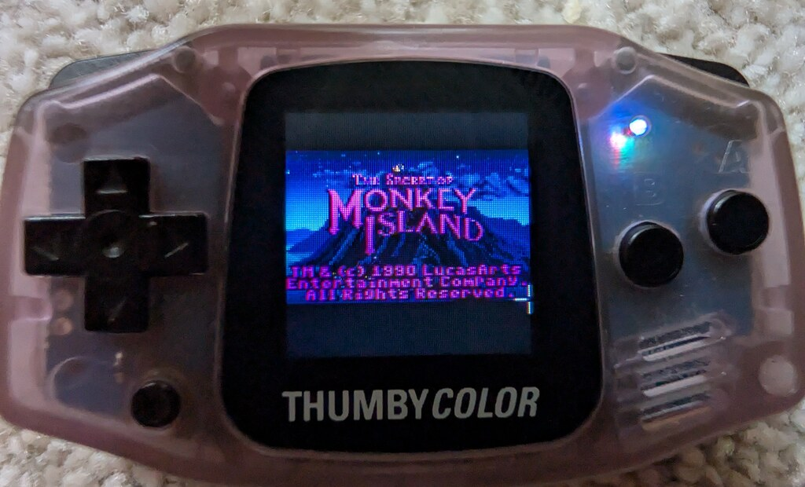
  
  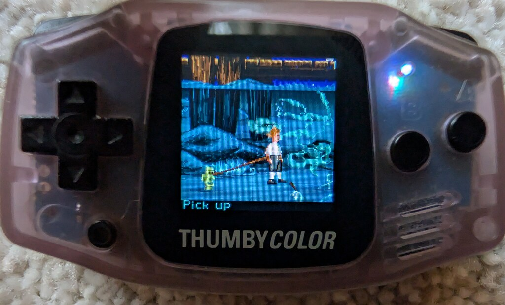
</p>

Monkey Island 1 (VGA Floppy), Monkey Island 2, and Indiana Jones 4 (Fate of Atlantis) run from a stripped-down ScummVM core, with the engine + DCL decoder + custom 128×128 verb/sentence overlay all fitted into a 640 KB slot. Indy 3 (Last Crusade EGA) is in the descriptor table but not yet wired through the v3 file resolver — coming later.

**Getting a game in:**

| You have… | What to drop into `/scumm/` |
|---|---|
| The original LucasArts `.img` install floppies (e.g. `disk1.img`, `disk2.img`) | The `.img` files directly into `/scumm/` |
| Pre-extracted MI1 data | Make `/scumm/mi1/` and copy in `DISK01-04.LEC`, `000.LFL`, `901-904.LFL` |
| Pre-extracted MI2 data | Make `/scumm/mi2/` and copy in `monkey2.000` + `monkey2.001` |
| Pre-extracted Indy 4 data | Make `/scumm/indy4/` and copy in `atlantis.000` + `atlantis.001` |

If you drop `.img` files: on first boot the slot's preload phase walks each `.img` (treating it as a FAT12 floppy image), finds the PCV / LFG! archive inside, decompresses it via PKWARE DCL with the per-file XOR, and writes the extracted files into the right `/scumm/<game>/` subdir. The `.img` is consumed in place — outer FAT clusters get freed as the PCV bytes stream through them, so MI2 / Indy 4 fit during install even though the raw 5–6 `.img` footprint would otherwise blow out the shared FAT. (Install peak ≈ final extracted game size + ~1 cluster.) Once the install finishes the picker shows the extracted game; the original `.img` files are gone.

**`.img` install is slow and produces fragmented files.** Expect **10–30 minutes** for a v5 game (MI2 / Indy 4) on hardware — the slot reads each .img cluster from XIP, runs PKWARE DCL decompression in software, applies the per-file XOR, and writes the extracted bytes back to FAT cluster-by-cluster while incrementally freeing the source .img clusters. That last detail is also why the extracted file ends up heavily fragmented: FatFs's first-fit allocator interleaves the freshly-freed .img clusters with the growing output, scattering a 9 MB `atlantis.001` across every other cluster on the volume. The engine reads game data via XIP-mapped flash pointers + offsets, which require contiguity, so a fragmented install will boot to a black screen.

**After a `.img` install, run `MENU → defrag fat` in the lobby** to lay the extracted files out contiguously. Expect another **several minutes** for the cluster-level cycle sort to rearrange a near-full 9 MB volume into a clean layout. See [Defragmenting the shared FAT](#defragmenting-the-shared-fat).

**Faster alternative: drop pre-extracted files instead.** Pull the game data out of the `.img` floppies on a desktop using **ScummVM Extract** (`extract_scumm_mac` / `extract_scumm_pc` from the ScummVM tools) or via **DOSBox** running the original installer to a host directory, then copy the resulting `monkey2.000` / `monkey2.001` / `atlantis.000` / `atlantis.001` / `DISK01-04.LEC` / `000.LFL` / `901-904.LFL` into the right `/scumm/<game>/` subdir directly. The drag-onto-USB path puts each file into one or two FAT writes — no decompression on-device, no cluster freeing dance, and on a mostly-empty volume the host's FAT driver writes the file as a single contiguous run from the first allocation onward. Total time: a few seconds per file. No post-install defrag needed.

**Picker:**

<p align="center">
  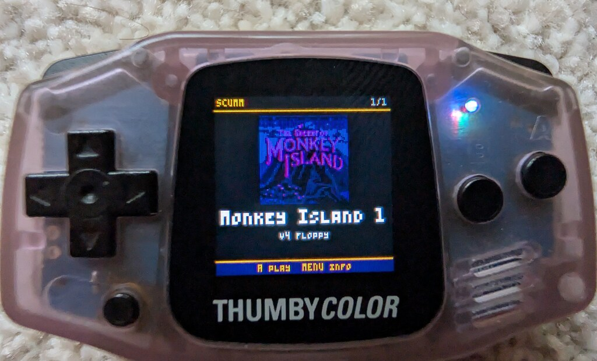
</p>

Orange SCUMM-themed banner, 64×64 cover-art thumbnail, game title + variant. Game list comes from the engine's built-in `kGameTable` (4 entries: MI1, MI2, Indy 3, Indy 4); each row shows install state from a quick `f_stat` on the required files. Pressing A on an installed game writes `/scumm/.active_game` and reboots into the SCUMM slot with a clean heap (so the engine starts with all 330 KB of RAM available rather than ~290 KB fragmented by the picker's transient allocations). MENU-long-hold returns to the lobby; MENU-short in the picker opens the overlay with battery / disk / volume / brightness / firmware version / back-to-lobby.

**In-game:**

<p align="center">
  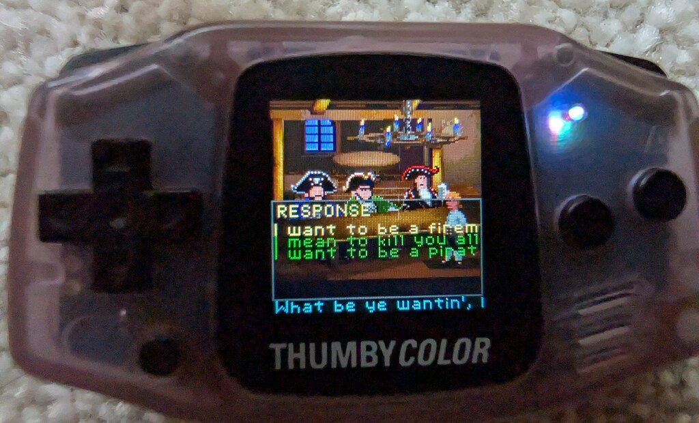
  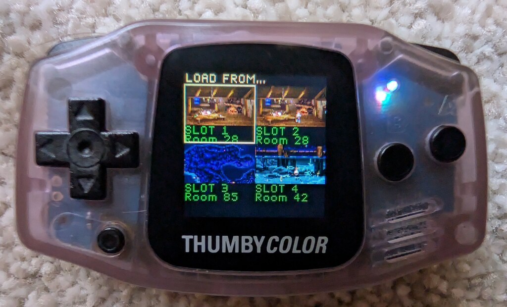
  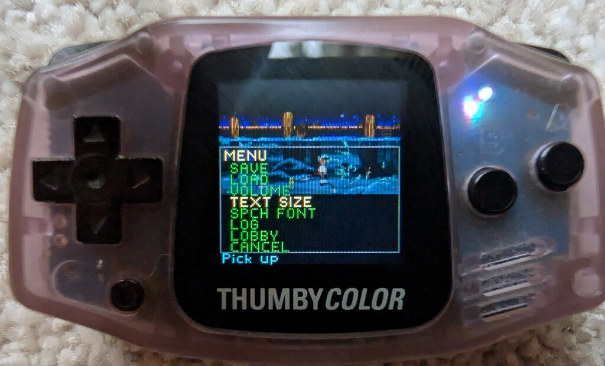
</p>

Dialog choices and verbs render through a custom 21-column 128×128 overlay (left). Save and load use slot-based persistence with per-slot 64×64 thumbnails captured at save time (centre) — pick a slot by sight rather than slot number. The in-game menu (right) covers save / load / volume / text size / speech font, a LOG viewer for engine diagnostics, and a one-press path back to the ThumbyOne lobby.

<p align="center">
  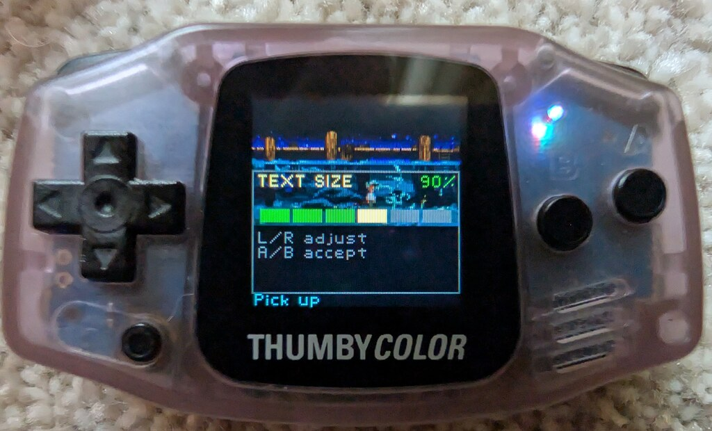
</p>

The 128×128 screen is square but a SCUMM scene is 320×200 — so dialog and verb text would normally crowd out gameplay.  A live TEXT SIZE slider scales the engine's text down so you can see more of the room behind it; speech font is also user-swappable for a wider/narrower face.

**Controls (in-game):**

| Button | Action |
|---|---|
| D-pad | Move on-screen pointer (or scroll viewport in Crop mode) |
| A | Right-click (verb / inventory pick) |
| B | Left-click (select / use) |
| LB + UP/DOWN | Adjust master volume (0–20) |
| MENU (tap) | Cycle scale mode (Fit / Fill / Crop) |
| MENU (hold) | Open save / load menu (includes LOG viewer + back-to-lobby) |
| RB | ESC — skip cutscenes / dismiss banners |

**Notes:**

- **Sizes (extracted):** MI1 ≈ 4.4 MB, MI2 ≈ 9.1 MB, Indy 4 ≈ 9.3 MB. The default 1.19 build has **8.0 MB** of shared FAT — large enough for MI1 but **not** MI2 or Indy 4. For the v5 games flash `firmware_thumbyone_nodoom.uf2` (10.4 MB FAT, everything except DOOM — including ThumbyCraft/ThumbyRogue as of 1.19) or `firmware_thumbyone_scummonly.uf2` (15 MB, SCUMM only).
- **Saves** under `/scumm/<game>/saves/slot<N>.sav`. Persistent across reboots; the SCUMM in-game save menu (MENU-long) handles slot selection.
- **LOG viewer** inside the save menu is 21 columns wide — used for diagnostic output. Pre-engine failures (install errors etc.) write to `/scumm/_install.log` when the picker can't show them via the in-game viewer.

---

### ThumbyCraft — voxel survival

*Original bare-metal voxel game for the Thumby Color — [ThumbyCraft](https://github.com/austinio7116/ThumbyCraft).*

<p align="center">
  
</p>

ThumbyCraft is a Minecraft-style voxel game built from scratch for the 128×128 RGB565 screen, dual-core M33, and 520 KB SRAM of the Thumby Color. Everything you see is rendered in real time by a per-pixel CPU raycaster — there's no GPU on the chip. Two cores share the per-frame raycast workload through a tile work-stealing scheduler.

**Getting in:** select the grass-top-dirt tile in the lobby and the slot boots into ThumbyCraft's title screen. The title shows four save slots with 32×32 screenshot thumbnails and a "New world" tile underneath. Pick a saved slot to continue, or **New world** to spawn into a fresh procedural world.

**Biomes & terrain (1.15):** the overworld is split into eight climate biomes from a temperature × humidity map — plains, forest, desert, taiga, swamp, mountains, jungle, savanna — each with tinted grass + leaves and its own flora (snowy conifers, giant vine-draped swamp trees, jungle mini-giants, acacias, cactus, lily pads). Mountains rise into bare rock and cap in snow above a temperature-driven snow line that blends into neighbouring tundra; tundra lakes freeze into a walkable ice sheet over the water. Deep caves pool **lava** — also sealed in mountain magma pockets — which glows like a torch, animates, and burns. Flow water onto lava to make obsidian, mine gravel for flint, and light a swirling portal on an obsidian frame.

<p align="center">
  
  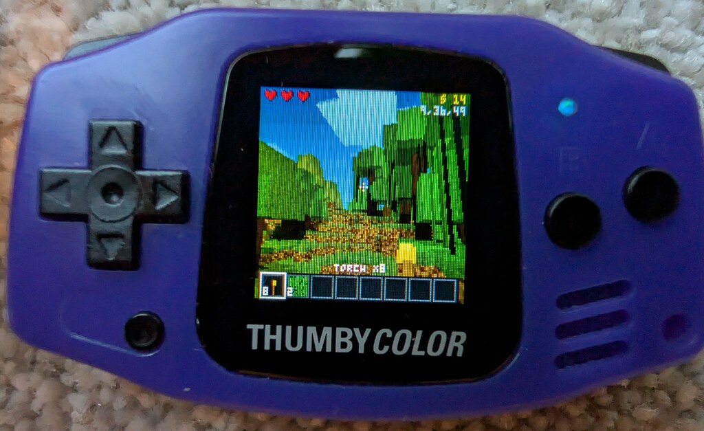
  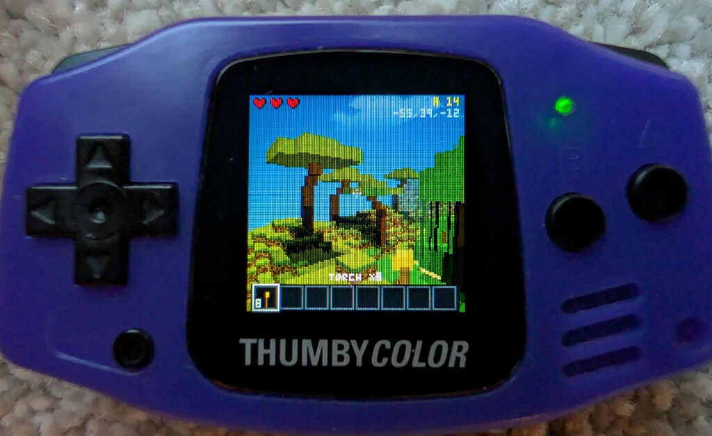
</p>

<p align="center">
  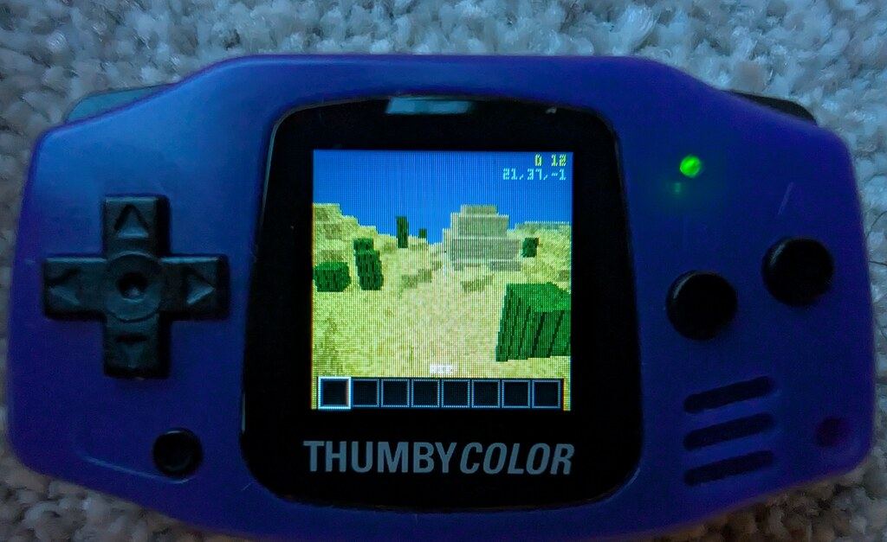
  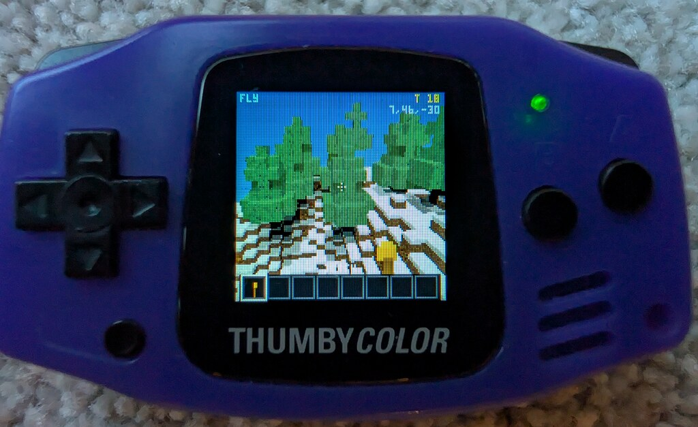
  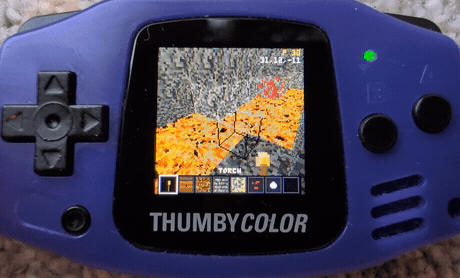
</p>

<p align="center">
  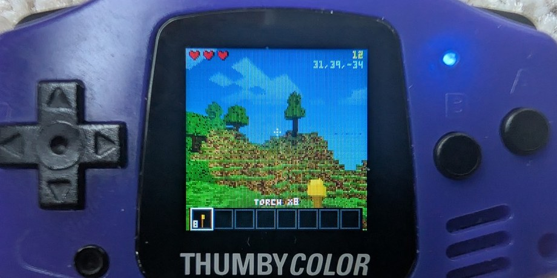
  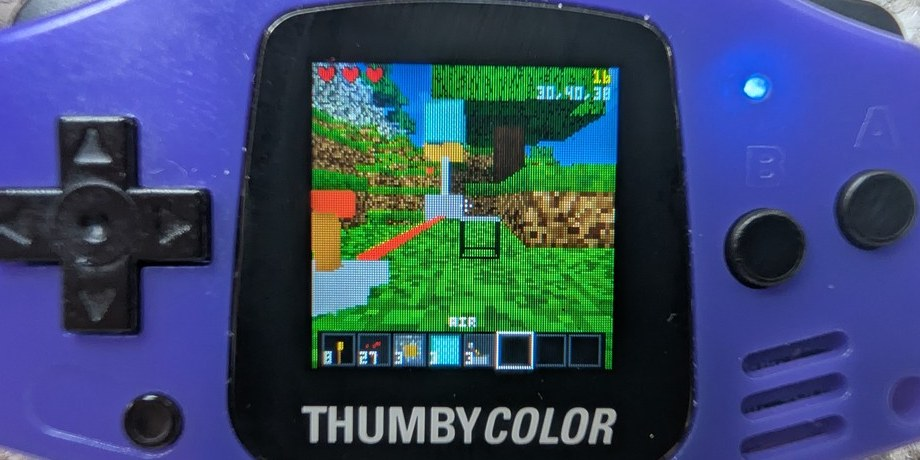
  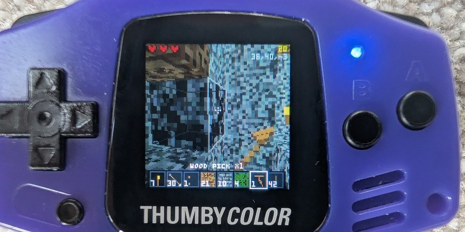
</p>

**The world:**

- Infinite in X / Z, 64 cells tall. A 64×64×64 window slides with you, regenerating new terrain at the edges from a deterministic seed. Walk back later and your edits are exactly where you left them.
- Procedural biomes (see **Biomes & terrain** above): eight climate types chosen by a temperature × humidity map, each with its own surface, foliage tint and flora; mountains run to bare rock + snow, deserts to sand + sandstone, taiga to snow + frozen lakes. Flatland rivers carve smoothly down to water level; ore density rises in the mountains.
- **Eight building variants** scattered across the lowlands — every one with a structured roof, none of them plain plank boxes:
  - **A-Frame Lodge** (5×5) — steep plank gabled ridge, wood corner posts, single back window.
  - **Hipped Cottage** (5×5) — plank 4-sided pyramid roof, twin back windows.
  - **Longhouse** (7×3) — long plank gabled ridge along the long axis.
  - **L-Hipped Cabin** (5×5 L-footprint) — single ridge running the length of the long arm.
  - **L-Gabled Cabin** (5×5 L-footprint) — twin ridges, one per wing, meeting at the inner corner.
  - **Watchtower** (3×3, 7 tall) — stone shaft with a cobble crenellated parapet and a torch on top.
  - **Church** (5×5, 7 tall) — steep gabled stone-and-plank nave with a wood-log steeple rising over the back and a torch belfry on top.
  - **Castle Keep** (7×7) — stone fortress with alternating cobble battlements all the way around and glass arrow slits on every side.

  Cottages are common; landmark builds (watchtower 9%, church 8%, castle 5%) are genuinely rare.
- Cave systems mixed from rounded "cheese" chambers and long thin "spaghetti" tunnels — denser in mountain biomes because their taller columns expose more underground volume. Coal, iron, silver, gold, diamond, and redstone ores at depth-gated densities.
- 5-minute day / night cycle with a sun arc, gradient sky, stars at night, drifting clouds. Hostile mobs spawn in darkness (caves or surface at night); they catch fire in direct sunlight if caught out at dawn. Passive mobs (pigs, cows) only ever spawn on dry land.
- A 10-block fall-damage grace, so casual drops are free; beyond that you take 1 HP per cell, capped.

**Survival, crafting, redstone:**

<p align="center">
  
  
  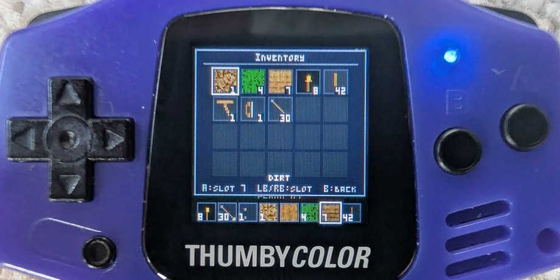
</p>

- Mine with tier-gated pickaxes (wood / stone / iron / silver / gold / diamond) — better picks unlock harder ores and break faster.
- 3×3 craft grid plus a recipe book. Bake ores in a furnace (coal as fuel; wood / planks / sticks burn shorter), store loot in chests (4 active chests with 16 slots each).
- Hut chests roll **rarity-tiered loot** on first open. Common (50%) gives crafting fodder; Uncommon (30%) adds iron + bow + wood pickaxe; Rare (15%) adds stone tools + redstone dust; Legendary (5%) gets iron tools, gold ingots, and a 50% diamond drop. Building type and chest tier are rolled independently, so a plain plank cabin can still hide a legendary chest and a stone house can be near-empty.
- Hotbar slots clear themselves in survival mode when a block runs out — no more visually "holding" the last torch you placed. Pick another up and the slot fills back in.
- Five hostile mob types — slimes, skeletons (drop a bow + 2-3 arrows), spiders, creepers (1-second fuse + spherical explosion + chain-fire TNT), and a giant boss spider only the diamond sword can damage. Spawn the boss by powering a diamond block with redstone.
- Full redstone toolkit: levers, wire dust (auto-connects through redstone blocks), pressure pads, doors, trapdoors, ladders, sticky pistons (3-part model, six-direction facing, drag blocks both ways), TNT.

<p align="center">
  
</p>

**Bow auto-aim:** with a bow and arrows on the hotbar, **hold A** to enter draw mode — the crosshair lerps onto the nearest hostile within 16 blocks (±60° cone) and turns yellow. Pitch stays under D-pad control for arc shots over walls. **Release A** to fire; the crosshair snaps back to centre. Missed arrows are pickupable.

<p align="center">
  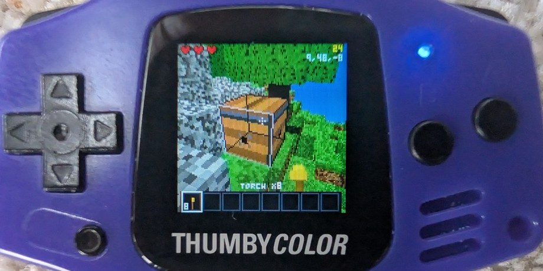
  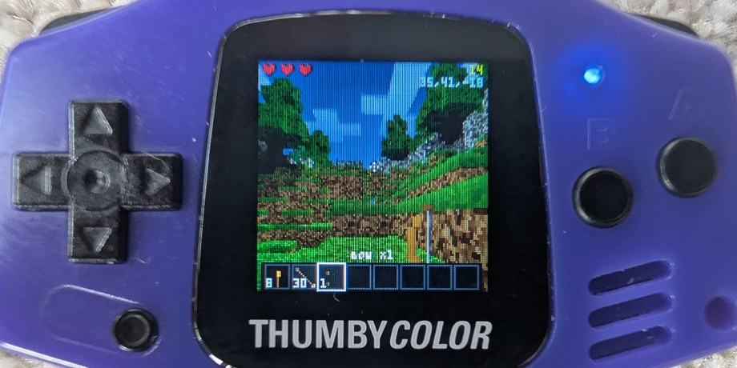
</p>

**Music:** Debussy's *Clair de Lune* played as actual MIDI through an in-game 6-voice polyphonic synth. Each loop picks a new key + direction (forward or reverse); pitch glides higher in caves and lower on mountaintops, so the music breathes with the world.

**Saving:**

<p align="center">
  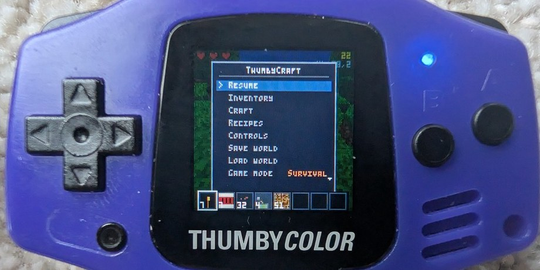
  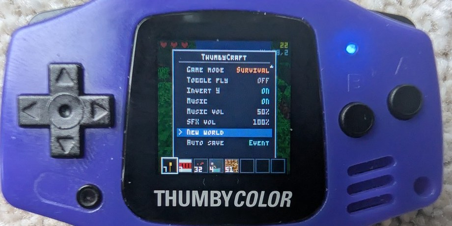
  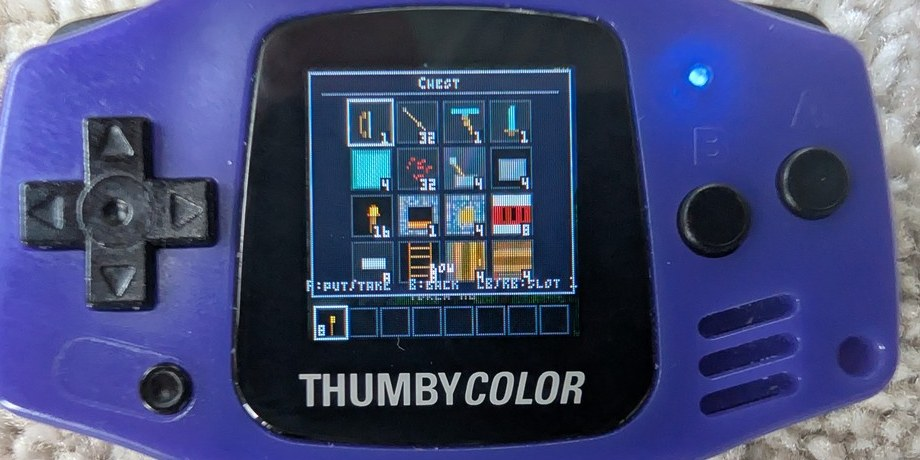
</p>

- Save data lives on the shared FAT under `/thumbycraft/` — one folder per save slot for chunks, plus a small `.meta` file with the player state + screenshot thumbnail. Back the whole tree up over USB MSC like everything else.
- Four save slots. **MENU → Save / Load world** picks a slot. Save thumbnails are visible at both the title screen and the in-game slot picker.
- **Everything in your world persists** across save/load: the chunks you've modified (block edits), chest contents (4 slots × 16 items), furnace state (input/fuel/output, smelt progress, fuel timer), and your control-scheme + auto-save preferences. Hut chests no longer refill with their original loot on reload.
- **Auto save** is a menu option with four modes — Off, every 60s, on Idle (5 s of no input + no walking), or Event (default: saves on menu open, menu close, sunrise / sunset). Defaults to Event so the save hitch lands at natural pause points instead of mid-walk.
- **New world** generates a fresh seed and clears in-RAM world state. Save slots are untouched until you explicitly save to one.

**Controls in-game (Classic scheme — the default):**

| Button | Action |
|---|---|
| LB held | Walk forward (gravity on); ascend in fly mode; climb ladders (pitch picks up/down) |
| LB double-tap-hold | Walk **backwards** (release-and-repress within 300 ms, hold the 2nd press) |
| RB tap | Jump |
| D-pad | Look (turn left/right + pitch up/down) |
| A | Break block / attack mob / draw bow (hold) |
| B | Place selected block / interact (toggle door / lever / chest / furnace) |
| MENU + LB / RB | Cycle hotbar slot |
| MENU + A | Toggle fly (creative only) |
| MENU (tap) | Open pause menu |

**Pick your control scheme.** The pause menu's **Controls** entry now opens a 4-card picker — pick whichever layout you prefer; selection persists per save:

- **Classic** (default, above).
- **Classic flip** — LB jump, RB walk (with the same double-tap-hold reverse on RB).
- **Walk + strafe** — D-pad U/D walks forward/back, L/R strafes sideways; **LB held** flips the d-pad into look mode (turn + pitch); RB jumps.
- **Walk + turn** — D-pad U/D walks forward/back, L/R turns; **LB held** overlays pitch on U/D; RB jumps.

Ladder climbing follows whichever scheme is active: classic schemes use the walk button + pitch (look up to ascend); d-pad schemes use D-pad UP / DOWN directly while standing in a ladder cell.

The pause menu also hosts inventory, crafting, recipes, save / load, game mode, music + SFX volumes, and the auto-save mode. The in-game auto-save events fire on menu open and close, so opening the menu from a stable position is a quick way to commit progress.

---

### ThumbyRogue — endless iso roguelike

*Original game for the Thumby Color — [ThumbyRogue](https://github.com/austinio7116/ThumbyRogue) · [illustrated guide](https://austinio7116.github.io/ThumbyRogue/).*

<p align="center">
  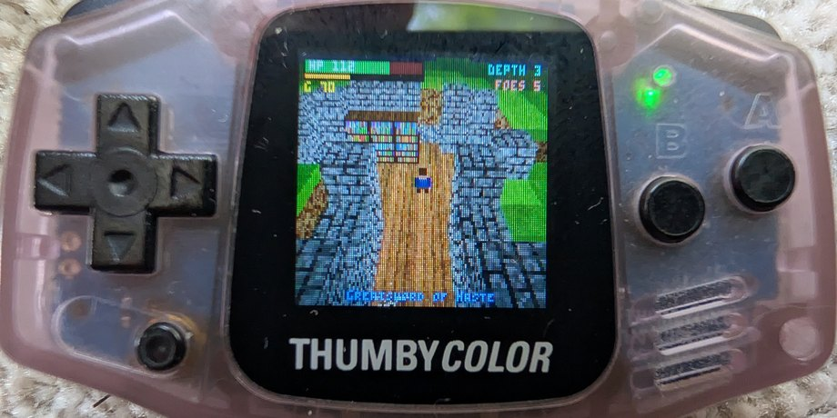
</p>

ThumbyRogue is an **endless, real-time, isometric hack-n-slash roguelike** built on a **vendored copy of the ThumbyCraft voxel engine** — the same per-pixel CPU raycaster and cuboid-model renderer, re-pointed at a fixed 3/4 isometric camera you can snap-rotate 90° with LB / RB to peek around walls. Each dungeon floor is generated into the engine's 64³ voxel buffer; you descend an endless staircase and **how deep you get is your score**.

**Getting in:** pick the ThumbyRogue tile in the lobby. If a suspended run exists it resumes; otherwise a fresh descent begins at depth 1.

**The run:**

- **Pure permadeath, one life.** No meta-progression — the gear you find *this* run is your build. Death shows a run summary (depth, gold, kills) and your best depth persists as a high score.
- **Procedural floors, always solvable.** A BSP rooms-and-corridors generator carves each floor; before any hazard or scenery is placed, the up→down route is computed and **reserved**, so lava chasms, set-pieces and clutter can never seal the path. Verified across tens of thousands of generated levels.
- **Your weapon is your class.** Twelve weapon types (daggers through to staves) with distinct base damage, attack arcs and projectile/particle effects — a found bow makes you a ranger, a staff a caster, dual daggers a fast bruiser.
- **Real-time combat** with a dodge/jump, telegraphed enemy wind-ups, knockback, hit-flash, screen shake and floating damage numbers (green dealt / red taken).
- **Diablo-style loot.** Common / Magic / Rare / Legendary rarities with rolled affixes (including **eight weapon elements** — fire, frost, poison, lightning, holy, shadow, void, arcane force), legendary aspects, sockets + gems, and salvage; six equip slots on a paperdoll inventory screen with a detailed item page (B). Gold buys upgrades at the **merchant's stall** — and the shopkeeper fights back if you attack him. Rarer drops are deliberately scarce on early floors so progression feels earned. Potions are carried in the backpack and quaffed on demand.
- **Light as a resource.** Your torch burns down in the dark; relight at braziers. Low light bites.
- **Five depth bands**, each reskinning floor / wall / pillar blocks, surround terrain, enemy roster and music — **The Crypt → The Caverns → Fungal Deep → Frostvault → The Inferno** — then the sequence loops with escalating stats. Twelve enemy types across the bands (counting the shopkeeper you really shouldn't provoke), with champion floors.
- **Furnished rooms.** Larger rooms get arranged set-pieces — bookcase libraries, sarcophagus tombs, barrel/crate stores, glowing crystal clusters, shrine altars — plus scattered 2D scenery sprites (bones, rubble, fungi, cobwebs). From the second band on, rare **lava chasms** you can fall into dot the deeper floors (crossed by a bridge or a moving platform). Invisible barriers cap the dungeon walls so the clutter can never be used to climb out of the level.

<p align="center">
  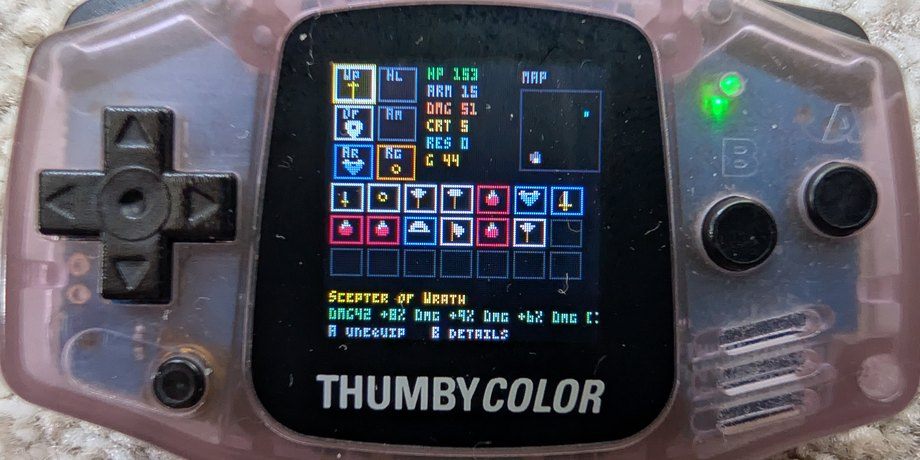
</p>

**Controls in-game:**

| Button | Action |
|---|---|
| D-pad | Move (screen-relative — "up" is always away from camera) |
| A | Primary attack (swing / fire the equipped weapon) |
| B | Secondary — dodge / jump (and interact: chests, merchant, stairs) |
| LB / RB | Snap-rotate the isometric view ±90° |
| MENU (tap) | Open the inventory / paperdoll (and the minimap) |
| MENU (hold ~1.2 s) | Back to the lobby |
| LB + RB (hold ~5 s) | Cheat: open the level-skip menu |

**Saving:** one suspended run lives on the shared FAT at `/thumbyrogue/run.sav`, auto-saved each time you descend, so quitting to the lobby (or another slot) and coming back drops you right back in. The save is wiped on death — permadeath is permadeath. Your best-depth high score survives.

---

### ThumbyElite — bare-metal space sim

<p align="center">
  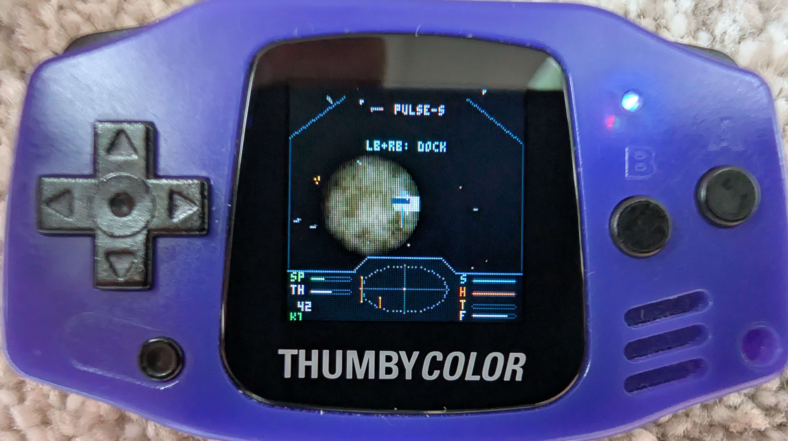
  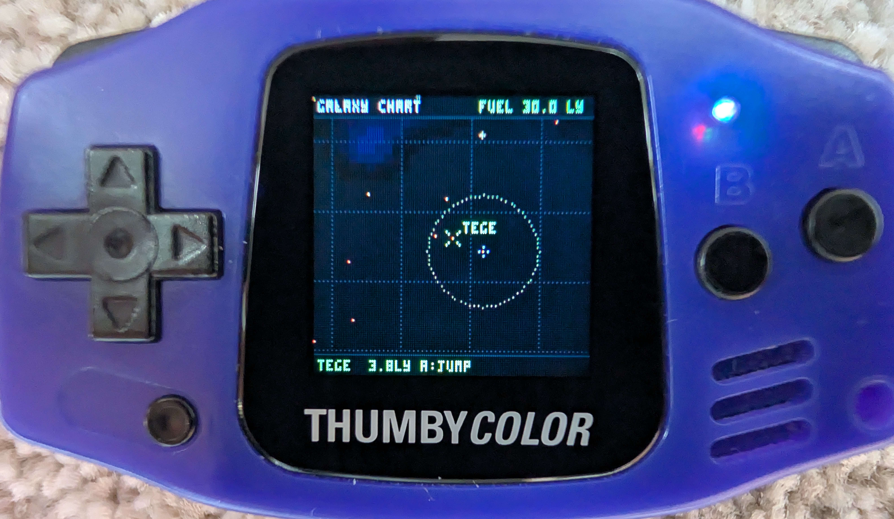
  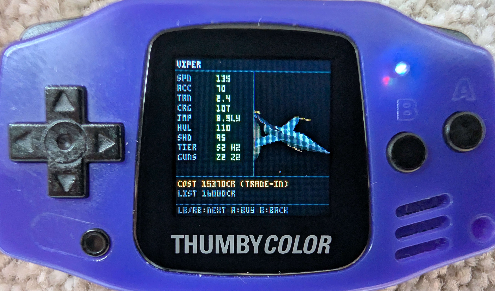
</p>

An Elite-style open galaxy in 223 KB of bare-metal C: camera-relative
flat-shaded 3D at a fluid uncapped frame rate, dual-core rasterized.
Every NEW GAME seeds a unique infinite universe — stars, planets,
economies, pirate fleets and even the ships in each dockyard's
showroom are procedurally generated (no two yards stock the same
hulls).

* **Fly** — Newtonian-lite flight with assist-off drifting, boost,
  supercruise between planets and fuel-limited hyperspace jumps whose
  range grows with your ship.
* **Fight** — 14 weapon families with quality grades and factory
  affixes, shield/armor variants, ion strips that scramble systems,
  chaff vs seekers, auto-turrets on heavy hulls, five AI skill tiers.
* **Earn** — trading across 20 commodities and 8 economy types,
  delivery/cull/bounty missions with faction reputation, instant kill
  bounties, and a salvage-scoop-refurbish-resell economy.
* **Build** — MechWarrior-style outfitting: weapon mounts, shield and
  armor slots, utility gadget bays and turret hardpoints, with live
  comparison deltas against your fitted gear on every shop sheet.

One dock-checkpoint save at `/thumbyelite/run.sav` (CONTINUE restores
your exact universe); dying recovers you to your last dock, insurance
style. MENU-hold returns to the lobby. Full manual: the
[Pilot's Handbook](https://austinio7116.github.io/ThumbyElite/).

## Changelog

### 1.20

Adds the eighth system: **[ThumbyElite](https://github.com/austinio7116/ThumbyElite)**, a bare-metal Elite/MechWarrior space sim.

**New**

* **ThumbyElite slot** — an infinite, deterministic procedural galaxy (every NEW GAME rolls its own universe): real-time 3D dogfighting with 14 weapon families (charge railguns, ion shield-strippers, flak, mines, tractor grapples), weapon affixes and quality grades, shield/armor variants, utility gadgets (chaff, fuel scoop, targeting computer), auto-turrets on the big haulers, per-dockyard procedural ship catalogues, station survey sheets on the galaxy chart, trading, missions, tiered bounties and a salvage-refurbish economy. Dock-checkpoint save at `/thumbyelite/run.sav`; death = insurance recovery to your last dock. See the [Pilot's Handbook](https://austinio7116.github.io/ThumbyElite/).
* Lobby grid gains the ELITE tile (fills page 2); MENU-hold (~1.2 s) returns to the lobby, shared brightness / LED settings apply.
* Lobby About-row version string fixed — it had been stuck at 1.14.3 since the 1.15 release.

> ⚠️ **Reformat on upgrade.** Adding the ThumbyElite slot (256 KB) moves the shared FAT forward, shrinking the default volume from 8.0 MB to **7.75 MB** (`_nomd`: 9.0 MB → **8.75 MB**, `_nodoom`: 10.4 MB → **10.1 MB**). First boot shows the **`FS BAD / A=FORMAT  B=ABORT`** prompt — hold **A** for one second to reformat. **Back up `/roms/`, `/carts/`, `/games/`, `/scumm/`, `/thumbycraft/`, `/thumbyrogue/`, `/Saves/` over USB MSC first.**

**Notes**

* Ships in the default `firmware_thumbyone.uf2` and the `_nomd`/`_nodoom` builds (all rebuilt for 1.20); slimmer presets unchanged.

### 1.19

> ℹ️ Drop-in on 1.18 — no FAT reformat. ThumbyRogue suspend saves from 1.18
> use an older layout and are ignored (the run restarts at the title).

A **ThumbyRogue 1.1** release — the slot picks up the post-release playtest
round plus three feature drops: a real **merchant stall** (and a shopkeeper
who turns battle-wizard if you attack him), **explosive magic** with eight
weapon **elements** + eight elemental gems, **real staircases**, lava that
burns enemies, and a full combat-feel pass (visibility, locomotion patterns,
slash crescents, fairness guarantees). See the
[ThumbyRogue changelog](https://github.com/austinio7116/ThumbyRogue#changelog)
and the [illustrated guide](https://austinio7116.github.io/ThumbyRogue/) for
the details.

**Notes**

* The **`_nodoom` preset is rebuilt at current head** and now includes every
  system except DOOM (previously it predated the ThumbyCraft/ThumbyRogue
  slots). Its FAT moves accordingly — first boot shows the usual
  `FS BAD / A=FORMAT` prompt; back up over USB MSC before flashing it.
* `_scummonly` / `_retro` presets remain at their older versions.

### 1.18

> ⚠️ **Reformat on upgrade.** Adding the ThumbyRogue slot (512 KB) moves the shared FAT forward, shrinking the default volume from 8.5 MB to **8.0 MB** (`WITH_MD=OFF`: 9.5 MB → **9.0 MB**). First boot shows the **`FS BAD / A=FORMAT  B=ABORT`** prompt — hold **A** for one second to reformat. **Back up `/roms/`, `/carts/`, `/games/`, `/scumm/`, `/thumbycraft/`, `/Saves/` over USB MSC first.**

Adds the seventh system: **[ThumbyRogue](https://github.com/austinio7116/ThumbyRogue)**, an endless isometric hack-n-slash roguelike built on the ThumbyCraft voxel engine.

**New**

* **ThumbyRogue slot** — procedural BSP dungeons with a guaranteed-solvable path, real-time combat (twelve weapon types, dodge, telegraphs, damage numbers), Diablo-style loot (rarities + affixes + legendary aspects + sockets/gems + salvage + merchant), a paperdoll inventory, light/torch tension, and five depth bands (Crypt → Caverns → Fungal Deep → Frostvault → Inferno) that loop with escalating depth. One suspended run auto-saves to `/thumbyrogue/run.sav` and resumes on relaunch; wiped on death. See the [systems section](#thumbyrogue--endless-iso-roguelike) and the [illustrated guide](https://austinio7116.github.io/ThumbyRogue/).
* Lobby grid gains the ROGUE tile; MENU-hold (~1.2 s) returns from the slot to the lobby, and the shared brightness / LED settings apply as in every other slot.

**Notes**

* Ships in the default `firmware_thumbyone.uf2` and its `_nomd` sibling only; the slimmer presets are unchanged.

### 1.17.1

> ℹ️ Drop-in on 1.17 — no FAT reformat, no save-format change. Existing ThumbyCraft worlds keep your edits and pick up the rebalanced biomes as terrain regenerates around you.

A **ThumbyCraft polish** release: two bugs fixed, biomes rebalanced, blossoms toned down. (See the [ThumbyCraft README](https://github.com/austinio7116/ThumbyCraft#whats-new-in-1171) for the full write-up.)

**Bug fixes**

* **Blossom trees now actually appear.** The leaves → blossom conversion was missing from the live world-fill path, so blossom-leaf blocks were never placed in-game. Fixed — warm broadleaf trees now bloom.
* **Flowering jungle vines now flower.** The flower-vs-plain choice was a fixed function of (dx, dz), identical for every jungle tree, so no run ever flowered. Now seeded with the per-tree variant; runs vary tree-to-tree.

**Biomes**

* **Jungle and desert rebalanced** — jungle ~7 % (was ~0.9 %) and desert ~10 % (was ~1.9 %), so they're findable instead of vanishingly rare. Taiga ~20 % → ~15 %; plains/forest/mountains/swamp essentially unchanged.

**Blossom tuning**

* **Sparse blossom cells** — only ~1/6 of a blossom tree's canopy cells bloom now (was every cell), so a blossom tree is mostly green with a sprinkle of flowers rather than a wall of bloom.
* **Acacia (savanna) blossoms are red**; **one bloom colour per tree** (pink/white/yellow/magenta) for the temperate broadleaf set.
* **Bloom whitelist:** oak, large oak, acacia, jungle and swamp giants. **Pine no longer blossoms** (it kept slipping through because mountains are gated by elevation, not temperature). Palm stays exempt — it uses fronds.

**Lobby**

* **ThumbyCraft logo navy background** — matches the title / save-select screen instead of the old sky-blue.

**Internal**

* Removed a legacy per-cell generator path that had drifted from the live column-and-stamp path — eliminating the drift footgun that caused both bugs above. Single source of truth for worldgen now.

### 1.17

> ℹ️ Drop-in on 1.16 — no FAT reformat, no save-format change (the
> loader still reads every version back to v5). Existing ThumbyCraft
> worlds load with your edits intact and gain the new dungeons / forts /
> foliage as the terrain regenerates.

A **ThumbyCraft biome-detail, structures & dungeons** release. (See the
[ThumbyCraft README](https://github.com/austinio7116/ThumbyCraft#whats-new-in-117)
for the full write-up.)

**Foliage & sprites**

* **DDA cutout rendering.** Plants, vines, ladders, doors, trapdoors, pressure pads and redstone wire now draw as see-through cutout textures inside the raycaster instead of post-pass cuboids — crisper and cheaper, and a **closed door blocks the ray** (saving the work behind it). Tree canopies are see-through "fancy leaves" with airy gaps.
* **Natural flowers** (tulip + daisy), retuned per-biome foliage greens, tinted grass sides, and **tall-grass tufts** in three biome-mixed styles (light-tips / seed-heads / half-height). Flowers + tall grass are placeable, with a **ground-cover toggle** in the pause menu.
* **Doors look like doors** — framed wooden doors with stiles, rails and a recessed panel; redstone-wire dust is thinner and cleaner.

**New growth**

* **Flowering jungle vines** dangle as a curtain under jungle canopies with colourful blossoms; **blossom trees** bloom in warm climates (pink/white/yellow/magenta over tinted green); **palm trees** on warm beaches.

**Forts & dungeons**

* **Forest skeleton forts** — a rare stone keep + walled compound deep in the forest, with loot, that **skeletons swarm day and night**.
* **Underground roguelike dungeons near the lava** — varied stone/cobble rooms linked by a mix of 1-wide and 2–3-wide corridors, with **treasure chests** (rare/legendary loot) and **trapdoor-hatch entrances** (a trapdoor in a stone surround over a well) so they're discoverable from the surface. Skeletons, spiders and slimes lair there and spawn more thickly underground.

**Other**

* New **ThumbyCraft lobby logo** — an isometric grass block with the title wordmark, replacing the plain block tile.
* New player **spawn** at the world origin on the first solid ground (never a treetop or lake); raycaster moved into SRAM for a steadier framerate.

### 1.16

> ℹ️ Drop-in on 1.15.x — no FAT reformat, all saves load.

A **ThumbyCraft performance + polish** release. (See the
[ThumbyCraft README](https://github.com/austinio7116/ThumbyCraft#whats-new-in-116)
for the full write-up.)

**Performance**

* **Smooth chunk loading.** The world streams in column-by-column as you walk (small batched runs) instead of regenerating a whole chunk at once — the periodic hitch/stutter when crossing into new terrain is gone. Music no longer clicks on the transition (it's now clocked from the audio samples, not the frame timer). The trade-off: spreading the chunk work over many frames costs a little peak framerate while moving (it used to all hit in one stutter) — but the raycaster work below makes up for it.
* **~30 % faster raycaster.** Empty-space skipping (a coarse terrain-height grid) lets rays jump over the empty air between you and the first solid instead of stepping cell-by-cell (≈95 % of steps were landing on empty air) — biggest win on open / long-distance views. Net across both changes: a steadier ~20 fps with no hitches, versus higher peaks but a stutter on every chunk boundary before.
* **FPS counter toggle** in the pause menu.

**Lava**

* **Flowing lava.** Lava now spreads from a source (up to 3 blocks, Minecraft-accurate overworld reach) and oozes slowly; running it into water still hardens to obsidian.
* **Lava settles.** A contained pour now comes to rest as a still pool instead of animating and re-lighting forever.
* **Creative inventory** no longer lists the flowing-lava levels — only the lava source, like water.

**Visuals**

* **New ice texture** — a clean near-white cracked-plate sheet with both per-block and smooth large-scale (value-noise) variation, replacing the old speckly tile.
* **Sticky pistons look distinct** from regular pistons — a green slime cap in-world and a green face in the inventory bar and held hand.

**Other**

* Creative mode can break any block (no tool gate); a held torch can act as a light source (toggle); optional 64×64 low-res perf mode.
* "New world" moved to the bottom of the pause menu, away from the everyday items.

### 1.15.1

> ℹ️ Drop-in on 1.15 — no FAT reformat, all saves load.

ThumbyCraft fixes:

* **Big framerate drop fixed.** Redstone blocks (observers, dispensers, repeaters, lamps, note blocks) no longer make the sim scan the whole world every tick — it only walks the redstone you've placed.
* **Redstone / torches / doors no longer vanish** in built-up or vine-heavy areas (raised the sprite-render limit; decorative vines now give way to functional blocks).
* **Arrow traps actually hurt you now.** Dispenser-fired arrows damage the player — arrows hit any target, player or mob.
* **Redstone lamps light up** (and cast light) when powered.
* **Repeaters show a sliding marker** for their delay setting (1–4), Minecraft-style.
* **Note blocks** play a cleaner, longer sine tone.
* **Ice redrawn** — a cracked blue sheet instead of the old flat, repetitive pattern.
* **Lily pads removed.**

### 1.15

> ℹ️ Drop-in on top of any 1.14.x — no FAT reformat, no partition
> change. Every other system's saves are untouched, and ThumbyCraft
> worlds carry over (the save format dual-reads back to v5; new biome
> terrain, lava and ores appear as you explore into fresh chunks).

A big **ThumbyCraft** content release — a full climate-biome overworld
plus the lava → obsidian → portal chain. (See the
[ThumbyCraft README](https://github.com/austinio7116/ThumbyCraft#whats-new-in-115)
for the full write-up.)

<p align="center">
  
  
  
</p>

<p align="center">
  
  
  
</p>

* **Eight climate biomes** — plains, forest, desert, taiga, swamp,
  mountains, jungle, savanna — from a temperature × humidity map, with
  per-biome tinted grass/leaves and distinct flora (snowy conifers,
  giant vine-draped swamp trees, jungle mini-giants, acacias, cactus,
  lily pads). New blocks: snow, sandstone, cactus, vine, lily pad,
  snowy rock.
* **Mountains & tundra** — bare-rock peaks with a temperature-driven
  snow line that blends into tundra snow; tundra lakes freeze into
  walkable **ice** with water beneath and snowy shores.
* **Desert temples** — sandstone stepped pyramids and walled ziggurats
  (rare jungle pyramids too) with baked-in **redstone arrow traps**
  (pressure pads + a door-watching observer) guarding high-tier loot.
* **Cave lava** — pools in deep caverns and sealed mountain magma
  pockets; animated cracked-basalt texture, casts light like a torch,
  and burns you on contact.
* **Obsidian / gravel / flint / portals** — flow water onto lava to
  make **obsidian** (diamond-pick only); mine new **gravel** for
  **flint**; strike flint on an obsidian frame to light a swirling
  purple **portal** (teleport destination lands in a later release).
* **Redstone wave 2** — dispensers, targets, observers, note blocks,
  lamps, NOT-gates, repeaters, slime blocks, and a regular/sticky
  piston split; **mobs now trigger pressure pads**, and pads seed
  wire.

### 1.14.3

> ℹ️ Drop-in on top of any 1.14.x — no FAT reformat, ThumbyCraft
> saves still load.

* **ThumbyScummby** — lobby brightness + volume now reach the slot
  (a `thumbyone_settings` XIP-address bug was making SCUMM reads
  default to full-brightness / mid-volume).  Picker brightness
  slider also live-updates the indicator LED.
* **ThumbyCraft** — Master volume slider in the pause menu wired to
  the shared store; "Quit to lobby" entry at the bottom of the
  menu; front LED glows blue at night to mark the moon rising.
* **ThumbyCraft control schemes** — two new layouts added (now six
  total in Menu → Controls): **Console + turn** and **Console +
  strafe**.  D-pad walks, B-hold puts the D-pad into look mode,
  A = jump, LB = place, RB = break/attack.

### 1.14.2

> ℹ️  **No FAT reformat needed.** 1.14.2 ships only ThumbyCraft
> changes inside the existing slot — partition layout is unchanged
> from 1.14 / 1.14.1. Flash on top and your `/roms`, `/carts`,
> `/games`, `/scumm/`, NES / P8 / DOOM / MPY / SCUMM saves all
> survive.

> ℹ️  **ThumbyCraft saves from 1.14.1 still load.** The save format
> bumps from v5 → v6 to persist mechanical-block orientations, but
> the deserialiser dual-reads — v5 worlds come back exactly as they
> did on 1.14.1 (mechanical blocks revert to floor mount, same as
> before), and from the first save they're written as v6 with full
> orientation state.

**ThumbyCraft 1.14.2.**

* **Levers, pistons, doors, trapdoors, ladders and torches keep
  their facing across saves.**  Orientation was stored in a SRAM
  hash that got wiped on load, so every mechanical block came back
  default-floor-mounted.  Save v6 serialises the hash into the slot
  blob; v5 saves still load (no regression).
* **Glass blocks are now translucent** — rays pass through the cell
  with a faint cyan tint so you can see what's behind them, like
  water but lighter.  Picks still stop at glass so you can break or
  place against it.
* **Water surface is visibly animated** at 4 Hz — two pre-baked
  frames toggle each tick.  The previous integer-stepped per-pixel
  regen was technically running but the deltas were too subtle to
  read as motion.
* **Renderer perf pass** — sky/texture-pointer caches, half-res
  held-item viewport, hotbar-plate ray skip, dead-clamp removal.
  Several percent FPS back across the board with no visual change.
* **Two new pause-menu toggles (both default OFF):**
  * **Far LOD** — hits past ~32 cells use the texture's centre texel
    as a flat colour instead of UV sampling.  Visible LOD pop as you
    walk; small FPS win.
  * **Interlace** — render half the rows per frame, alternating
    phase, skipped rows keep their previous-frame content (classic
    comb-tear on motion in exchange for a meaningful FPS lift).

### 1.14.1

> ℹ️  **No FAT reformat needed.** 1.14.1 ships only ThumbyCraft
> updates inside the existing slot — partition layout is unchanged
> from 1.14. Flash on top of 1.14 and your `/roms`, `/carts`,
> `/games`, `/scumm/`, NES / P8 / DOOM / MPY / SCUMM saves all
> survive untouched.

> ⚠️  **ThumbyCraft saves from 1.14 will NOT load** — the save
> format inside `/thumbycraft/slot<N>.meta` bumps from v4 → v5 so
> chest + furnace contents now persist across loads (see below).
> v4 slot files are detected and rejected at the title screen;
> pick **New world** to start fresh on 1.14.1. Only ThumbyCraft
> worlds are affected — saves for every other system are
> untouched. (1.14 only landed days ago, so anyone hit by this is
> on a recent test world.)

**ThumbyCraft 1.14.1.**

* **Eight building variants with structured roofs.**  The plain
  plank boxes from 1.14 are gone.  Buildings now spawn in eight
  visually distinct designs — none with a flat-square roof:
  A-Frame Lodge (steep gable), Hipped Cottage (4-sided pyramid),
  Longhouse (7×3 with a long gabled ridge), L-Hipped + L-Gabled
  Cabins (L footprint with corner-ridge or twin-ridge roofs),
  Watchtower (3×3 stone shaft with crenellated parapet + torch),
  Church (steep gabled nave with a wood-log steeple + torch
  belfry), and Castle Keep (7×7 stone fortress with cobble
  battlements).  Materials split the lineup: PLANK + WOOD
  cottages form the settlement family; STONE + COBBLE for the
  watchtower and castle; STONE + PLANK + WOOD log for the church.
  Distribution is weighted so the landmark builds (church 8%,
  castle 5%) are genuinely rare while the cottage family fills
  out the typical settlement.

* **Chest + furnace contents persist across saves.**  Previously
  hut chests refilled with their original loot every reload and
  player-placed chests came back empty — both because the SRAM
  state tables weren't serialised into the save blob.  v5 now
  embeds the chest array (4 active chests, 16 slots each) and
  furnace array (8 active furnaces, smelt progress + fuel timer
  included) into the save record.  Save what you stored and
  reload it back unchanged.

* **Rarity-tiered chest loot.**  Hut chests now roll one of four
  rarity tiers — Common (50%), Uncommon (30%), Rare (15%),
  Legendary (5%).  Each tier adds layers: Common is just sticks
  + planks; Uncommon adds iron / bow + arrows / wood pickaxe;
  Rare adds stone tools + redstone dust; Legendary throws in
  iron tools, gold ingots, and a 50% diamond drop.  Tier is
  rolled independently of building type, so a plain plank cabin
  can still hide a legendary chest.

* **Control scheme picker** (Menu → Controls).  Four input
  layouts:
  - **Classic** (default) — D-pad turn + pitch, LB walk, RB jump.
  - **Classic flip** — LB jump, RB walk.
  - **Walk + strafe** — D-pad U/D walk fwd/back, L/R strafe,
    LB-held flips D-pad into look mode.
  - **Walk + turn** — D-pad U/D walk fwd/back, L/R turn,
    LB-held adds pitch on U/D.

  In the LB/RB walk schemes, **double-tap-then-hold** the walk
  button (within 300 ms between presses) to walk backwards
  instead of forwards.  Selection persists per save.

* **Hotbar slot clears on depletion.**  In survival mode, a
  hotbar slot whose block has been used up to zero inventory now
  clears to empty — both visually and functionally.  No more
  "holding" a depleted torch.  Pick the block up again and the
  slot fills back in.

* **No more spawn-in-water.**  Player spawn scan + passive-mob
  spawn both rejected shoreline tiles where the head cell was
  water — fixed in this version.  Pigs + cows always spawn on
  dry land now, and a freshly-rolled world won't drop you into a
  river on game start.

* **Auto-step + worldgen polish.** Mountain-edge cliff smoothing,
  cave depth-floor refinements, and tighter river bank slopes
  (mostly carried over from late-1.14 fixes the changelog didn't
  call out individually — folded in here for completeness).

### 1.14

> ⚠️  **Back up before flashing.**  1.14 reshuffles the on-flash
> partition layout to make room for the new ThumbyCraft slot, which
> means the shared FAT moves to a different offset.  When you flash
> 1.14 on top of 1.13.x the lobby will see an unrecognised FAT and
> prompt for a reformat — your ROMs, carts, MicroPython games,
> SCUMM data, and **all saves and save states** will be wiped.
> Drop into the 1.13.x lobby first, plug in USB, copy the whole
> drive contents to a folder on your PC, then flash 1.14 and copy
> everything back when the new firmware is up.

> ℹ️  **The new ThumbyCraft slot ships only in `firmware_thumbyone.uf2`
> (the default all-on build) and the matching no-MD build.**  The
> slimmer preset images (`_nodoom`, `_scummonly`, `_retro` etc.) are
> rebuilt from 1.13 sources for storage compatibility but stay on
> the original five systems — no ThumbyCraft tile in those.  If you
> want the new game, flash the main image.

ThumbyCraft arrives — a bare-metal voxel game built from the ground
up for the Thumby Color's 128×128 RGB565 screen and dual-core M33.
Plus a cleaner lobby grid that doesn't shift icons around when
paging.

**New: ThumbyCraft.**

A pocket-sized take on the Minecraft loop — explore an infinite
procedural world, mine, craft, build, fight off mobs, manage HP
and hunger, all rendered in real time on a 128-pixel screen by a
per-pixel CPU raycaster.

<p align="center">
  
</p>

<p align="center">
  
  
  
</p>

What's in the slot:

- **Infinite procedural world** with grass plains, mountain
  biomes, rivers, caves, trees (oak, large oak, pines), and rare
  5×5 plank huts to take shelter in.
- **Survival mode** with HP, fall damage, regen, and a 5-minute
  day / night cycle.  Night and dark caves spawn hostile mobs —
  slimes, spiders, skeletons (drop a bow + arrows on death),
  creepers (fuse + explode + chain-detonate TNT), and a giant
  boss spider that takes only diamond-sword hits.
- **Mining and crafting** — wood / stone / iron / silver / gold
  / diamond tool tiers, a 3×3 craft grid, recipe book, furnace
  (smelt iron ore / sand / cobble / silver / gold / diamond /
  redstone ores), and storage chests.
- **Redstone circuits** — levers, redstone wire, pressure pads,
  doors, trapdoors, sticky pistons, TNT.  Activate a diamond
  block to spawn the boss.
- **Bow auto-aim** — hold A with a bow + arrows to snap the
  crosshair onto the nearest hostile within 16 blocks.  Release
  to fire.  Pitch stays manual for arc shots.
- **Live Debussy *Clair de Lune* soundtrack** — real MIDI played
  through a 6-voice polyphonic synth.  Each loop picks a new key
  and direction; pitch glides higher in caves and lower on
  mountaintops.
- **Four save slots** with 32×32 screenshot thumbnails.  Choose
  your auto-save behaviour from the in-game menu: off, every
  60 s, on idle (5 s of no input + no walking), or on natural
  pause events (menu open, menu close, sunrise / sunset).
  Defaults to **Events**.

Save data lives on the shared FAT under `/thumbycraft/` —
back it up to your PC over USB MSC like everything else.  See
the [ThumbyCraft section](#thumbycraft--voxel-survival) for
controls and the full feature list.

**Lobby tile layout: stable across pages.**

When the lobby has more than four enabled systems (and 1.14
introduces the sixth), the carousel pages.  Previously page 2
re-centred its tiles if only one or two were present, which
made the icons appear to *move* as you flipped pages.  Now
every page lays icons at the same fixed grid positions —
turning pages feels like turning pages of one contact sheet
rather than a re-flowing gallery.

**Storage.**

The ThumbyCraft slot is 512 KB, and the shared FAT shrinks
accordingly:

| Build               | 1.13 shared FAT | 1.14 shared FAT |
|---------------------|----------------:|----------------:|
| Default (with MD)   | 9.0 MB          | **8.5 MB**     |
| `WITH_MD=OFF`       | 10.0 MB         | **9.5 MB**     |

Slimmer presets (`_nodoom`, `_scummonly`, etc.) are unaffected
because they don't include the ThumbyCraft slot.  See [Build
matrix](#build-matrix).

### 1.13

> ⚠️  **Back up before flashing.**  1.13 reshuffles the on-flash
> partition layout to make room for the new SCUMM slot, which means
> the shared FAT moves to a different offset.  When you flash 1.13
> on top of 1.12.x the lobby will see an unrecognised FAT and
> prompt for a reformat — your ROMs, carts, MicroPython games,
> SCUMM data, and **all saves and save states** will be wiped.
> Drop into the 1.12.x lobby first, plug in USB, copy the whole
> drive contents to a folder on your PC, then flash 1.13 and copy
> everything back when the new firmware is up.  Same drill applies
> if you switch between 1.13 preset UF2s with different feature
> sets (e.g. moving from the default build to `_scummonly`).

Monkey Island, Indy 4, a smarter FAT layout that hands you a free
megabyte of storage, and preset firmware images so you can pick
the trade-off between systems and storage that suits you.

**New: SCUMM adventures.**

Three classic LucasArts adventures now run natively on the device,
no companion app required:

- **The Secret of Monkey Island** (VGA Floppy)
- **Monkey Island 2: LeChuck's Revenge**
- **Indiana Jones 4 and the Fate of Atlantis** (Floppy)

(Indiana Jones 3 — *The Last Crusade* — is in the picker's game
table but its v3 file format isn't fully wired yet; coming in a
follow-up.)

You can either drop pre-extracted game files into `/scumm/<game>/`
(fastest — a few seconds per file) or drop the original LucasArts
`.img` install floppies straight into `/scumm/` and let the device
install them itself.  See the [ThumbyScummby section](#thumbyscummby--scumm-adventures)
for the full how-to, including the **strong recommendation to
pre-extract on a desktop** rather than use the `.img` flow if you
have the option — `.img` install takes 10–30 minutes for the v5
games and produces fragmented files that then need a
defragmentation pass.

**More storage, even with a whole new slot added.**

Every existing slot's binary got measured against the size of the
partition it was actually using, and several had been sitting in
partitions much bigger than they needed.  Trimming the slack freed
about **1 MB** across the existing slots — enough to fit the new
SCUMM slot *and* still hand back more storage to the shared FAT
than 1.12 had:

| Build               | 1.12 shared FAT | 1.13 shared FAT |
|---------------------|----------------:|----------------:|
| Default             | 8.6 MB          | **9.0 MB**      |
| No Mega Drive       | 9.6 MB          | **10.0 MB**     |

So even after paying for a whole new adventure-games slot, you end
up with more room for ROMs / carts / games than 1.12 gave you.
Slimmer presets (see below) reclaim even more.

**The defragmenter moved into the lobby.**

ThumbyNES's FAT defragmenter used to live inside the NES picker
menu — but the FAT is shared across every slot, so cross-slot
compaction belongs at the layer that owns the volume.  Open the
lobby menu (MENU button), scroll to **`defrag fat`**, press A.
Same preview-then-confirm UX, same live cluster-map visualisation,
same red "DO NOT POWER OFF" overlay during the cycle sort — just
in the lobby now, so it works for NES ROMs, MicroPython games,
SCUMM data, anything on the shared FAT.

You'll want to run it after dropping a lot of new ROMs at once,
after a SCUMM `.img` install, or any time the device feels like
something might be sitting fragmented.  Detail in
[Defragmenting the shared FAT](#defragmenting-the-shared-fat).

**Preset firmware images.**

If you don't need every system, the slimmer presets give you a
bigger shared FAT:

| Image                                 | What's in it                                  | Shared FAT |
|---------------------------------------|-----------------------------------------------|-----------:|
| `firmware_thumbyone.uf2`              | Everything (default)                           | **9.0 MB** |
| `firmware_thumbyone_nomd.uf2`         | Everything except Mega Drive                  | **10.0 MB** |
| `firmware_thumbyone_nodoom.uf2`       | Drop DOOM (keep NES + P8 + MPY + SCUMM, with MD) | **11.4 MB** |
| `firmware_thumbyone_scummonly.uf2`    | SCUMM only — everything else stripped         | **15.0 MB** |

The `_scummonly` preset is the only one with room for two of the
big v5 SCUMM games (MI2 + Indy 4) at the same time.  Full
breakdown in [Build matrix](#build-matrix).

**Background fix: SCUMM addressing past 4 MB.**

Indy 4's `atlantis.001` is a single 9 MB file the engine reads
straight out of flash.  The Pico's address-translation hardware
only exposes 4 MB of virtual space per partition slot by default,
so reads past the 4 MB mark inside the SCUMM slot were landing on
the wrong physical bytes and the engine hung on a black screen
launching Indy 4 from the `_scummonly` preset.

Fixed by reconfiguring the slot's three secondary address
translators at boot so the SCUMM slot can address all 16 MB of
flash through one continuous pointer.  Affects only the SCUMM
slot's own runtime — every other slot (NES, P8, DOOM, MPY) is
untouched and keeps its existing addressing, so there's no
performance change for ThumbyNES-inclusive builds.

### 1.12.1

Patch release. Megadrive volume sounded a touch quiet in 1.12 because
the post-mixer EMA low-pass we'd added (`POPT_EN_SNDFILTER` at
`sndFilterAlpha = 0xC000`) shaved a small but audible amount off
perceived loudness on the 9-bit PWM output. Reverted; the cleaner
GenPlus YM2612 implementation already handled most of the
high-frequency hash on its own. Loudness is back to where 1.11 had
it. No other changes.

### 1.12

In-game saves no longer cause periodic audio stutters and now reach
flash the moment the cart finishes writing. Megadrive / Genesis FM
sounds cleaner, and every emulator holds its target frame rate
steadily instead of drifting below it under load.

- **Cart saves: no more 30 s freezes, immediate persist.** Pre-1.12,
  every cart-save game (Pokemon Crystal / Gold / Silver, Zelda DX,
  Sonic 3, Phantasy Star, Final Fantasy, Crystalis, etc.) had a
  brief audio stutter every 30 s — the autosave timer unconditionally
  re-wrote the entire .sav file to flash, blocking the audio IRQ
  during the flash erase + program window. AND if you powered off
  within that 30 s window after an in-game save, the .sav file still
  held the previous state. Both fixed:
  - **No periodic stutter.** The autosave now CRC-hashes the cart's
    SRAM and only writes when the contents have actually changed.
    During ordinary gameplay there's no flash activity, no stutter.
  - **Saves reach flash immediately when the cart is done writing.**
    Each emulator core watches the cart hardware's RAM-disable
    register (GB MBC1/3/5, MD SRAM control, NES MMC1/MMC3, SMS
    SEGA mapper) — real cart silicon flips this register the
    moment the in-game save sequence finishes, and we use that as
    the precise trigger to flush to disk. PCE infers the same
    signal from BRAM write quiescence (HuCards have no clean
    register transition). Pokemon save → "Saved!" → power off
    immediately → save persists.
- **Cleaner Megadrive FM.** ThumbyNES now uses the Genesis Plus GX
  YM2612 implementation in place of PicoDrive's stock one — the
  high-frequency hash that sat on top of every Genesis chord is
  reduced. PicoDrive's heap-free `POPT_EN_SNDFILTER` post-mixer
  EMA low-pass is also enabled to take a few percent off the very
  top end without veiling mid-range chiptune detail.
- **All emulators hold the target frame rate.** Fixed a long-standing
  pacing bug where a frame that ran a little over budget would
  permanently lose those few milliseconds of schedule, dragging the
  wall-clock loop rate below the target refresh and starving the
  audio buffer in lockstep — audible as music playing slightly slow
  and occasional audio thinning. Affected NES / SMS / PCE / GB / MD;
  all now lock to their refresh target with no drift.
- **Volume / brightness sliders no longer crater the frame rate.**
  Adjusting volume or brightness from an emulator's in-game menu
  used to leave the flash chip in slow safe-mode single-bit read,
  silently dropping every flash access to a quarter of normal speed
  until the next reboot. Games would crawl after one slider change.
  Now the fast-XIP config is re-applied after every settings save,
  so the slider has zero lasting effect on performance.
- **New DOOM control scheme: BA STRAFE.** A third option in the
  overlay menu's Controls row, alongside CLASSIC and SOUTHPAW. Moves
  Fire and Use onto the shoulder buttons (RB / LB) and turns A and
  B into strafe-right / strafe-left — closer to a modern-FPS layout
  for players who prefer face buttons for strafing. Selection
  persists across reboots.

### 1.11

Legacy Thumby polysynth games (PSdemo, TinyFreddy) play correctly
on Color, the lobby gains a real-time clock that drives the home
screen and Pokemon Crystal / Gold / Silver, and Game Boy / Game
Boy Color audio is significantly cleaner.

- **Polysynth games run.** The original Thumby's `polysynth.py`
  library used to brick Color when bundled because the bare-GPIO
  PIO synth conflicted with the LCD backlight, RGB LED, and three
  of the face buttons. ThumbyOne now replaces it with a software
  shim before the game imports, so PSdemo and TinyFreddy play with
  full 7-voice chiptune synthesis (square waves, noise drums,
  phase-locked chords, arpeggios — same as the original Thumby).
- **Set the time in the lobby.** Lobby menu → **SET TIME** opens a
  date/time picker (year/month/day/hour/minute). The home screen
  shows a live `HH:MM` clock; it reads `--:--` if the chip's
  battery has lost power, prompting a re-set.
- **Pokemon Crystal / Gold / Silver work properly on the GB
  emulator.** The cart's MBC3 real-time clock is driven by the
  lobby clock and persisted across power-off via a `.rtc` sidecar
  alongside each cart's `.sav`, so day-night cycle, time-of-day
  events, and berry growth all track real elapsed wall time. Other
  GBC RTC carts (Harvest Moon GB 2 etc.) get the fix for free.
- **GB / GBC audio significantly cleaner.** Chord-heavy tracks no
  longer have crunchy aliasing on top of the music; envelope
  changes don't pop; music doesn't speed up or crackle under heavy
  on-screen load.
- **Screenshot chord for legacy Thumby games** — hold **LB + RB**
  together for ~0.5 s while a legacy game is running to capture the
  current frame as the game's picker thumbnail.
- **MD / PCE FPS overlay simplified** to fps + skipped-frame count
  only (the per-frame microsecond timings and audio-mode tag are
  removed).

Technical detail — the polysynth shim mechanics, the RTC integration
with Peanut-GB, the GB audio anti-alias filter + frame-pacing clamp,
and the upstream MicroPython parser fix that PSdemo needed — is in
the [MicroPython + engine slot](#micropython--engine-slot),
[ThumbyNES](#thumbynes--nes--master-system--game-gear--game-boy),
and [Real-time clock](#real-time-clock-111) sections.

### 1.10

Original (monochrome) Thumby games run inside the MicroPython slot,
the lobby volume slider applies to legacy game audio for the first
time, and a new bare-metal render path means classic games run at
full speed instead of the laggy rate they hit going through the
standard engine pipeline.

- **Original Thumby games run.** Drop a classic 72×40 monochrome
  Thumby game folder into `/games/<name>/` and it appears on the
  same hero picker as Color games. Buttons, audio, saves, and
  multiplayer-link constructors all work transparently — no game
  source modifications.
- **Big performance jump for legacy games.** A new bare-metal render
  path blits the legacy 72×40 framebuffer straight onto Color's
  128×128 panel via viper kernels, bypassing the engine's general-
  purpose sprite / draw pipeline. Combined with a fast button-poll
  hook that keeps legacy games' tight read-button loops responsive
  without paying for a full engine tick on every read, classic
  games now run at full speed where they previously felt sluggish.
- **Greyscale games supported** — both common variants. Games that
  `import thumbyGrayscale` (Timendus's library) and games that
  bundle an inline copy of the same library inside their own
  `display.py` both end up at the same Color-aware renderer. Umby
  & Glow uses the inline-display variant; LyteBykes, Foxgine, and
  RocketCup use the import variant.
- **Press MENU during a legacy game to cycle 5 scale presets** —
  `1.0× / 1.5× / 1.75× / 2.0× / 2.5×`. The default scale per game
  is set from the picker's *Legacy scale* row before launch. The
  5-second MENU hold still returns to the lobby.
- **Lobby volume slider applies to legacy game audio** — both
  tone-style games (Umby & Glow, Gravity, TinyGolf, …) and the
  PCM-streaming kind (BadApple) now respect the slider end-to-end.
  Native Color games are unchanged.
- **Per-game *Legacy scale* and *Legacy FPS* rows** in the MPY
  picker menu — set the default scale preset for each legacy game
  and toggle an on-screen FPS counter, persisted on the FAT.

Note: Umby & Glow plays correctly **only on ThumbyOne**. The game
relies on a MicroPython viper detail that was changed upstream
between MP 1.19 (the original Thumby firmware) and MP 1.20+ (which
stock Thumby Color uses); we revert that one upstream commit in our
mp-thumby fork specifically so this game works. On stock TinyCircuits
firmware it's been broken since the Color launch.

Technical detail — the launcher's pin / PWM / UART shims, the audio
path's tone-vs-PCM mode detection, the grayscale dual-path import
sniff, the `zlib` compat shim for MP 1.21+, and the deliberate
viper revert that makes Umby & Glow's small-int tag idiom work — is
in [MicroPython + engine slot](#micropython--engine-slot).

### 1.09

Small follow-up to 1.08 that lines the FILL/CROP behaviour up across
every emulator core and tidies a couple of PCE labelling misses.

- **NES / SMS / GG / GB CROP harmonised to LB + d-pad.** Previously
  NES and SMS paused the cart and panned with bare d-pad; GG and GB
  panned via MENU + d-pad. All four now keep the cart running with
  the **LB + d-pad** chord — same shape as MD and PCE. Tap LB still
  maps to SELECT on NES / GB (strip-and-pulse pattern); SMS / GG
  don't bind LB cart-side, so it's just the pan modifier. The
  "pause and read NES dialogue" feature is gone — the in-game
  menu's *Resume* anchor still pauses if you need to step away.
- **SMS FILL is now horizontally pannable** with LB + L/R (range
  0..64 source pixels). The 192-col centre slice was hard-coded
  in 1.08; you can now pick which third of the SMS image gets
  cropped off.
- **PCE FILL pan defaults to centred per-cart**, computed from the
  running game's actual viewport instead of a hard-coded 16. Lands
  centred on 256×224 (Bonk, Soldier Blade), 256×240 (R-Type), and
  336× modes. The hard-coded value pinned wider/taller modes
  against the right edge.
- **Lobby NES tile label now lists PCE** — bottom-of-screen tagline
  reads `NES / SMS / GG / GB / MD / PCE` (or without `/ MD` in the
  no-MD build).
- **Picker hero view shows "PC ENGINE"** as the tab label — was a
  silent miss in 1.08 (the tab-bar icon was already there, the
  big system label below the thumbnail wasn't).

### 1.08

- **PC Engine / TurboGrafx-16 (HuCard) support** — sixth emulator
  in the ThumbyNES slot. Drop `.pce` ROMs into `/roms/`; the picker
  gets a new **PCE** tab. Plays HuCards at native 60 fps on the
  250 MHz overclock with PSG audio, save state, region detect,
  master volume. Available in **both** `WITH_MD=ON` and `WITH_MD=OFF`
  builds — the HuCard-only core fits inside the existing slot
  partition, so **upgrading from 1.07 doesn't trigger a FAT
  migration**: the volume you have today mounts untouched.
  See the [ThumbyNES v1.08 changelog](https://github.com/austinio7116/ThumbyNES#v108--pc-engine--turbograf16-tab-strip-facelift-lcd-reliability)
  for the technical write-up — HuExpress trim (~70 KB flash, no CD
  / Arcade Card / netplay), per-scanline renderer that drops 568 KB
  of upstream scratch buffers to fit Thumby Color's 520 KB SRAM,
  static-IRAM `exe_go` for performance, PSG audio with mono-mix
  workaround for an upstream stereo memset bug, JP-default region
  detect (Hudson cart pre-decoding makes US carts boot from the JP
  code path), 0xFC + VDC-reg-select strict-abort fixes for
  HuCard compatibility, six-core heap-leak audit (HuExpress + smsplus).

- **Tab strip facelift in the picker.** The procedurally-drawn
  console icons in the ThumbyNES picker tab strip are replaced by
  hand-painted 12×8 bitmaps.

- **LCD cold-boot reliability.** The lobby's GC9107 init now issues
  an explicit `SWRESET` + `INVOFF` before configuring orientation
  and pixel format. Fixes a rare cold-boot artefact where the panel
  came up rotated 180° or with colours inverted until the next
  power cycle. Same fix applied in the ThumbyNES slot's display
  init.

- **Stock-firmware recovery path.** A new `revert_uf2.py` tool
  (`tools/`) repacks the local stock TinyCircuits firmware image
  into a one-shot recovery UF2 for users who want to drop back to
  factory firmware. Walkthrough lives in
  [Tips and troubleshooting → Returning to stock](#returning-to-stock).

- **Screenshot persistence on power-off.** MENU+A snapshot in any
  emulator (NES / SMS / GG / GB / MD / PCE) now flushes the FAT
  write-cache to flash immediately. Previously a power-off (or USB
  pull) before the next battery_save / cfg_save would lose the
  shot. Quitting through the in-game menu always saved correctly
  because the menu's flush picked up the pending writes; only
  hard-power-off lost them.

### 1.07

- **MD pad B stuck on second cart load — fixed.** Launching a
  second MD cart inside the same slot session left pad B reading
  as held from the first frame — Cannon Fodder firing constantly,
  Sonic ignoring the jump downpress so only jumping on release, any cart that polls B
  affected. First launch was fine; only subsequent launches broke.
  See the [ThumbyNES v1.07 changelog](https://github.com/austinio7116/ThumbyNES#v107--defrag-overhaul-md-b-stuck-fix-300-mhz-removed)
  for the technical write-up.

- **300 MHz overclock removed.** The 300 MHz option in the picker's
  Overclock row and the per-cart Overclock in each in-game menu has
  been dropped — it could cause hard-to-recover crashes, because a
  crash on next launch with 300 MHz saved meant needing USB-MSC to
  delete the config file before the device would boot a cart again.
  Saved configs still set to 300 MHz now fall back to 250 MHz
  silently on load; no user action needed. Max overclock is 250 MHz.

- **Defragmenter overhaul.** The NES-slot defragmenter is more
  reliable on near-full volumes:
    - New `<PACK>` mode past K=500 on the preview slider —
      guaranteed layout, always reaches `frag: 0` if the volume
      physically has room, at the cost of more writes.
    - Automatic reclaim of leaked FAT entries left behind by dirty
      USB disconnects — built-in `chkdsk`-style pass that recovers
      the lost space, shown as `rclm:N` in green on the preview.
    - Honest "after" numbers — the free-space-after figure no
      longer claims contiguous space that wouldn't actually exist
      post-defrag.
    - Bigger, red-free cluster-map palette so the pinned-cluster
      indicator (red) never blends into a file colour.

### 1.06

- **Mega Drive / Genesis compatibility jump** — every cart in our
  41-ROM test set now boots and renders, up from 27/41 in 1.05.
  Roughly one in three previously-broken carts now play. Headline
  beneficiaries: Xenon 2, Castle of Illusion, FIFA / FIFA 98,
  Cannon Fodder, Gunstar Heroes, Brian Lara Cricket 96, Theme Park
  (was a hard crash), Rock n' Roll Racing, Sonic & Knuckles,
  Street Fighter II SCE, Thunder Force IV. See the
  [ThumbyNES v1.06 changelog](https://github.com/austinio7116/ThumbyNES#v106--mega-drive-compat--pan-chord)
  for the technical write-up.

- **MD save / load state — fixed.** Save state in the in-game menu
  used to silently hang on most carts; now works reliably across
  the library. Note that MD save states are larger than the other
  systems — see [Storage budgets](#storage-budgets--leave-headroom)
  below.

- **Play-while-cropped pan chord (CROP + FILL).** Hold **LB** + a
  d-pad direction to pan the source viewport without losing game
  control. CROP gets full XY pan; FILL gains left/right pan within
  the centre crop. LB → MD START now fires on release (a tap still
  acts as START) so the chord never accidentally pauses the game.
  Replaces the always-on CROP pan from 1.05, which permanently
  stole the d-pad from cart input.

### 1.05

> ### ⚠️ Upgrading from 1.04 or earlier — back up first
>
> The 1.05 default build shifts every partition up by 1 MB to make room for the enlarged Mega Drive / Genesis ROM / tables area in the NES slot. The shared FAT therefore moves from `0x660000` (9.6 MB) to `0x760000` (**8.6 MB**) — a different on-disk location AND 1 MB smaller. When you flash 1.05 the lobby sees no valid FAT header at the new offset and shows an `FS BAD / A=FORMAT  B=ABORT` prompt on first boot. **Hold A for one second** to confirm the format. **Everything on your ThumbyOne USB drive is wiped.**
>
> Back up first, every time:
> 1. Boot into the 1.04 lobby (or any slot, then back to lobby).
> 2. Plug in USB — the device enumerates as `ThumbyOne Storage`.
> 3. Copy everything off — `/roms/`, `/carts/`, `/games/`, `/Saves/`, `/.favs`, `/.active_game`, and the hidden `/.volume` / `/.brightness` settings if you care about those.
> 4. Eject, unplug, flash 1.05, plug back in. Lobby shows `FS BAD / A=FORMAT  B=ABORT`.
> 5. Hold **A for one second** to format the new 8.6 MB volume.
> 6. Copy as much back as fits in **8.6 MB**. If you were near-full on 1.04 you'll need to trim something — typically the largest ROMs or a couple of MicroPython games with big assets. The per-slot picker's `Disk` row in the settings menu tells you exactly how full the new FAT is after each write.
>
> If you don't need Mega Drive / Genesis support at all, you can skip the migration hassle by building / flashing with `-DTHUMBYONE_WITH_MD=OFF` instead (see the [Build matrix](#build-matrix)). That keeps the original layout (9.6 MB FAT at `0x660000`) and the FAT you already had on 1.04 will mount untouched — no format, no data loss. You just don't get MD.

- **Sega Mega Drive / Genesis support** via vendored
  [PicoDrive](https://github.com/notaz/picodrive) (LGPLv2), integrated
  into the ThumbyNES slot. Drop `.md` / `.gen` / `.bin` into `/roms/`;
  the picker gets a new **MD** tab. Boots and plays most 1990-era
  3-button carts (Sonic 2, Streets of Rage 2, many more) locked at
  50 FPS PAL with full audio at the 250 MHz overclock. See the
  ThumbyNES repo's [Changelog v1.05](https://github.com/austinio7116/ThumbyNES#v105--mega-drive--genesis)
  for the emulator-level details (IRAM tricks, adaptive VDP skip,
  runtime audio modes, etc.) and [`vendor/VENDORING.md`](https://github.com/austinio7116/ThumbyNES/blob/main/vendor/VENDORING.md)
  for the 18 individual PicoDrive patches that got it running on
  Cortex-M33 + XIP flash.

- **New `THUMBYONE_WITH_MD` build option** (default `ON`). PicoDrive's
  ~850 KB of precomputed flash tables (FAME 68K jumptable 256 KB,
  YM2612 log-sine + LFO 208 + 128 KB, cz80 SZHVC 256 KB) don't fit
  in the original 1 MB NES partition, so the default build grows
  that partition to 2 MB and shifts every downstream partition +
  the shared FAT up by 1 MB (FAT goes from 9.6 MB to 8.6 MB of
  ROM storage). Users who want the old layout + no MD can rebuild
  with `-DTHUMBYONE_WITH_MD=OFF`; ThumbyNES drops to 643 KB, the
  NES partition stays 1 MB, and the FAT keeps its 9.6 MB.

- **DOOM overlay menu trigger changed** from the LB + RB chord to a
  MENU long-press, matching the in-game menu gesture used everywhere
  else. MENU-tap still opens the vanilla DOOM Main Menu (Save /
  Load / Options / Quit). The cross-slot handoff from DOOM's
  overlay menu to the lobby is now wired up — no need to route
  through Main Menu → Quit Game any more.

- **DOOM front-LED health indicator.** The device's front RGB LED
  now smoothly tracks player HP during gameplay — pure green at
  100, yellow around 50, pure red at 0. Handy for peripheral-vision
  awareness while your eyes are locked on the tiny screen. Hidden
  on the title screen / demo playback (LED stays at boot idle
  green). The blend is gamma-balanced against the Thumby's LED dies
  — raw `(R=255, G=255)` reads almost-red because the green die is
  dimmer than red at equal duty, so the "yellow" midpoint caps red
  at ~96 to get a visually-balanced yellow. Zero perceptible cost —
  new PWM writes only fire when HP actually changes.

- **Consistent front-LED behaviour across every slot.** The LED now
  reads `/.brightness` on every slot entry (DOOM too — previously it
  flashed white at full brightness on load), stays dark during the
  chain_image handoff between slots (no white flash between tiles),
  and tracks the brightness slider live as you drag it in every
  picker and in-game menu. New shared `thumbyone_slot_init_brightness_and_led()`
  helper + live `on_change` callback plumbed through the menu slider
  rows — every slot now drives the LED through the same code path
  with the same PWM policy.

- **Battery module raw-ADC diagnostics** exposed via a new accessor
  so the picker / in-game overlays can show counts for debugging,
  and the half-voltage logic got refreshed for more accurate
  reporting near the low-battery cutoff.

- **NES defragmenter planner refresh** — the cluster-level defragmenter
  introduced in v1.03 got a planner rewrite for faster compaction and
  a cleaner preview on near-full volumes. See the NES slot's picker
  menu → **Defragment now**.

### 1.04

- **Game Boy Color and Game Gear look better.** The asymmetric
  5:4 × 9:8 scaling the 160×144 screens need to fill the Thumby's
  128×128 display used to drop every 5th source column and every
  9th row with a pure nearest-neighbour blit — thin text strokes
  disappeared in menus, HUDs and dialogue boxes. FIT now runs a
  coverage-weighted blend that preserves every source pixel
  proportional to its footprint, making text clean and legible.
  A new **BLEND toggle** in each cart's in-game menu (default on
  for GB / GBC / GG) lets you flip back to pure nearest on carts
  where you specifically want the old sharp look.
- **Palette-aware DMG blend.** On original Game Boy carts the
  blend runs in palette-index space and interpolates between
  neighbouring palette entries, so the classic Nintendo green (and
  every other DMG palette) stays on its own gradient instead of
  picking up the teal hue shift a naive RGB blend would introduce
  between the lighter and darker greens.
- **Packed-RGB565 lerp** for the fast blend path. One 32-bit
  multiply per pixel lerp handles all three channels in parallel;
  the full 128×128 blend costs well under a millisecond per frame
  at 250 MHz.
- **New 300 MHz overclock option** in the NES-slot menus — both
  the global Overclock row in the picker menu and the per-cart
  Overclock in each in-game menu. Default stays at 250 MHz; 300
  MHz is there for dense carts that want extra headroom — but may
  not work on all hardware. Use at your own risk; if it fails you
  may have to delete the config files to revert it.
  _(Removed in 1.07 — see changelog.)_

### 1.03

- **MicroPython games exit cleanly back to the picker.** If a game calls `sys.exit()`, `engine.end()`, raises an uncaught exception, or simply returns from `main.py`, the slot now reboots straight back into the MicroPython game picker instead of hanging on a dead REPL. Previously the device appeared frozen until you power-cycled it.
- **Game Boy Color support** on the ThumbyNES slot. Drop `.gbc` carts alongside your `.gb` files — the emulator now runs them with their full CGB palette (converted to RGB565 per line). Powered by a swap to fhoedemakers' CGB-capable peanut_gb fork; DMG carts still work unchanged with the six built-in shade palettes.
- **Chained-XIP for fragmented ROMs.** Fragmented cartridges used to refuse to load (`load err -35` on the red splash). They now fall back to a per-cluster XIP pointer table and still run at full 60 fps — no RAM copy, no defrag required. Drop a ROM, play it, defragment whenever (or never).
- **Brand-new cluster-level defragmenter** for the shared FAT. The old file-level rewrite couldn't handle near-full volumes; the new one cycle-sorts clusters directly and works down to tiny free margins. Features a preview-and-confirm screen (A = apply, B = cancel) with before/after cluster maps so you can see what it'll do before it touches anything, live per-file cluster-map animation during the move, and a red "DO NOT POWER OFF" banner with matching front-LED indicator while the FAT is mid-write. Triggered from the ThumbyNES picker menu's "Defragment now"; running it is optional because chained-XIP handles fragmentation transparently, but compacting the free space lets you drop large new ROMs that otherwise wouldn't fit in one contiguous run.

### 1.02

System-wide controls, consistent across every menu:

- **Global volume and brightness.** The lobby MENU overlay gets two new sliders — `VOLUME` and `BRIGHTNESS`. Set them once, they apply to every slot on launch: NES, SMS, GG, Game Boy, PICO-8, DOOM and every MicroPython game pick up the same values. Change volume inside any slot's menu and the lobby shows the new value next time you back out.
- **Brightness sliders in every slot menu.** ThumbyNES picker + in-game pause, ThumbyP8 picker + in-game pause, and the MicroPython picker all have a live brightness slider now — the backlight PWM tracks while you slide.
- **DOOM honours the system volume and brightness** too. On launch DOOM picks up whatever the lobby was set to; its own pause menu still works as a session-level override.
- **Consistent widgets**: thick right-aligned outlined slider across the lobby + every slot menu, press-and-hold autorepeat with identical timing everywhere (300 ms warm-up, 60 ms cadence), and every slider takes ~20 clicks end-to-end regardless of its internal range. Full-row highlighted cursor band in the lobby (used to be a hairline).
- **"Back to lobby" and "Quit to picker" are always the LAST menu item.** Press UP once from the top of any menu to wrap straight to back-out — the muscle-memory shortcut.

Cleanups:

- **No more "checking files" / "DEFRAGMENTING" flashes** on every NES launch. The auto-defrag was unreliable and fired unnecessarily; it's gone.
- **Lobby MENU tidied**. The old "Reboot lobby" action is gone (it was occasionally landing in a random slot) — close the menu via B / MENU / A-on-Close.
- **NES picker menu tidied**. Dead "Defragment now" action removed.
- **Minimum brightness lowered** (FLOOR 25 → 5, about 2 % duty). Room to dim the screen further for dark-room play without letting a slider set 0 = invisible.
- **Consistent disk display**. Every menu with a disk row reads "`X.XM / Y.YM`" used / total with the bar filling with used; previously the direction and formatting varied slot-to-slot.
- **Consistent battery readout**. One shared sampler (16-sample trimmed mean + EMA + ±2 % percent hysteresis) — the number stays put, stops flickering, and reads the same on every screen that shows it.

Under-the-hood fixes that you might notice:

- **DOOM no longer slows down** after saving a game or opening the LB+RB overlay menu — a flash-write bug that left the chip in slow-XIP mode has been fixed.
- **NES + P8 brightness actually applies.** Those slots share a PWM slice with their audio output, so the old hardware-PWM backlight was overwritten on every audio sample. The shared backlight driver now uses PIO PWM on a dedicated state machine; audio can't touch it.
- **MicroPython: no bright-frame flash** between menu redraws in the picker.

Storage format: system settings (volume + brightness) live in a single 4 KB flash sector — readable by every slot including DOOM, written only when you move a slider and close the menu.

See the [MENU overlay](#the-lobby) and per-slot menus for the slider rows; the [technical notes](#per-slot-architecture) explain the flash layout for curious readers.

---

## Tips and troubleshooting

### Returning to stock

> ⚠️ **The official TinyCircuits stock firmware UF2 will NOT recover a ThumbyOne-installed device** if you drag it directly onto the BOOTSEL drive.
>
> Stock firmware ships as UF2 family `rp2350-arm-s`, which the RP2350 bootrom treats as a *movable* application image — it gets routed into one of ThumbyOne's slot partitions (which have `arm_boot 1` set), not over the lobby. The drive copy may even appear to succeed, but the device keeps booting ThumbyOne and the lobby never gets replaced. This is RP2350 bootrom behaviour, not a ThumbyOne bug — no partition-table tweak or firmware update fixes it. **Use one of the procedures below instead.**

#### Option A — drag-and-drop the recovery UF2 (recommended)

The repo ships a prebuilt `firmware_thumbyone_revert.uf2` — exactly the stock TinyCircuits MicroPython firmware (build `b8a2e6a`), with every UF2 block re-flagged as family `absolute` so the bootrom writes it at its declared addresses (0x10000000+) and overwrites the lobby region.

1. Power off the Thumby Color.
2. Hold **DOWN** on the d-pad and plug in USB.
3. The device appears as `RPI-RP2350` on your computer.
4. Drag `firmware_thumbyone_revert.uf2` onto it.
5. The device reboots into stock firmware. Your ThumbyOne data is gone; the device is back to factory state with a fresh empty FAT.

**After the revert, the device is fully stock — no partition table left in flash, no ThumbyOne traces.** Future stock firmware updates from TinyCircuits drag-and-drop normally (the standard update path on a stock Thumby Color). The recovery UF2 is only needed for the one-shot ThumbyOne → stock transition; from then on the device behaves exactly like a unit that's never had ThumbyOne installed.

If you want to revert to a *different* custom firmware build than the bundled one - either flash the revert firmware first - then flash the custom one or you can repack it as absolute family yourself with the converter script in this repo:
```
python3 ThumbyOne/tools/uf2_repack_absolute.py firmware_<hash>.uf2 firmware_<hash>_recovery.uf2
```
Then drag the produced `_recovery.uf2` onto BOOTSEL the same way. picotool will report the rewritten file as `family ID 'absolute'`.

#### Option B — picotool

If you'd rather use a host-side tool than the recovery UF2, [picotool](https://github.com/raspberrypi/pico-sdk-tools/releases) (Raspberry Pi's official Pico command-line tool) can erase ThumbyOne's partition table and let the device accept any stock firmware UF2 directly.

**Install picotool** (one-time, prebuilt binaries from Raspberry Pi's release page):

*Linux x86_64:*
```bash
curl -LO https://github.com/raspberrypi/pico-sdk-tools/releases/download/v2.2.0-3/picotool-2.2.0-a4-x86_64-lin.tar.gz
tar xzf picotool-2.2.0-a4-x86_64-lin.tar.gz
sudo cp picotool/picotool /usr/local/bin/
sudo cp picotool/udev/99-picotool.rules /etc/udev/rules.d/ 2>/dev/null || true
sudo udevadm control --reload-rules && sudo udevadm trigger
picotool version
```

*Linux aarch64* (Raspberry Pi OS, ARM laptops): same commands, swap `x86_64-lin` for `aarch64-lin` in the URL.

*macOS:*
```bash
brew install picotool
# or download picotool-2.2.0-a4-mac.zip from the release page above and unzip
```

*Windows:* download `picotool-2.2.0-a4-x64-win.zip` from the [release page](https://github.com/raspberrypi/pico-sdk-tools/releases/tag/v2.2.0-3), unzip it somewhere (e.g. `C:\picotool\`), and either add that folder to your `PATH` or invoke the binary directly. Windows also needs the libusb driver bound to the device — easiest path is [Zadig](https://zadig.akeo.ie/): with the Thumby Color in BOOTSEL, run Zadig, pick `RP2 Boot` from the device dropdown, choose `WinUSB` as the driver, and click `Replace Driver`. Picotool will then see it.

**Run the recovery:**

```
# 1. Power off the Thumby Color, hold DOWN, plug in USB to enter BOOTSEL.
# 2. Erase the chip (wipes ThumbyOne and its embedded partition table):
picotool erase --all
# 3. Load the stock firmware UF2 with an explicit target offset, and execute:
picotool load <path-to-stock>.uf2 -o 0x10000000 -x
```

The `-o 0x10000000` flag tells picotool exactly where to put the bytes — without it, picotool refuses an `rp2350-arm-s` UF2 with `Family ID 'rp2350-arm-s' cannot be downloaded anywhere` (its own conservative check on movable UF2s when the chip has no partition table to map them onto). With the explicit offset picotool stops trying to interpret the family and just writes the blocks. The `-x` flag executes (boots) the firmware afterwards. Result: device boots stock firmware, no PT in flash, fully back to factory state.

### Switching between WITH_MD=ON and WITH_MD=OFF builds

The two ThumbyOne build variants put the shared FAT at different flash
offsets and different sizes:

| Build | FAT offset | FAT size |
|---|---|---|
| `THUMBYONE_WITH_MD=ON` (default, `firmware_thumbyone.uf2`) | `0x760000` | 8.6 MB |
| `THUMBYONE_WITH_MD=OFF` (`firmware_thumbyone_nomd.uf2`) | `0x660000` | 9.6 MB |

Flashing one variant on top of the other leaves the old FAT stranded
at the previous offset — the lobby's mount attempt at the new offset
finds no valid filesystem, so on first boot you'll see:

```
FS BAD
no filesystem
A=FORMAT  B=ABORT
```

**Hold A for one second** to confirm the format — the lobby creates
a fresh FAT at the new offset and continues to the home screen. The
old FAT's data is unreachable after this; if you had ROMs / saves
on it, back them up over USB before flashing the layout switch.

**Backup-and-restore round-trip**:

1. Boot the layout you currently have, plug in USB, copy `/roms/` /
   `/carts/` / `/games/` / `/Saves/` and any hidden files (`/.favs`,
   `/.volume`, `/.brightness`, `/.active_game`) off the device.
2. Flash the new layout's UF2.
3. On first boot, hold **A for one second** at the `FS BAD` prompt
   to format the new FAT.
4. Plug in USB and copy as much back as fits — note the WITH_MD=ON
   ceiling is 1 MB smaller than WITH_MD=OFF, so a near-full 9.6 MB
   FAT won't restore in full; trim a couple of MB worth of ROMs or
   bulky MicroPython games first.

**Pressed B at the prompt by accident?** The lobby falls back to an
`FS ERR / mount failed / LB+RB to wipe` splash. Hold **LB + RB at
boot** to wipe and reformat — same end result, just the
LB+RB-confirmation flow instead of A-confirmation.

**Re-flashing the same layout you already have** (e.g. updating
`firmware_thumbyone.uf2` from one MD-enabled build to a newer one)
does not show the prompt: the existing FAT mounts as-is and your
data persists.

### Other tips

**The picker takes a few seconds to appear after I pick a system.**
That's the bootrom chaining into the slot partition — NES in particular has to re-initialise USB clocks and LCD DMA. P8 is snappy; DOOM is basically instant.

**I dropped a game into `/games/` but the picker doesn't see it.**
The picker scans at boot. Return to the lobby (MENU → Back to lobby), plug in, check the folder has a `main.py`, eject, re-enter MPY.

**The MPY game just shows a blank screen.**
The launcher writes any game crash to `/.last_error.txt` on the shared FAT. Return to the lobby, plug in USB, open that file from the drive for a Python traceback.

**My PC is still showing an old "ThumbyNES Carts" drive from a pre-ThumbyOne flash.**
ThumbyOne enumerates as a different USB product ID to avoid driver-letter collision, but your host's `Devices and Printers` may remember old entries. Harmless; delete from there if it's cluttering things up.

**Everything's broken after a bad transfer.**
Hold **LB + RB** at boot, hold them through the countdown — fresh FAT, pristine device.

### Storage budgets — leave headroom

The shared FAT is **8.6 MB in the default MD-enabled build** (9.6 MB with `THUMBYONE_WITH_MD=OFF`). ROMs are the bulk of it; save states and battery saves are small individually but add up across a library, and MD's are by far the biggest:

| File | Typical size |
|---|---|
| **MD save state** (`.sta`) | **130–200 KB per slot** (full 68K + Z80 + VRAM + CRAM + YM2612 + WRAM snapshot) |
| MD battery save (`.srm`) | 8–32 KB depending on cart |
| NES / SMS save state | 15–25 KB |
| GB / GBC save state | 17–25 KB |
| GB / GBC battery save | 8–32 KB |

**Aim to keep at least ~500 KB free** at any time — enough headroom for an MD state save plus the FAT defragmenter's working room. Save state writes fail silently if the disk is full (the OSD reports "save fail" with no further detail). The lobby MENU overlay's `Disk` row shows live used / total — check it after big USB transfers.

If you fill up, the easiest fixes are: drop a couple of the largest ROMs over USB, or delete old save states (they live alongside their ROM in `/roms/`, with the same basename but `.sta` extension).

### "load err -35" on the red splash

Most fragmented carts fall back to the chained-XIP path ([added in 1.03](#whats-new-in-103)) and load cleanly, but extreme fragmentation combined with low free space can still produce a `load err -35` on the cart-launch splash — the cluster chain runs longer than the loader's pointer table can hold. Run **Defragment now** from the ThumbyNES picker menu (see [FAT defragmenter](#fat-defragmenter) below); a clean volume guarantees the cart loads via the contiguous mmap path.

### FAT defragmenter

Most slots run game data straight out of flash via **XIP** rather than copying it to RAM — that's how a 1 MB Game Boy Color cart, a 2 MB Mega Drive cart, or a 9 MB SCUMM `atlantis.001` file all fit on a device with a few hundred KB of heap. There are two XIP paths:

1. **Contiguous mmap** — when the file's FAT chain is a single cluster run, the whole file maps to one flat address range in flash. Every byte access is a single flash read. Optimal path.
2. **Chained XIP** *(new in 1.03)* — when the file is fragmented, the loader builds a per-cluster pointer table and every read does a shift + mask + table lookup to find the right cluster. Still zero-copy, but the indirection adds CPU cost on every byte the core touches.  ThumbyNES uses this as a fallback for small carts; bigger carts (MD, GBA) and the SCUMM engine use *contiguous-only* and refuse to run a fragmented file.

**Most games are fine either way.** Lighter carts (early NES, Game Boy, most SMS) stay locked to their native refresh rate on chained XIP. Heavier ones — dense NES mapper carts, some Game Boy Color games with large tilemaps, a few SMS titles with aggressive sample playback — can drop frames on chained XIP when they wouldn't on contiguous mmap. SCUMM v5 games (Indy 4, MI2) fail outright if `atlantis.001` / `monkey2.001` lands fragmented after a `.img` install — they need contiguity, which is why post-install defrag is part of the SCUMM workflow.

**Why run the defragmenter:**
- **Moves currently-fragmented files onto the fast path.** Every file on the volume ends up as a contiguous chain, so every cart / game runs via direct mmap with no per-byte indirection. If a cart was dropping frames because it was fragmented, a defrag puts it right.
- **New uploads stay on the fast path too.** Defragging consolidates all free space into one run at the end of the volume. The next ROM / cart / file you drop over USB lands in that contiguous run, which means it starts life as a contiguous file — no fragmentation, no chained XIP, no redefrag needed.

**Why you can also not bother:** for NES / SMS / GB content, chained XIP means a fragmented volume isn't broken — every cart still loads and plays. Lighter games won't notice the difference. Defrag when a specific cart feels sluggish, after a SCUMM `.img` install, or periodically just to keep future uploads on the fast path.

Trigger it from the **lobby's MENU overlay → `defrag fat`**.  Promoted out of the ThumbyNES picker in 1.13 — the FAT is shared across slots, so cross-slot compaction lives at the layer that owns the volume.  You get a preview first and nothing is written until you confirm.

**Preview screen** — before/after cluster maps, frag count, largest free contiguous block, total files and bytes, and the planner's current K weight. **LEFT / RIGHT** on the preview screen tunes K (the trade-off between writes and free-space consolidation); **A** applies, **B** cancels.

<p align="center">
  
</p>

**Variable K weighting** — the planner picks among block-shift configurations (up to 2^16 enumerated; greedy hill-climb above that) by minimising `moves − K × free_consolidation_gain`. K is log-spaced through `0, 1, 2, 3, 5, 8, 13, 25, 50, 100, 200, 500, PACK`:

- **K = 0** — write-minimising. Only moves what must move.
- **K = 5** (default) — moderate. One contiguous-free cluster gained is worth five writes.
- **K = 500** — aggressive consolidation. Spends many writes to push every free cluster into one big run at the end of the volume.
- **PACK** — bypasses the optimiser and runs a guaranteed pack-from-cluster-0 planner. Use when even K = 500 can't reach `frag → 0` on a near-full volume.

**During execution** — clusters move live; the map redraws per file (one hue per file, cycled through a 15-colour palette). A red "DO NOT POWER OFF" banner at the top is mirrored by the front LED going solid red while the FAT is mid-write.

<p align="center">
  
</p>

The pass does an **in-place cluster-level cycle sort** (same family as Norton SpeedDisk and ext4 `e4defrag`): it plans the target layout first, then cycles each cluster into place using only two cluster-sized RAM buffers (2 KB total on ThumbyOne's 1 KB-cluster FAT). The cycle machinery needs as little as **one free cluster** on disk to operate, so it can compact a 99%-full volume — a file-level rewrite couldn't, since that would need 2× the largest file free at once. Phases: cluster move, FAT rebuild, directory-entry patch, FatFs remount. A post-pass re-check counts fragmented files against the original to confirm the pass worked.

Running it on an already-clean volume is a no-op (preview shows `0 mv`, zero writes).

**A note on flash wear:** a full defrag rewrites every moved cluster to flash, and the RP2350's internal QSPI flash is a consumer-grade chip with a finite erase/program endurance (spec is ~100k cycles per sector). One defrag a week after a big upload session won't meaningfully dent that budget, but don't run it for fun — it's an occasional tidy-up, not something to trigger every time you boot. Preview-and-confirm is there partly to make accidental runs hard; the "nothing to do" no-op also means repeat runs on a clean volume cost zero writes.

---

---

# Technical specifications

*Below the line: internals, architecture, build system. Skip unless you're curious about how the pieces fit.*

## Architecture at a glance

```
                               ┌─────────────────────────────────────┐
                               │            16 MB flash              │
                               │                                     │
                              ┌┤  0x000000  ──── Lobby (128 KB)      │
                              ││             (selector, USB MSC)     │
               bootrom        ││  0x020000  ──── NES slot  (1 MB)    │
              rom_chain      ─┤│  0x120000  ──── P8  slot  (512 KB)  │
              image →         ││  0x1A0000  ──── DOOM slot (2.5 MB)  │
              chosen slot     ││  0x420000  ──── MPY slot  (2 MB)    │
                              ││  0x620000  ──── P8 active-cart (252 KB) │
                              ││  0x65F000  ──── Settings sector (4 KB)  │
                               │  0x660000  ──── Shared FAT (9.6 MB) │
                              ─┤                                     │
                               │  (NES/P8/DOOM/MPY all mount the     │
                               │   shared FAT via common FatFs.)     │
                               └─────────────────────────────────────┘
                                           ▲
                                           │  USB MSC (drive letter)
                                           │
                                      ┌─────────┐
                                      │   PC    │  only when in lobby
                                      └─────────┘
```

Each slot is a **completely independent** firmware image, laid out at flash offset `0x10000000` as it would be if it owned the chip. The bootrom's `rom_chain_image()` remaps physical flash at boot via QMI ATRANS so the chosen slot sees itself at the base of XIP and runs unmodified. When a slot wants to return to the lobby it writes a handoff magic into watchdog scratch and triggers a reset; the lobby's `main()` consumes the magic and chains to the target.

No two slots are in memory at the same time. Each slot has the whole 520 KB SRAM to itself.

## Flash layout

Two layouts depending on `THUMBYONE_WITH_MD`:

### Default build (`THUMBYONE_WITH_MD=ON`, `THUMBYONE_WITH_CRAFT=ON`)

NES slot is 2 MB to hold PicoDrive's precomputed tables; every downstream partition shifts. SCUMM landed in 1.13, CRAFT in 1.14 — both eat into the shared FAT.

| Partition  | Offset     | Size    | XIP address     | Purpose |
|-----------:|-----------:|--------:|-----------------|---------|
| Lobby      | `0x000000` | 128 KB  | `0x10000000`    | Selector, USB MSC, mkfs, handoff consumption |
| Handoff sector | `0x010000` | 4 KB | `0x10010000`    | Cross-slot payload (bigger than watchdog scratch can hold) |
| NES        | `0x020000` | **2 MB** | `0x10020000`   | ThumbyNES + **MD (PicoDrive)** |
| P8         | `0x220000` | 384 KB  | `0x10220000`    | ThumbyP8 firmware |
| DOOM       | `0x280000` | 2432 KB | `0x10280000`    | ThumbyDOOM + shareware WAD |
| MPY        | `0x4E0000` | 1280 KB | `0x104E0000`    | MicroPython + engine |
| SCUMM      | `0x620000` | 640 KB  | `0x10620000`    | ThumbyScummby (engine + picker; data on FAT) |
| CRAFT      | `0x6C0000` | 512 KB  | `0x106C0000`    | ThumbyCraft (engine + textures; world data on FAT) |
| P8 scratch | `0x740000` | 252 KB  | `0x10740000`    | P8 active-cart working area |
| Settings sector | `0x77F000` | 4 KB | `0x1077F000`    | System-wide volume + brightness |
| Shared FAT | `0x780000` | **8.5 MB** | `0x10780000` | `/roms`, `/carts`, `/games`, `/scumm/`, `/thumbycraft/`, `/Saves`, `/.favs`, `/.active_game` |

### Backward-compat build (`THUMBYONE_WITH_MD=OFF`, `THUMBYONE_WITH_CRAFT=ON`)

NES partition shrinks to 1 MB. MD emulation is excluded (no `.md/.gen/.bin` support in the picker).

| Partition  | Offset     | Size    | XIP address     | Purpose |
|-----------:|-----------:|--------:|-----------------|---------|
| NES        | `0x020000` | 1 MB    | `0x10020000`    | ThumbyNES (NES / SMS / GG / GB / PCE only) |
| P8         | `0x120000` | 384 KB  | `0x10120000`    | ThumbyP8 firmware |
| DOOM       | `0x180000` | 2432 KB | `0x10180000`    | ThumbyDOOM + shareware WAD |
| MPY        | `0x3E0000` | 1280 KB | `0x103E0000`    | MicroPython + engine |
| SCUMM      | `0x520000` | 640 KB  | `0x10520000`    | ThumbyScummby |
| CRAFT      | `0x5C0000` | 512 KB  | `0x105C0000`    | ThumbyCraft |
| P8 scratch | `0x640000` | 252 KB  | `0x10640000`    | — |
| Settings sector | `0x67F000` | 4 KB | `0x1067F000`    | — |
| Shared FAT | `0x680000` | **9.5 MB** | `0x10680000` | — |

Disabling individual slots (`-DTHUMBYONE_WITH_SCUMM=OFF`, `-DTHUMBYONE_WITH_CRAFT=OFF`, etc.) shifts everything downstream and grows the FAT correspondingly. The slimmer preset images at the repo root (`_nodoom`, `_scummonly`, `_retro`, ...) build from various subsets — currently they all keep `THUMBYONE_WITH_CRAFT=OFF`; only the main `firmware_thumbyone.uf2` and its `_nomd` sibling ship the ThumbyCraft slot.

Canonical source: [`common/slot_layout.h`](common/slot_layout.h) (preprocessor-selects the layout based on the `THUMBYONE_WITH_*` flags). The partition table consumed by the RP2350 bootrom is generated at build time from the same flags by [`tools/gen_pt.py`](tools/gen_pt.py).

## Boot and handoff

**Lobby startup** (`lobby/lobby_main.c`):

1. Init MENU button first — holding it at boot escapes to lobby even if a stale handoff magic would otherwise chain into a broken slot.
2. If no override held, consume any pending handoff via `thumbyone_handoff_consume_if_present()` — if there's one, the bootrom chains into the target and never returns.
3. Otherwise init LCD, buttons, USB, mount the shared FAT, render the grid.

**Slot entry** (applies to NES, P8, DOOM, MPY):

- Each slot links at `0x10000000` as though it owned the chip. The bootrom's ATRANS remap makes this a lie.
- On entry, each slot runs `thumbyone_xip_fast_setup()` from RAM. This resets the flash chip (Winbond 66h / 99h reset-enable / reset pair) and reconfigures QMI for fast continuous-read XIP. Without this step, flash left in continuous-read mode from the lobby's boot_stage2 is mis-interpreted when the slot first reconfigures QMI — we tracked an NES blank-screen hang to exactly this for a full day. See [`common/thumbyone_handoff.c`](common/thumbyone_handoff.c) and the memory note at [feedback_rp2350_xip_reset_first.md](https://github.com/austinio7116/ThumbyOne).

- **Re-apply after every flash write (1.12).** The Pico SDK's `flash_range_erase` / `flash_range_program` internally call `rom_flash_enter_cmd_xip`, which leaves QMI in a slow safe-mode single-bit read config. Without re-applying the fast-XIP setup afterwards, every subsequent flash read — including the slot's own code executing in place — runs at roughly a quarter of normal speed until the next reboot. We hit this with the in-game volume / brightness sliders: a single slider tweak silently dropped MD frame rate to ~15 fps. Fix is uniform across every flash writer in the codebase: save ATRANS, do the SDK call, restore ATRANS, then call `thumbyone_xip_fast_setup()`. Both `nes_flash_disk` and `thumbyone_settings` follow this pattern post-1.12.

**Return to lobby:**

- Slot writes a "return to lobby" sentinel into watchdog scratch registers, calls `watchdog_reboot()`.
- Bootrom restarts, lobby consumes the sentinel, `rom_chain_image()` loads lobby firmware into place (no-op — it's already at `0x10000000`), lobby runs normally.

## Shared filesystem

The shared FAT is a plain FAT16 volume with 1 KB clusters, label `THUMBYONE`. Location and size depend on `THUMBYONE_WITH_MD`: **8.6 MB at `0x10760000`** in the default MD-enabled build, **9.6 MB at `0x10660000`** in the backward-compat build. All five participants (lobby + four slots) use the **same** FatFs R0.15 code, compiled from [`common/lib/fatfs/`](common/lib/fatfs/) with the same `ffconf.h`, linked against the same block device [`common/fs/thumbyone_disk.c`](common/fs/thumbyone_disk.c).

**Only the lobby ever calls `f_mkfs()`.** Slots strictly mount-or-fail. This guarantees on-disk layout identity across slots — a FAT written by the NES slot is byte-compatible with a FAT read by the MPY slot.

`thumbyone_disk.c` is a 512-byte-sector block device over 4 KB flash erase blocks, with read-modify-erase-program for sub-erase writes. Writes disable interrupts for the ~50 ms erase+program window per sector; this is why the lobby holds off slot launches for 500 ms after the last USB MSC op.

**MicroPython compatibility:** the MPY slot uses stock upstream FatFs R0.15 rather than the ooFatFs fork MicroPython historically carried. Port details in [`extmod/vfs_fat_diskio.c`](https://github.com/austinio7116/micropython/blob/thumbyone-slot/extmod/vfs_fat_diskio.c) — we rewrote the diskio shim for plain FatFs API and added a pre-mount fallback through `thumbyone_disk` for the pre-Python picker window.

## USB MSC centralisation

Single entry point for host transfers: `lobby/lobby_usb.c`.

- **Composite-less device** — MSC only, no CDC. Descriptor set is minimal (one interface, two endpoints).
- **Distinct VID/PID** (`0xCAFE:0x4020`) and serial prefix (`ONE-<board uid>`) so Windows doesn't inherit drive-letter assignments from earlier slot-era firmwares that used `0xCAFE:0x4011`.
- **tud_msc callbacks route directly to `thumbyone_disk_*`** — no deferred-write cache, because the RMW is already synchronous at the disk layer. Simpler state, no SYNCHRONIZE_CACHE work.
- **Slot-launch debounce** — lobby tracks `lobby_usb_last_op_us()`; A-press is accepted but handoff is held back until MSC has been quiet for 500 ms, so an in-flight `WRITE(10)` finishes before the FAT gets handed to a slot.

Slots carry no tinyUSB stack at all in ThumbyOne-slot-mode builds. We strip tinyUSB device + class drivers + descriptors, gate every `tud_task()` / `tusb_init()` / `tud_mounted()` call site behind `#ifndef THUMBYONE_SLOT_MODE`, and rely on `--gc-sections` to drop the rest. Per-slot savings: ~15 KB flash on NES/P8, ~27 KB on MPY, and several KB of SRAM each.

## Per-slot architecture

Every slot has a 520 KB SRAM budget and a ~250 MHz default clock (higher on overclock). Each has been individually tuned to maximise performance and compatibility while keeping RAM usage inside those limits. The lists below are the highlights — see the slot repos for the full story.

### NES / SMS / GG / GB / MD slot

**Emulator cores** (all vendored under [`ThumbyNES/vendor/`](https://github.com/austinio7116/ThumbyNES/tree/main/vendor)):

- **Nofrendo** (GPLv2) — NES 6502 + PPU + APU.
- **smsplus** (GPLv2, from the retro-go fork) — Master System / Game Gear Z80 + VDP + PSG.
- **Peanut-GB** (MIT) — Game Boy DMG + CGB core. Vendored from [fhoedemakers' fork](https://github.com/fhoedemakers/pico-peanutGB), which adds Game Boy Color support on top of Mahyar Koshkouei's original [Peanut-GB](https://github.com/deltabeard/Peanut-GB). Enabled via `PEANUT_FULL_GBC_SUPPORT`.
- **minigb_apu** (MIT) — Game Boy 4-channel APU by Alex Baines, paired with Peanut-GB.
- **PicoDrive** (LGPLv2, notaz master @ `dd762b8`) — Sega Mega Drive / Genesis. FAME 68K core + cz80 Z80 core + SN76489 PSG + VDP. Heavily patched for Cortex-M33 Thumb-2 (CZ80 function-pointer Thumb bit fix), XIP flash ROMs (`FAME_BIG_ENDIAN` + bswap-on-read in 17+ sites), heap-allocated statics (~4.4 MB of upstream BSS moved to heap), and build-time precomputed tables (FAME jumptable, cz80 SZHVC, YM2612 log-sine — ~730 KB of `const` flash data). Full catalogue: [`ThumbyNES/vendor/VENDORING.md`](https://github.com/austinio7116/ThumbyNES/blob/main/vendor/VENDORING.md#picodrive).
- **Genesis Plus GX YM2612** (Eke-Eke @ `c7ecd07`, non-commercial license) — *new in 1.12.* Replaces PicoDrive's MAME-derived YM2612 with the implementation from RetroArch's `genesis_plus_gx` core for noticeably cleaner FM. Three files vendored under `picodrive/pico/sound/`: `ym2612_genplus.c` (verbatim, with `YMGP_*` symbol rename), `ym2612_genplus.h`, and `ym2612_shim.c` (translates PicoDrive's `YM2612_*` API onto GenPlus's). Selected by build switch `THUMBYNES_YM2612_GENPLUS=ON` (default in ThumbyOne's MD-enabled builds); off reverts to PicoDrive's stock YM2612 bit-for-bit.
- **HuExpress** (GPLv2, Hu-Go! lineage) — *added in 1.08.* PC Engine / TurboGrafx-16 HuCard support. HuC6280 6502-derivative + HuC6260 video. HuCard-only build trim — CD audio, the 74 KB CD-track table, Arcade Card, netplay, and the SDL / Haiku / iniconfig frontends are stripped at vendor time. Custom per-scanline compositor replaces upstream's 568 KB of `XBUF` / `SPM` / `VRAM2` / `VRAMS` scratch buffers (which didn't fit in 520 KB SRAM); h6280 dispatcher runs from `.time_critical.*` SRAM.

**Performance & compatibility:**

- **Multi-core dispatcher** (`nes_device_main.c`) switches between Nofrendo / smsplus / Peanut-GB / PicoDrive / HuExpress based on file extension; only one core is linked into the hot path per cart.
- **Per-cart clock override** — global + per-ROM selection of 125 / 150 / 200 / 250 MHz; dispatcher re-runs `nes_lcd_init` + `nes_audio_pwm_init` on every launch so SPI dividers and audio IRQ rate follow the new clock correctly.
- **Hot loops in SRAM** — `IRAM_ATTR` / `.time_critical.*` placement on the CPU+PPU inner loops so XIP cache misses never hit the frame budget. v1.01 also moved the smsplus Z80 core out of flash into RAM for a large SMS/GG speedup.
- **MD dynamic IRAM** — PicoDrive's `Cz80_Exec` (17 KB hot Z80 dispatch loop) lives in a custom flash section (`.md_iram_pool`) and gets `memcpy`'d into a heap-allocated SRAM buffer at `mdc_init`, with a `--wrap=Cz80_Exec` linker thunk that indirects callers through a function pointer. Zero BSS cost across sibling cores — the 17 KB only occupies heap while MD is the active emulator. +2-3 ms/frame reclaimed vs flash execution.
- **MD / PCE adaptive VDP skip-render** — slip-based trigger (1.12 rework). When the wall-clock pacing schedule has fallen behind by more than 1 ms at the top of a new iteration, the next frame sets `PicoIn.skipFrame=1` (or PCE's equivalent), letting 68K + Z80 + audio emulate normally while the VDP line composite + `FinalizeLine` bail early. Caps at 2 consecutive skips. Saves ~6-8 ms on skipped frames; locks the wall-clock loop at the refresh target without permanently losing schedule when individual frames overrun. The pre-1.12 trigger ("last frame over budget") self-stabilized at a 1:1 render/skip alternation and was paired with a snap-to-now pacing clamp that was bleeding ~2 ms per render-overrun off the schedule, dragging the loop rate below the refresh target — both replaced.
- **MD runtime audio modes** (FULL / HALF / OFF) — per-cart menu item. FULL = 22050 Hz YM2612 + PSG + Z80. HALF = 11025 Hz YM2612 with ZOH upsample (halves FM cost ~2.5 ms, audible HF roll-off). OFF = `POPT_EN_Z80|FM|PSG` stripped (completely silent, maximum refresh).
- **Zero-copy XIP ROM execution** — the picker walks FAT cluster chains for any ROM ≥256 KB, checks contiguity, and hands the core a direct pointer into the XIP address space. Fragmented ROMs trigger the in-firmware defragmenter (`f_expand` reserves a contiguous chain, then streams the file through a 4 KB buffer). MD's XIP path suppresses `PicoCartInsert`'s safety-op write (which would otherwise try to write 4 bytes to read-only flash).
- **Per-system scalers** — NES 2:1 nearest or 2×2 box-blend to 128×120 letterbox; SMS FIT / BLEND / FILL (new 1.5× fill in v1.02); GG & GB asymmetric 5:4 × 9:8 nearest; MD per-line streamed downsample (640 B scratch, no full-frame buffer) with packed-RGB565 2×2 blend and sx-column LUT; FILL in MD preserves aspect (scale-by-height, crop X sides) to match SMS's FILL behaviour.
- **Region detection** — iNES 2.0 byte-12, iNES 1.0 byte-9, with a filename fallback (`(E)`, `(PAL)`, `(Europe)`) — overridable per-ROM. MD uses PicoDrive's native header-based region detect (auto EU → US → JP preference).
- **Per-ROM save states** (NES / SMS: SNSS-tagged; GB: `'GBCS'`-tagged `gb_s` + APU memcpy; MD: PicoDrive's native state chunks) via a thin `thumby_state_bridge.[ch]` patch that macros `STATE_OPEN` / `STATE_WRITE` in nofrendo & smsplus over a single shared `FIL` for atomic save/load. PicoDrive uses its own `PicoState` API routed through the same bridge.
- **Battery SRAM** for all four families — NES battery (FCEUmm), SMS SRAM (smsplus), GB cart RAM, MD battery RAM (Sonic 3, Streets of Rage 2, etc.). 30 s autosave on change, `.sav` sidecar per cart.
- **Palette cycling** — six selectable palettes for NES and GB; SMS / GG drive their VDP palettes natively; MD reads the CRAM directly (512-colour palette, no user override needed).
- **Fast-forward 4× with audio preservation** — four cart frames per loop, only the newest rendered; audio ring untouched so FX don't stutter.
- **30 s battery-SRAM autosave** + 90 s idle → LCD blank + tight sleep.
- **Tabbed picker** with per-tab selection memory, favourites (hold B), 5–10 s B-hold to delete, live USB-activity rescan (polls MSC activity, rescans FAT after 400 ms of host quiet).

**SRAM discipline:**

- **One shared 32 KB RGB565 framebuffer** (`static uint16_t fb[128*128]`) across all three runners — no double-buffer.
- **Per-core source framebuffers** (NES ~137 KB, SMS ~98 KB, GB ~92 KB) are **malloc'd by each core's `init()` and freed by `shutdown()`** — only the active core's buffer occupies heap.
- **Cores coexist in BSS, not heap** — Nofrendo (~30 KB) + smsplus (~80 KB) + Peanut-GB (~30 KB) all present in the image, but only one is active at a time.
- Menu backdrop is a reused `static uint16_t fb_dim[128*128]` — allocated once, only in use while the menu is open.
- FAT scans use a single `static uint8_t fat_sec[512]`; defragger uses a single `static uint8_t buf[4096]` — no per-call mallocs.
- Screenshots stream one row at a time (no 8 KB scratch buffer).
- Typical free heap in-game: ~330 KB.

**Slot-mode adjustments** (`#ifdef THUMBYONE_SLOT_MODE`):

- ROMs + sidecars (saves, screenshots, state files, favourites) live under `/roms/` rather than the filesystem root.
- Boot splash + file-check diagnostic silent unless the defragger is actually running.
- MSC + tinyUSB excluded — ~15 KB flash + several KB RAM reclaimed.
- Picker's settings menu grows a "Back to lobby" action; in-game menu gains the same.
- `boot_filesystem()`'s auto-format on mount-failure is gated out — slots never wipe the shared FAT.

### PICO-8 slot

**Runtime**: clean-room PICO-8 fantasy console implementation. Uses **Lua 5.2.4** (`LUA_VERSION_NUM == 502` in [`ThumbyP8/lua/lua.h`](https://github.com/austinio7116/P8Thumb/blob/main/lua/lua.h)) — 5.2 and not 5.3 because 5.2's integer/bitwise story maps directly onto PICO-8's 16.16 fixed-point numeric model.

**Performance & compatibility:**

- **On-device cart conversion pipeline** (`.p8.png` → playable bytecode), running entirely on the Thumby:
  - stb_image streaming PNG decode via file-I/O callbacks (no full PNG in heap).
  - PXA decompressor for PICO-8's compressed code section.
  - **shrinko8 streaming tokenizer + parser + emitter** — a C port of shrinko8's unminify pass; handles minified PICO-8 source and converts PICO-8's fixed-point bitwise operators (`band`, `bor`, `shl`, `rotl`, `flr`, `\`, `@`, `$`, `%`, `!=`, `+=` etc.) to their Lua 5.2 equivalents during emission.
  - PICO-8 dialect character-level transforms: `\` → `p8idiv()`, `@` / `$` / `%` / `!=` → runtime calls, button glyphs → indices, `0b1010` binary → decimal, P8SCII high bytes → numeric escapes.
  - `luaL_loadbuffer` + `lua_dump` → Lua bytecode, programmed into the 256 KB active-cart scratch partition at `0x620000`.
  - One cart per boot cycle — prevents the ~260 KB PNG peak from fragmenting the Lua heap across multiple conversions.
- **int32 16.16 fixed-point numerics** — `lua_Number = int32_t` interpreted bit-for-bit as PICO-8's fixed-point format. Bitwise ops work on 32-bit patterns with no float round-trip, so `0xbe74` round-trips through `band` / `bor` / `shl` as an address without precision loss.
- **`_ENV` metatable fallback** — every source-level binding site gets `{__index = _G}` patched in so bare-global references in cart code still resolve under Lua 5.2's lexical env model.
- **String byte-indexing via metatable** — `str[i]` returns the byte value (PICO-8 convention) via a custom `__index` on the string metatable.
- **Multi-cart `load()` chain** — implemented as `watchdog_reboot` with `/.pending_load` marker + transition param plumbed through `stat(6)`; sub-carts hidden in `/.hidden` to declutter the picker.
- **`menuitem(index, label, cb)`** — up to 5 cart-defined custom pause-menu items, fully interoperating with our Back-to-lobby entry.
- **Full 4-channel audio synth** — 8 waveforms, pattern-advance with loop / stop flags, fade-in / fade-out, `fillp` patterns, `tline` tilemap blits, full P8SCII font rendering.

**SRAM discipline:**

- **XIP bytecode execution** — `lundump.c` patched so when the undump buffer address is in the XIP range (`0x10000000..0x11000000`, `IS_XIP_ADDR`), `Proto.code[]` and `Proto.lineinfo[]` become **direct flash pointers** instead of heap-copied arrays. `lfunc.c` patched so the GC never tries to free those XIP-resident arrays. Saves 40–80 KB of Lua heap per cart.
- **Debug info stripped** at `lua_dump` — reclaims another 5–20 KB per cart.
- **Capped allocator** — Lua VM hard-capped at 280 KB (`P8_LUA_HEAP_CAP`) so large carts OOM cleanly inside Lua rather than starving libc.
- **PICO-8 machine memory is `static uint8_t mem[64 KB]`** — drawing writes 4-bit colour indices straight into that (not RGB565). The present step expands indices → RGB565 **one scanline at a time** through a reused `static uint16_t scanline[128]`. Halves the RAM cost of the screen.
- **Cart ROM is `const uint8_t *` into XIP on device** (zero SRAM). Host build is the only path that malloc's it.
- **Streaming shrinko8 uses ~90 KB peak** — no AST, no token array, the C call stack *is* the parse tree.
- **Fixed-position Lua VM in BSS** — avoids heap fragmentation on successive cart loads.
- **Reboot-on-exit** — quit-to-picker triggers a watchdog reboot, guaranteeing the Lua heap is reclaimed cleanly with zero fragmentation carryover.
- **16 KB stack** (`PICO_STACK_SIZE=0x4000`) — default 2 KB is too small for PICO-8 C → Lua → C reentry.
- BSS ~148 KB, free heap in-game ~356 KB (280 KB Lua cap + ~76 KB libc headroom).

**Slot-mode adjustments**:

- Welcome / USB-mount-wait screen skipped — direct to picker.
- MSC + tinyUSB excluded.
- Picker menu grows a "Back to lobby" action.
- `boot_filesystem()` auto-format gated out.

### DOOM slot

Based on Graham Sanderson's [rp2040-doom](https://github.com/kilograham/rp2040-doom) port of Chocolate Doom, retargeted to RP2350 + Thumby Color. Shareware IWAD embedded via `.incbin` — ~2.3 MB, fits in the 2.5 MB partition with room. Pure XIP — the code runs direct from flash; no ROM load, no FAT access, no USB.

**Performance & compatibility** (`#if THUMBY_NATIVE` / `#if THUMBYONE_SLOT_MODE`):

- **Full 32-bit pointer model** — `shortptr_t` defanged to `void *` on RP2350; Doom's original 256 KB window / base-offset pointer compression is gone. Simpler, faster, fits the RP2350's memory map.
- **Single-core display pipeline** — the original rp2040-doom used PIO scanvideo + core1 beam-racing. On Thumby we render into a 128×128 8-bit indexed framebuffer on core0, palette-convert to RGB565 on the fly, and DMA to the GC9107. All the scanline / PIO machinery deleted.
- **Custom RGB565 melt wipe** in `i_video_thumby.c` — classic random-walk acceleration, operates directly on `g_fb`. The vanilla state machine is killed so the game tick keeps advancing during the wipe (audio / level state both continue).
- **320×200 overlay buffer** (`v_overlay_buf`) for HUD / menu / intermission / automap — composited at vanilla coordinates then 2×2 box-blended down to 128×128, with a split Y-map so the 32-row status bar lands on exactly 16 native rows.
- **Weapon sprite scaling fix** — `pspritescale = FRACUNIT * viewwidth / 320` (vanilla) not `/ 128`; weapon X centering uses the vanilla half-width (160); `BASEYCENTER = 57` so the weapon is vertically placed correctly.
- **OPL2 + SFX mixer on core1** — emu8950 OPL2 native 49716 Hz output, downsampled to 22050 Hz then mixed with 8-channel ADPCM SFX via int32 accumulators with clamping. Core1 runs `multicore_lockout_victim_init()` so flash erase/program on core0 can NMI-pause core1 during saves.
- **12-bit PWM DAC with triangular dither** (v1.2+) — up from 10-bit; eliminates quantisation noise. Loosened low-pass filter (1.5:1 ratio, ~85% new sample) for crisper SFX edges.
- **Settings persistence in save slot 7** — FPS cap, controls scheme, volume, music, gamma, overlay preferences all survive power cycles.
- **DOS-style boot log** — hooks the SDK's `stdio_driver_t` to capture `printf()` output during init and render it with the mini font (red header + grey scrolling text).
- **Crash diagnostics** — HardFault handler renders a red screen with PC / LR; DWT watchpoint infrastructure + a blue diagnostic screen available for debugging hangs.
- **Overlay menu** — hold LB + RB for 3 s: cheats (god, all-weapons, no-clip), level warp, gamma, volume / music sliders, control-scheme toggle, battery gauge.
- **Flash-safe save system** — `M_SaveSelect` auto-fills slot names (no on-screen text entry), uses `flash_safe_execute()` for the NMI-based multicore lockout during erase + program.
- **Auto-advance through the original's intro slides** — less tapping to start a game.

**SRAM discipline:**

- **160 KB fixed BSS zone** — `static byte zone[160 * 1024]` in `port/i_system_thumby.c` holds Doom's entire dynamic heap. Zero malloc in flight during play.
- **8-bit indexed double-buffer** — `frame_buffer[2][SCREENWIDTH * SCREENHEIGHT]` = 2 × 128×128 bytes (= 32 KB), **not** RGB565. Palette expansion happens once per present into `g_fb`. Halves the front-buffer cost vs storing RGB565 per buffer.
- **`list_buffer` aliased to both `render_cols` AND `flat_runs`** via `#define` — ~90 KB of BSS serves column data during the wall-render phase then repurposes as the flat cache during span rendering. The buffer is physically one allocation.
- **Single 32 KB `g_fb` LCD buffer** — no double-buffer for RGB565; DMA completes before the next write.
- **64 KB `v_overlay_buf`** reused every frame (cleared at frame top by `V_ClearOverlay()` — no separate HUD buffer).
- **8 KB audio ring buffer** total.
- **Stacks**: `PICO_STACK_SIZE=0x2000` on core0, **`PICO_CORE1_STACK_SIZE=0x800`** on core1 (audio loop is tight, 2 KB is enough).
- **`PICO_HEAP_SIZE=0`** — libc heap disabled entirely. Doom allocates only via its zone.
- **2 MB shareware WAD via `.incbin`** in `.rodata.doom1_whd` — executes / reads directly from XIP, never copied to RAM.
- **`USE_THINKER_POOL=0`** — the original's thinker pool disabled after a 1-byte corruption bug in it.
- **`DOOM_TINY=1 DOOM_SMALL=1`** — vendor's compressed-structures modes retained.

**Slot-mode adjustments:**

- **`M_QuitDOOM` short-circuits** — in-game Quit Game skips the vanilla "Are you sure?" dialog and calls `thumbyone_handoff_request_lobby()` inline under `#ifdef THUMBYONE_SLOT_MODE` (GCC inlines the function at `-O2` so linker `--wrap` alone isn't enough).
- **`I_Quit` wrapped** — `doom_quit_handoff.c` wraps `I_Quit` to drain display DMA (50 ms) and hand off to the lobby, covering any fatal-exit paths (out-of-memory, `Z_Malloc` failure, etc.) that bypass the main Quit menu.
- MSC + tinyUSB excluded.

### MicroPython + engine slot

The most involved slot, because we're bolting a pre-Python C picker onto MicroPython's boot sequence:

**Boot order:**

```
main()
  ├── thumbyone_xip_fast_setup()       // QMI reset + fast XIP
  ├── thumbyone_picker_run()           // C picker — see below
  │     └── writes /.active_game
  ├── mp_init()                        // MicroPython runtime
  ├── _boot_fat.py (frozen)            // vfs.mount shared FAT + ROM /system
  ├── thumbyone_launcher.py (frozen)   // read /.active_game, exec main.py
  └── pyexec REPL (fallback)
```

**The C picker** ([`common/picker/picker.c`](common/picker/picker.c)) runs **before** `mp_init()`. It mounts the shared FAT directly via FatFs (bypassing MicroPython's VFS which isn't up yet), scans `/games/<name>/main.py`, renders a hero view with icon + description, handles d-pad navigation + favourites + sort + menu overlay. On A-press it writes the chosen path to `/.active_game`, unmounts, tears down the LCD + SPI + DMA, and returns to `main()`. Zero Python runtime cost for selection — the first Python thing you see is the game itself.

**ROM-backed `/system/` VFS**: the engine's `filesystem/system/` tree (fonts, splashes, launcher assets, ~376 KB of 51 files) is packed into the firmware image at build time by [`tools/pack_system_rom.py`](tools/pack_system_rom.py) as a single 242 KB byte blob + 51-entry directory table. The C module in [`mp-thumby/ports/rp2/thumbyone_rom_vfs.c`](https://github.com/austinio7116/micropython/blob/thumbyone-slot/ports/rp2/thumbyone_rom_vfs.c) implements the MicroPython VFS protocol against that blob — `open()`, `stat()`, `ilistdir()`, stream read / seek / tell / close. `_boot_fat.py` mounts it at `/system` after the shared-FAT root mount, so `open('/system/assets/foo.bmp')` resolves transparently without consuming any FAT space. Added in 1.10: the same blob is **also mounted at `/lib`** with a `/lib`-prefixed path lookup, so legacy games that import from the original Thumby's library path (e.g. `from /lib/thumbyGrayscale import Grayscale` patterns, or any open(`/lib/...`) lookup) resolve into the same firmware-baked content with no FAT space cost. The `ThumbyOneRomVFS` C class accepts an optional path-prefix argument that gets prepended to entry lookups, so we mount the same underlying blob twice with different visible roots.

**Flash resource scratch override**: the Tiny Game Engine stores non-in-RAM textures into "flash scratch" via `hardware_flash`. The engine's default scratch region is at 1 MB from chip base — which in ThumbyOne is the **NES partition**. Left as-is, `TextureResource("foo.bmp")` would erase NES firmware, leading to truly glorious sprite corruption. The CMake passes `-DFLASH_RESOURCE_SPACE_BASE=0x560000u -DFLASH_RESOURCE_SPACE_SIZE=0xC0000u`, which points scratch at the upper 512 KB of the MPY partition; the engine source is `#ifndef`-guarded so the override takes effect.

**USBDEV disabled**: the MPY slot builds with `MICROPY_HW_ENABLE_USBDEV=0` + `MICROPY_HW_USB_MSC=0` + `MICROPY_PY_OS_DUPTERM=0`. No CDC serial, no MSC, no `stdin_ringbuf` dependency. Lobby owns USB; slot is USB-silent. The engine's multiplayer-link module (`engine_link_rp3.c`) is gated behind the same flag and compiles into no-op stubs.

**Launcher**: [`thumbyone_launcher.py`](https://github.com/austinio7116/micropython/blob/thumbyone-slot/ports/rp2/modules/thumbyone_launcher.py) is a frozen module. Reads `/.active_game`, adds the game dir to `sys.path`, `os.chdir`s into it (so `TextureResource("sprite.bmp")` resolves relative to the game folder), initialises `engine_save` with a per-game namespace, `exec`s `main.py`. On exception, captures the traceback to `/.last_error.txt` before falling through.

**`engine.reset()` → back-to-picker** — the MPY slot wraps `watchdog_reboot` via `-Wl,--wrap=watchdog_reboot` in [`thumbyone_reset_hook.c`](https://github.com/austinio7116/micropython/blob/thumbyone-slot/ports/rp2/thumbyone_reset_hook.c). MicroPython's `engine.reset()` and `machine.reset()` ultimately both go through `watchdog_reboot`; our wrap sets the handoff scratch to `THUMBYONE_SLOT_MPY` before calling the real function, so the chip reboots straight back into the MPY picker rather than the lobby. The **lobby-side** handoff path (`thumbyone_handoff_request_lobby`) uses `rom_reboot` instead of `watchdog_reboot`, bypassing the wrap — otherwise "Back to lobby" would be caught by the same wrap and loop back into MPY.

**FatFs port** — the MPY slot runs stock upstream FatFs R0.15 (vendored in [`common/lib/fatfs/`](common/lib/fatfs/)), not MicroPython's historical ooFatFs fork. The `extmod/vfs_fat_diskio.c` shim was rewritten against the R0.15 API; the block device is [`common/fs/thumbyone_disk.c`](common/fs/thumbyone_disk.c), shared byte-for-byte with the lobby and other slots — a FAT written by MPY is guaranteed readable by NES / P8 / DOOM and vice versa.

**Legacy (original-Thumby) game support** — added in 1.10. The launcher detects a legacy game heuristically (presence of a top-level `<game_dir>.py` file matching the original Thumby naming convention; native Color games use `main.py` only). When detected, before `exec`ing the game it installs a transparent compatibility layer:

- **`sys.modules['machine']` hijack.** A `_MachineShim` wrapper takes over the `machine` module so `from machine import Pin, PWM, UART` resolves to our shimmed classes. Untouched names (`Timer`, `freq`, `reset`, `disable_irq`, etc.) forward to the real module via `__getattr__`. Patching `machine.Pin` directly doesn't work — `machine` is a built-in module with a read-only attr dict.
- **Pin shim.** The class' `__new__(pin_id, ...)` dispatches:
  - GPIO 3, 4, 5, 6, 24, 27 → `_LegacyButtonPin` wrappers around `engine_io.UP/DOWN/LEFT/RIGHT/B/A`. `.value()` calls `engine_io.update_buttons()` then returns `0 if pressed else 1`, preserving the original Thumby's active-low semantics.
  - GPIO 28 → `_BUZZER_PIN` sentinel singleton.
  - GPIO 0, 1, 2 → `_NoopPin` (these are the Color d-pad GPIOs but the original Thumby uses them for the UART link cable; games that try to reconfigure them as outputs would brick three of the four d-pad buttons).
  - Anything else → real `machine.Pin` constructor.
- **PWM shim.** `_PwmShim.__new__(pin_obj, ...)` returns the singleton `_LegacyBuzzerPwm` instance when given the buzzer-pin sentinel, otherwise the real `machine.PWM`. `_LegacyBuzzerPwm` forwards to `thumbyAudio.audio.pwm` (which is the real `PWM(Pin(23))`) and applies frequency-detected volume scaling — *tone mode* (carrier < 20 kHz) uses cube scaling for perceptual linearity across the slider, *PCM mode* (carrier ≥ 20 kHz) re-centres the waveform around 50 % duty with linearly-attenuated swing so the class-D amp doesn't rail-clip. The mode flips automatically based on the underlying PWM's current frequency, queried per-call.
- **UART shim.** No-op `_LegacyUart` class (the Color has no link-cable pins) so `UART(0, ...)` constructors swallow without raising.
- **`thumbyHardware` button augmentation.** Frozen `thumbyHardware` only exports `swBuzzer` (the audio PWM); it doesn't expose `swA` / `swB` / `swU` / `swD` / `swL` / `swR` button objects. Some games (TinyGolf, Bowling Days) read those module-level attributes directly. The shim attaches `_LegacyButtonPin` wrappers to `thumbyHardware` post-import.
- **`display` shim for inline grayscale games.** A few games inline a partial copy of the Timendus grayscale library inside their own `display.py` rather than importing `thumbyGrayscale`. We sniff the file (`class Grayscale` + `_thread`) and replace `sys.modules['display']` with our `thumbyGrayscale` module so the inline copy never gets imported (its SSD1306 SPI / mem32 register pokes would crash on Color hardware).

**`thumbyGrayscale` library — two entry paths, one renderer.** Color-aware port of [Timendus's library](https://github.com/Timendus/thumby-grayscale), frozen into firmware under [`mp-thumby/ports/rp2/modules/thumbyGrayscale.py`](https://github.com/austinio7116/micropython/blob/thumbyone-slot/ports/rp2/modules/thumbyGrayscale.py). Two distinct legacy-game patterns reach it; both transparent:

  1. **Import path.** Games that do `import thumbyGrayscale` (newer indie titles, anything published after Timendus shipped the library as a standalone module — LyteBykes, Foxgine, RocketCup, etc.) pick up our frozen port directly. No special handling needed; standard frozen-module resolution.
  2. **Inline-display path.** Older games that predate the standalone library bundled their own copy of `class Grayscale` (often a slightly modified or pre-release version) inside the game folder's `display.py`. The canonical example is Umby & Glow — its `display.py` defines `class Grayscale` plus the `_thread`-based GPU pacing loop, then the rest of the game does `from display import *`. Two problems on Color: (a) those bundled copies poke SSD1306-specific SPI registers and `mem32[0xD0000000+0x01C]` PIO addresses that crash the device, and (b) we want them to share our colour renderer anyway. The launcher solves both with a `sys.modules` interception: before the game's first import resolves, we read `<game_dir>/display.py`, scan for the byte sequences `b"class Grayscale"` and `b"_thread"`, and if both are present we install `sys.modules['display'] = thumbyGrayscale`. Subsequent `import display` / `from display import Grayscale` then resolve to the frozen Color port, the bundled `display.py` is never parsed, and the game ends up talking to the same `Grayscale()` API surface as the import-path games. False-positive risk is low — the two-marker check is specific to the Timendus library + its variants.

  Both paths construct a `Grayscale()` object exposing the same 72×40 buffer + 72×40 shading-plane API the original Thumby firmware shipped. The actual blit goes via our `thumby_render` module onto Color's 128×128 RGB565 panel. Each output pixel is composed as `(buffer_bit | shading_bit << 1)` and looked up in a fixed 4-entry RGB565 palette baked into [`thumby_render.py`](https://github.com/austinio7116/micropython/blob/thumbyone-slot/ports/rp2/modules/thumby_render.py): `BLACK 0x0000 / WHITE 0xFFFF / DARKGRAY 0x4208 (~33 % luma) / LIGHTGRAY 0x8410 (~66 % luma)`. The original's GPU-thread sub-frame pacing (rapid SPI re-clocking on the SSD1306 to fake the four levels) is replaced by a single full-frame blit at the configured FPS (default 30 Hz, matching the original's effective rate). Games that supply only a buffer (no shading plane) hit a 2-entry mono palette via the same code path. The 4-entry palette is currently hardcoded — a per-game palette override would be a small addition (one bytearray per game folder + lookup at `Grayscale()` construct time) but no game has needed it yet.

**`thumby_render` module** — frozen helper at [`mp-thumby/ports/rp2/modules/thumby_render.py`](https://github.com/austinio7116/micropython/blob/thumbyone-slot/ports/rp2/modules/thumby_render.py). Owns a 128×128 RGB565 shadow texture, registers it as `engine_draw.set_background()`, and exposes viper-compiled `present_mono()` / `present_gray()` kernels that scale the legacy 72×40 mono / grey framebuffers up to fill the colour screen. Two render paths per kernel:

  - **1× pixel-perfect** when the active scale is 1.0 — direct byte-by-byte blit, centred 72×40 in 128×128 with a 28-px / 44-px black border.
  - **Nearest-neighbour scaled** for 1.5× / 1.75× / 2.0× / 2.5× — two precomputed bytearray LUTs (one per axis, ASCII source-coordinate per output pixel) feed the viper kernel so the per-pixel hot path pays zero divide cost. LUTs are rebuilt only when the active scale changes.

  Active scale comes from `/.legacy_scale` (ASCII "0".."4" → preset index into `(1.0, 1.5, 1.75, 2.0, 2.5)`) on first import. After that the per-frame `present_*()` entry points poll `engine_io.MENU.is_pressed` for a quick tap (rising-edge), and each tap advances `_scale_idx = (_scale_idx + 1) % 5` and rebuilds the LUTs in place. The change does **not** write back to `/.legacy_scale` — the picker's *Legacy scale* row remains the persisted source of truth, so re-launching the game starts again at the user's picker-set default. The 5-second `menu_watchdog` hold-to-lobby (`common/picker/menu_watchdog.c`) takes precedence over taps; we deliberately use `is_pressed` (level) rather than `is_just_pressed` (edge) for the tap detector because legacy games may absorb the edge into their own button tick before our render path sees it.

  An on-screen FPS overlay is gated by `/.legacy_fps == "1"` (set from the picker's *Legacy FPS* row) and renders into the 128×128 shadow with a tiny embedded 4×6 digit font, top-right corner.

**`engine_io.update_buttons()`** — small new C function in the engine for refreshing the button state machine without paying for a full engine `tick()`. Lets the legacy button shim poll fresh state from inside the game's own loop, which is the difference between legacy games being responsive and not — classic Thumby games drive their own ticking and never call `engine.tick()`, so without this entry point the shim couldn't refresh button state at all without dragging the entire engine pipeline through every `Pin.value()` call. Submitted upstream as a standalone PR.

**Polysynth shim — full 7-voice chiptune emulation (added in 1.11).** The original Thumby's [`polysynth.py`](https://github.com/TinyCircuits/TinyCircuits-Thumby-Games/blob/master/PSdemo/polysynth.py) library (used by PSdemo and TinyFreddy) is a 7-voice PIO-based synthesiser that drives bare GPIOs directly: 7 wave-generator output pins (7, 8, 9, 10, 11, 21, 22), an inhibit pin (25), and a mixed audio output (28). On Color those GPIOs collide with the LCD backlight (7), the RGB LED PWMs (10, 11), and the A / B / RB buttons (21, 22, 25); letting the upstream library run would brick the device while a song plays.

The launcher detects bundled `polysynth.py` (any non-empty file at `<game_dir>/polysynth.py`) before the game's first import resolves and replaces `sys.modules['polysynth']` with our frozen [`polysynth.py`](https://github.com/austinio7116/micropython/blob/thumbyone-slot/ports/rp2/modules/polysynth.py) shim. The bundled source therefore never gets parsed and none of its GPIO claims happen. The game's `polysynth.setpitch / setnote / play / playstream / playnote / instrument` calls land in the shim instead.

The shim routes notes through `engine_audio`'s 7-channel mixer (CHANNEL_COUNT bumped from 4 to 7 in `engine_audio_channel.h` specifically for this — RAM cost ~150 bytes, ISR cost a few extra branch-and-skip iterations per fire). Each logical polysynth voice owns one `ToneSoundResource` whose properties are configured up front:

  - **`shape`** (1.11 addition to `ToneSoundResource`): `0=SINE` (default — engine games unchanged), `1=SQUARE`, `2=NOISE`. Set per voice from the game's `configure(types)` call. The sampler in [`engine_tone_sound_resource.c`](https://github.com/austinio7116/Tiny-Game-Engine/blob/thumbyone/src/resources/engine_tone_sound_resource.c) dispatches on shape: SINE is the original `sinf(omega·time)`, SQUARE is `sign(sinf(omega·time))` (perfect 50% duty rectangular wave with all the harmonic content of a chiptune square), NOISE advances a 22-bit LFSR with feedback polynomial `bit_low XOR bit_high` matching the upstream library's `pio_lfsr` algorithm bit-for-bit. The LFSR step rate is gated by `frequency` so the noise's perceived pitch / brightness scales with the same control surface the original PIO uses.
  - **`instant_freq`** (1.11 addition): bool, default false. When true, frequency writes skip the engine's FADE_DOWN → FADE_UP smoothing (which exists to prevent clicks when one resource transitions between two unrelated pitches in normal engine usage). Polysynth wants snappy pitch changes for arpeggios, vibrato, and pitch rises — the fade smear sounds noticeably worse than the absence of a transition click for these patterns. Set true on every shim-managed voice.
  - **`phase`** (1.11 addition): float, settable in `[0, 1)` representing fraction-of-cycle. Writing `tone.phase = 0.0` resets `self->time = 0` (or `phase / frequency` for non-zero values), which is the lock-step needed for chord coherence. The same property lets the original library's per-instrument `phase` parameter (in halfcycles, where 0.5 = 90°, 1.0 = 180°, 1.5 = 270°) work correctly — the shim divides by 2 to get a fraction-of-cycle and writes the result.

Phase locking across multiple voices uses the engine's 22050 Hz mixer rate as an alignment quantum: the shim collects all phase-locked note starts in the current `audiotick` event-flush loop, then applies them as a tight sequence of Python statements (`tone.phase = 0.0; tone.frequency = hz` per voice). Each Python store takes single-digit microseconds; even a 7-voice chord lock fits inside one 45 µs audio sample, so all voices reset their `time` accumulator within the same ISR fire and produce the chord with audibly perfect phase alignment. This matches what the upstream library achieves via its `synthcore.put(0)` mixer-disable + parallel wavegen FIFO writes — different mechanism, same audible result.

What's not emulated: PSdemo's oscilloscope feature reads raw RP2040 GPIO state via direct register access at `0x40014000`, which is the RP2040 SIO GPIO_IN base. RP2350 has a different memory map; the read returns garbage, which the visualiser displays as garbage. The synth output also doesn't appear on a physical GPIO on Color (the shim writes via `engine_audio.play(tone, channel)` straight into the mixer ISR), so even if the addresses were correct there'd be nothing to read. The music still plays correctly — only the diagnostic visualiser is affected.

**`machine.freq` hijack — ties into the polysynth fix.** PSdemo runs `machine.freq(125_000_000)` at startup to "ensure full speed". Color boots at a higher clock; the standard rp2-port `machine.freq` calls `set_sys_clock_khz` and returns. That's fine for the CPU but drops a hidden audio bug: the engine's audio-mixer PWM-IRQ wrap was computed for the BOOT clock at engine init time, not the new clock. With the wrap stuck at the old value, the IRQ fires at a proportionally lower rate, samples take longer than `1/22050` s to play, and audio comes out at exactly half-rate — one octave low — when the user-side clock halves. Engine 1.11 exposes `engine.freq()` which calls `set_sys_clock_khz` AND `engine_audio_freq_adjust()` (recomputes the PWM-IRQ wrap for the new clock). The launcher's `_MachineShim.freq` routes `machine.freq(hz)` through `engine.freq(hz)` so any legacy game's clock change keeps the audio rate correct without source modification.

**Per-voice mixer-fair gain.** `engine_audio` mixes channels via simple summation then clamps to [-1, +1]. Summing 7 polysynth voices each at full ±1.0 amplitude clips brutally; the harmonic distortion the ear interprets as a wrong fundamental made earlier 1.11 test builds sound "octave low" in chord-heavy passages. Upstream's PIO mixer dodges this naturally because it's a 1-bit time-multiplexer — each voice's instantaneous amplitude contributes 1/N of the output duty, sum bounded to ±1.0 by construction. Our shim replicates the upstream semantics by setting each voice's `channel.gain = 1/corecount` in `_set_voice` and `_apply_per_voice_gain()` (called from `configure()` and `enabled()` whenever the active count changes). Per-voice peak amplitude scales with N exactly as the upstream library; chord summing fits cleanly without clipping.

**Defensive frequency clamp.** `tone_sound_resource_set_frequency` clamps incoming values to `[0, 100 kHz]`. The NOISE-shape sampler advances `lfsr_phase` by `frequency * dt` per outer ISR fire, then a `while(lfsr_phase >= 1.0f)` inner loop drains it one LFSR step at a time. With `frequency = Inf` the addition produces Inf, the loop's subtract keeps it Inf, and the audio ISR never returns — locking up the device hard. PSdemo songs with `instrument(rise=...)` accumulators could push the value to Inf over time, which hung early 1.11 builds. The clamp catches NaN and negatives via `!(frequency >= 0.0f)` (NaN compares false to all finite numbers) and Inf via the upper bound; sanitises everything to a sane range.

**`zlib` compatibility** — MicroPython 1.21+ renamed `zlib` to `deflate`. We freeze a small `zlib.py` wrapper into firmware ([`mp-thumby/ports/rp2/modules/zlib.py`](https://github.com/austinio7116/micropython/blob/thumbyone-slot/ports/rp2/modules/zlib.py)) — re-exports `decompress` / `compress` over `deflate.DeflateIO`. Required for BadApple's per-frame zlib-compressed audio block decoder.

**MicroPython viper `STORE_ATTR` reverted to MP 1.19.1 behaviour** — load-bearing for Umby & Glow. Upstream commit [`9714a0e`](https://github.com/micropython/micropython/commit/9714a0e) (Jim Mussared, Jul 2022, *"py/emitnative: Fix STORE_ATTR viper code-gen when value is not a pyobj"*) inserted an `MP_F_CONVERT_NATIVE_TO_OBJ` call into `emit_native_store_attr` so viper-typed `int` values stored into Python attributes get boxed via `mp_obj_new_int(val)` before reaching `mp_store_attr`. That's a legitimate type-safety fix from upstream's perspective — the old code passed the raw 32-bit word straight through to `mp_store_attr` as `mp_obj_t`, which is type confusion if the caller doesn't construct a valid tagged-pointer bit pattern. **But Umby & Glow's viper-compiled physics tick code deliberately exploits exactly that:** the upstream game writes attribute stores like

  ```python
  self._y = (yf + (yv >> 8)) << 1 | 1
  ```

  The trailing `<< 1 | 1` is a hand-rolled `MP_OBJ_NEW_SMALL_INT` — under `MICROPY_OBJ_REPR_A`, a small int with value `n` is stored as the pointer `(n << 1) | 1` (low bit = type tag). On MP 1.19.1 (the original Thumby firmware) that bit pattern goes straight through `mp_store_attr` as `mp_obj_t`, the slot holds a valid tagged small int, and the next read recovers `n`. **No allocation per tick** — the trick was the author's per-tick alloc-free attribute store. On MP 1.20+ the boxing call wraps the raw `(n << 1) | 1` literal as a fresh Python int with value `(n << 1) | 1` — double-encoded — so the next read returns `(n << 1) | 1` instead of `n`, and within ~6 game ticks the player's `_y` blows up exponentially and they die "fell into the abyss".

  We revert the Mussared commit in our `mp-thumby` fork (`py/emitnative.c::emit_native_store_attr` is back to the 1.19.1 form: pop, assert, store). The function gains a multi-line comment block calling out the constraint that drops out: **viper code that stores into attributes must use Python objects or pre-tagged small ints, never raw native ints.** Storing an even native `int` would now drive `10` (or whatever) through `mp_store_attr` as `mp_obj_t` — low bit 0, interpreted as a heap pointer to address `0xa`, GC corruption follows. Our launcher Python modules (`thumbyGraphics.py`, `thumby_render.py`, `thumbySaves.py`, `thumbyGrayscale.py`) and the engine's viper code paths are audited to avoid that pattern; new viper code added to the slot needs the same audit.

  This is a deliberate one-commit divergence from upstream. It applies *only* to the MPY slot in ThumbyOne — the engine's `engine`, `engine-1.23.0`, `engine-1.24.0` branches that stock TinyCircuits firmware tracks all carry the upstream fix and break Umby & Glow accordingly. The reasoning, the original commit hash, and the "if we ever rebase" note are kept inline in the source comment so a future maintainer doesn't accidentally paper over the divergence.

**SRAM discipline:**

Bolting a pre-Python C picker onto MicroPython has a cost: the picker's framebuffer, icon cache, game-metadata table, etc. can't just live in plain `.bss` — that would push `__bss_end__` up and permanently steal RAM from the MicroPython GC heap for data that's only alive for a second at boot. Several measures keep the slot honest:

- **`.picker_scratch` linker section** ([`memmap_mp_rp2350.ld`](https://github.com/austinio7116/micropython/blob/thumbyone-slot/ports/rp2/memmap_mp_rp2350.ld)) — a NOLOAD section pinned to `__StackLimit` (which equals `__GcHeapStart`). The picker's 32 KB framebuffer (`g_fb`), 8 KB icon cache (`g_icon_px`), and 4 KB game-metadata table (`g_games`) all live in this section via `__attribute__((section(".picker_scratch")))`. Because the section's address range sits *inside* the GC heap range, `gc_init()` claims those same bytes as heap once MicroPython is up. The picker uses them before `mp_init`, then they're transparently reclaimed — no code change, no `free` call, just linker alignment. Net: ~44 KB that would otherwise be stuck in BSS is returned to the GC heap.
- **No in-game overlay** — MENU-long-hold used to pop a 128×128 "returning to picker..." splash before rebooting, which required carrying a permanent 32 KB BSS framebuffer (`g_ovl_fb`) plus the LCD-acquire / SPI-release plumbing to steal the panel mid-frame from the running engine. The overlay has been dropped entirely; 5 s MENU hold reboots directly. The 5 s threshold is deliberate enough to not need visual confirmation. Saving: 32 KB BSS + several KB of code.
- **Menu-backdrop regenerated, not cached** — opening the picker's in-picker menu used to snapshot the hero frame into a dedicated `g_menu_backdrop[128×128]` so it could be restored + darkened on every cursor move. That 32 KB cache is gone; the menu renderer now re-renders the hero into `g_fb` and darkens in place. The redraw cost is trivial.
- **Frozen manifest pipeline** — launcher, `_boot_fat.py`, and assorted helpers are compiled to bytecode and frozen into the firmware image. No `.py` / `.mpy` files to pay FAT space for, no parse-time RAM on boot.
- **Shared flash-write RMW buffer** — `rp2_flash.c` uses a single `static uint8_t s_rmw_buf[FLASH_ERASE_BLOCK]` (+ a `static uint32_t s_saved_atrans[4]` for ATRANS save/restore around flash ops); every `flash.writeblocks` call reuses them, no per-call mallocs.
- **Shared MSC RMW buffer** — the lobby's `msc_disk.c` has one `static uint8_t s_msc_rmw_buf[FLASH_ERASE_SIZE]` that serves every host write.
- **Fixed-size PIO state tables** — `rp2_state_machine_initial_pc[NUM_PIOS*4]`, `rp2_pio_instruction_memory_usage_mask[NUM_PIOS]` — no dynamic PIO allocation overhead.
- **One-slot-at-a-time residency** — MPY gets the full 520 KB SRAM when running; no co-residency with NES / P8 / DOOM, so the MicroPython heap doesn't have to be pre-partitioned around sibling VMs.
- **`/system/` assets stay in XIP** — fonts, splash graphics, launcher art all served from `.rodata` by `thumbyone_rom_vfs.c`, never copied into RAM. Cumulative saving: 376 KB of files that would otherwise live on the FAT and, if `in_ram=True`, in SRAM too.

**Measured impact (v1.01+):** the ThumbyOne MPY slot now ships with **more MicroPython heap than stock firmware** — not just parity. Straight from the linker map (`firmware.elf.map`, `__GcHeapStart` to `__GcHeapEnd`):

| Build | BSS end | MicroPython GC heap |
|---|---|---:|
| Stock Thumby Color firmware | `0x2002e8b8` (~186 KB BSS) | **~197 KB** (`0x2004dcb8..0x2007f000`) |
| ThumbyOne MPY slot | `0x2000cbe4` (~51 KB BSS) | **~332 KB** (`0x2002bfe4..0x2007f000`) |
| **Delta** | −135 KB BSS | **+135 KB (~1.68× stock)** |

Both builds reserve the same 128 KB MicroPython C heap (libc `malloc`) and the same 4 KB extra stack. The difference is pure BSS → GC-heap reclaim. The lobby owning USB (no tinyUSB in the slot), the `.picker_scratch` section overlapping `__GcHeapStart`, ROM-backed `/system/`, and no co-tenant pre-partitioning each pay into that ~135 KB.

That extra heap is what unblocked import-heavy startup cases like Thumbalaga (MemoryError on its 30th `import` under stock; fine under ThumbyOne).

### ThumbyScummby slot

The smallest of the five game slots: **640 KB partition** (vs 2 MB for NES, 1.28 MB for MPY) carrying a native C++ port of the SCUMM v3 / v4 / v5 interpreter for *The Secret of Monkey Island*, *Monkey Island 2*, *Indiana Jones 4 — Fate of Atlantis*, and (game-table-only, file-resolver coming) *Indiana Jones 3*.  Source lives in [`ThumbyScummby`](https://github.com/austinio7116/ThumbyScummby).

**ScummVM transcription, not link.**  The engine isn't a runtime dependency on the upstream ScummVM library; it's a hand-transcribed subset of the engine source, slimmed to just the code paths the four target games use.  HE engines, v0 / v6 / v7 / v8, the NES/Mac/SegaCD ScummVM variants, the dialog manager, and most of the audio plugin tree are stripped at vendor time.  What remains: the v3 / v4 / v5 opcode tables, the script VM, the resource manager, the actor / costume system, the sound shim (AdLib OPL2 + iMUSE), the BMOMP sprite codec, and a Thumby-native platform layer.  Result is a ~530 KB engine binary that fits in 640 KB of flash with room for further game-specific bring-up.

**Game data lives on the shared FAT, not in the slot binary.**  Each game's resources sit under `/scumm/<game>/` — `DISK*.LEC` + `00.LFL` / `90n.LFL` for MI1, `monkey2.000/001` for MI2, `atlantis.000/001` for Indy 4.  The engine reads them via **XIP-mapped flash pointers** straight off the FAT volume — no RAM copy.  Loading `atlantis.001` (9.2 MB) into heap on a 330 KB-budget device is obviously a non-starter; XIP makes it free.  The catch is contiguity: a single base pointer plus offset only resolves correctly if the file is one straight cluster run, so the SCUMM workflow includes a post-install defragmenter pass (see [Defragmenting the shared FAT](#defragmenting-the-shared-fat)).

**Continuous ATRANS — addressing past 4 MB.**  The RP2350's QMI hardware exposes flash as four 4 MB virtual windows (`ATRANS[0..3]`), each independently mapped to a 4 MB physical-flash slice via a base register.  By default each partition slot's `ATRANS[0]` points at its own partition (so slot code can run from `XIP_BASE`), while `ATRANS[1..3]` identity-map physical 4–16 MB.  That works for slots that never touch flash above their own 4 MB virtual window — but the SCUMM engine reads a single 9 MB file as one base pointer plus offset, which crosses the 4 MB boundary into `ATRANS[1]`.  In the SCUMM partition layout (slot at low physical offset, FAT in higher physical space), the identity mapping doesn't line up with the slot-relative view the engine needs; reads past 4 MB land on the wrong physical bytes and the engine hangs on a black screen.  The slot reconfigures `ATRANS[1..3]` at boot to be continuous extensions of `ATRANS[0]` (`BASE[N] = slot_base + N*0x400`), so a single virtual pointer addresses all 16 MB of flash from the slot's perspective.  Only fires inside the SCUMM slot's runtime; other slots are unaffected.

**Display pipeline — 320×200 to 128×128.**  SCUMM scenes are 320×200, 256-colour, with a 320×8 sentence strip at the top and a 320×56 verb panel at the bottom.  The verb panel doesn't survive the squeeze to 128×128 in any usable form, so it's blanked at engine startup — verb selection happens through a custom on-demand overlay (LB tap opens a 9-verb picker; tooltip beneath the cursor labels the default action).  Three scale modes (cycled by MENU tap):

- **FIT** — whole 320×200 frame letter-boxed into 128×80 with 24 px borders top and bottom.  Default; everything's visible at once at the cost of pixel detail.
- **FILL** — full-width 128×80 crop, vertical pan tracks the cursor.  Trades pixel density for scene coverage.
- **CROP** — 1:1 native, 128×128 viewport scrolls under a 320×200 scene driven by cursor proximity to the edges.  Faithful pixels, asks more of the player.

The frame composer runs in C++, takes the engine's 320×200 8-bpp surface plus the 256×3 RGB palette, and does the downsample + RGB565 conversion straight into the LCD framebuffer.  No intermediate canvas.

**Custom 128×128 overlay UI.**  ScummVM's stock verb panel + sentence line are sized for 320×200 and unreadable when squashed to 128 px.  ThumbyScummby blanks them and runs three custom overlays sized for the small screen:

- **Sentence strip** — top of the screen, one line, shows the currently-selected verb plus the hovered object's name ("Walk to bartender", "Pick up coin").  Standard SCUMM functionality, re-rendered through our own font.
- **Verb / dialog picker** (LB tap) — full-screen list of available verbs in the current scene; A picks one.  Doubles as the dialog-tree response picker when the scene's in dialog mode.
- **Inventory picker** (RB tap) — full-screen list of held items; A picks one to use.
- **Cursor tooltip** — labels the cursor with the contextual default action (*Look at*, *Open*, *Pick up*, *Talk to*).  In MI1 this is read directly from the game's own hover machinery (script 23 writes the chosen verb id into Var[182]) — a 100% authentic match for what right-click would do.

**Audio — DOSBox OPL2 + iMUSE.**  AdLib music (MI1, Indy 3) is rendered by a vendored DOSBox OPL2 emulator at 22050 Hz, mixed mono through the same PWM ISR the other slots use.  MI2 / Indy 4 deliver iMUSE Standard MIDI File payloads wrapped in a SCUMM `MDhd` header with the OPL instrument table inline as SCUMM-format SysEx; the same OPL2 emu plays back the SMF stream.  All audio paths run from the audio ISR; no separate thread.

**SCUMM saves with screenshot thumbnails.**  Slot-based save / load (4 slots per game), each save bundling a 64×64 RGB565 thumbnail captured at save time.  The save / load menu renders the four slots as a 2×2 grid of thumbnails so you pick by sight rather than slot number.  Saves live under `/scumm/<game>/saves/slot<N>.sav` — durable across reboots, reformats need a backup-and-restore.

**Install from `.img` floppies — PCV/LFG! extraction.**  The original LucasArts installer floppies are FAT12 disks containing a single PCV / LFG! archive with chunked PKWARE-DCL-compressed file data XOR'd with a per-game key.  Dropping the floppy images directly into `/scumm/` triggers an on-device install pass that walks the floppy's FAT12, finds the PCV archive, decompresses each chunk with our [`dcl.cpp`](https://github.com/austinio7116/ThumbyScummby/blob/main/device_pico/dcl.cpp), applies the per-game XOR, and writes the extracted files into the right `/scumm/<game>/` subdir.  Incremental cluster freeing means a 9 MB game's `.img` set can be installed even though the raw set wouldn't otherwise fit on the FAT.  Trade-off: install is slow (10–30 minutes for a v5 game on hardware) and produces heavily fragmented output; users are warned in the picker to run `defrag fat` after install, or to drop pre-extracted files instead.

**Separate-boot launch.**  The slot ships a small **launcher / picker** that runs before the engine itself.  The picker shows a hero-card for each installed game (cover-art thumbnail, title, variant), lets the user pick, writes `/scumm/.active_game` to the FAT, and then **reboots into the SCUMM slot a second time**.  The picker code never coexists in memory with the engine — same separate-boot pattern P8 uses for cart launches.  Reason: the picker's transient allocations (game-table parse, cover-art decode, MENU overlay backdrop) fragment heap; doing the heap-hungry engine init *after* a fresh reboot guarantees a clean 330 KB heap rather than ~290 KB peppered with picker leftovers.

**SRAM discipline:**

The 520 KB SRAM budget is *much* tighter for SCUMM than for the other slots — the engine itself uses far more working memory (script VM state, actor table, costume table, sound channels, palette manager, every loaded room's compressed graphics) than NES/SMS/GB cores do.  The squeeze relies on:

- **Reduced-memory configs.**  `REDUCE_MEMORY_USAGE=1` zeroes ScummVM's in-class HashMap node pools — saves ~48 KB on ConfigManager alone (DomainMap pre-allocates 10 Domain-sized chunks inline).  Several other upstream `#if MEMORY_TIGHT` paths are forced on.
- **No `dynamic_cast` / RTTI.**  `-fno-rtti -fno-exceptions`.  ScummVM's `Common::ReadStream` polymorphism via `dynamic_cast` is replaced by a small set of statically-typed stream classes — saves ~16 KB of typeinfo + RTTI tables.
- **Audio mix buffer kept small.**  4 audio channels at 22050 Hz mono, 8 KB ring — same budget as the other slots.
- **No save-game history / no autosave thumbnails persisted.**  Save thumbnails are captured live at save time; the load menu reads them from the `.sav` file on demand, never caching more than the currently-rendered slot.
- **Sound resource cache cap.**  The default ScummVM 16 MB resource cap is reduced to ~30 KB; old resources expire aggressively.  Audible only on the very first frame after a long room transition.
- **Continuous-ATRANS-aware FAT addressing.**  The `thumbyone_disk` helper detects whether `ATRANS[1].BASE == ATRANS[0].BASE + 0x400` and switches between slot-relative and absolute addressing accordingly.  Common code; one cheap runtime check.

**LOG viewer.**  Built into the save / load menu — 21 columns wide, scrollable list of engine diagnostics.  Used for in-the-field debugging of save/load failures or resource-not-found errors when the user can't reproduce on a PC.  Pre-engine failures (install errors, missing files) can't reach this viewer, so they fall back to writing `/scumm/_install.log` on the FAT, readable from the lobby's USB MSC mount.

### ThumbyCraft slot

The newcomer in 1.14, with 1.14.1 refreshing the buildings + save layer: **512 KB partition** carrying a from-scratch C voxel game.  Smallest game slot in the ThumbyOne lineup (a third the size of MPY, a fifth of NES+MD), but the only one that's pure bare-metal — no MicroPython runtime, no port of an existing engine, no AdLib emulator dependency.  Source lives in [`ThumbyCraft`](https://github.com/austinio7116/ThumbyCraft).

**Bare-metal end to end.**  The engine sits directly on `pico/stdlib.h` plus a small hardware shim — `craft_lcd_gc9107.c` for the SPI + DMA framebuffer push, `craft_audio_pwm.c` for the PWM-IRQ ring buffer, `craft_buttons.c` for GPIO edge detection.  No `framebuf` indirection, no engine event loop, no Python tick.  Means a tight ~370 KB `.text` footprint with ~140 KB of headroom in the 512 KB slot, and a render path that's just C compiled with `-O3 -ffast-math -mfpu=fpv5-sp-d16` running from `.time_critical` SRAM.

**Per-pixel CPU raycaster, dual-core tile work-stealing.**  No GPU.  Every one of 128×128 = 16 384 pixels per frame is generated by a 3D DDA walking the resident world buffer voxel by voxel; up to 64 steps per ray, ~5 ns per step on the SRAM-resident path.  The two M33 cores share that workload through a **tile work-stealing scheduler** rather than a fixed half/half split: the 128-row frame is sliced into 16 tiles of 8 rows each, and both cores `__atomic_fetch_add` against a single shared counter, grabbing the next tile as soon as their current one finishes.  Self-balancing under any view direction (sky-heavy strips finish fast and the other core picks up more terrain-heavy tiles automatically), where a static 50/50 split was bleeding ~6 ms whenever one half was visually busier than the other.  Tile size of 8 rows lands per-tile cost in the 3–5 ms range — orders of magnitude bigger than the ~50 ns CAS overhead, so dispatch is invisible.

**Sliding 64³ window over an infinite world.**  X / Z are conceptually unbounded; Y is fixed 0..63.  A 256 KB `craft_world_blocks` buffer (64×64×64 bytes) is the resident window, anchored by a `(origin_x, origin_z)` pair.  When the player walks within 16 cells of an edge, the window slides one axis at a time — `memmove` shifts the overlap region in-place, the new strip is regenerated from a 4-octave FBM noise heightmap + ridge-noise rivers + 3D noise caves + per-position-hashed trees & buildings, and any player edits in the entering chunks are restored from flash.  A 16-cell shift regenerates ~1 024 columns in ~7 ms, fitting inside a frame.

**Eight building variants from a single per-cell rule.**  1.14.1 replaces the original plain plank box with eight visually-distinct designs, each expressed as a tight per-cell function `hut_block_local(dx, dz, dy, dir, type)`.  Per-type footprint helpers (`hut_w / hut_h / hut_top`) bound each design to its actual size — 3×3 for the watchtower, 7×3 for the longhouse, 5×5 L-shape for the L-cabins, 7×7 for the castle — so smaller buildings spawn more readily on hilly lowlands (`hut_origin_at` only requires the type's real footprint to be flat).  World-column scan widens from 5×5 → 7×7 origin candidates per column to accommodate the castle's bounding box, but since buildings are still 1/4096 cols the absolute cost stays fractional.  Material families are intentionally cohesive: PLANK + WOOD cottages form the settlement family; STONE + COBBLE reserved for the watchtower and castle; STONE + PLANK + WOOD for the church's nave + steeple.  Hut chest loot rolls one of four rarity tiers (Common 50% / Uncommon 30% / Rare 15% / Legendary 5%) on first open — independent of building type, so a plain plank cabin can still hide a legendary chest.

**Per-world chunk store with nonce-filtered isolation.**  Player edits — torch placements, dug blocks, redstone wires, planted huts — are persisted as `(lx, y, lz, blk)` records keyed by `(chunk_x, chunk_z)`.  In slot mode the backend is FatFs files under `/thumbycraft/<region>/<cx>_<cz>.cnk`, with five regions: one per save slot (`slot0/` .. `slot3/`) and one `scratch/` for unsaved new worlds.  The store is **bound** to one region + 32-bit nonce at a time; reads filter out files whose stamped nonce doesn't match the active binding.  That's what makes "New World" a single-instruction operation: instead of deleting the scratch directory (slow on FatFs), the runtime just picks a fresh random nonce, and old files become invisible until overwritten.  Save-into-slot copies all valid scratch files into the slot's directory, restamped with the slot's freshly-bumped seq number as nonce — atomic-ish at the save-record level, and per-slot regions can't accidentally surface each other's data even on hash collision.

**Why one file per chunk, not one big hash table.**  The standalone build uses 5 × 1 MB flash regions hashed by `(cx, cz)` with linear probe — straightforward, contiguous.  But in slot mode FatFs has no sparse-file support: `f_lseek` past EOF + `f_write` allocates every cluster up to the write position, so a single chunk written at hash slot 200 would balloon to 800 KB of allocated clusters per region.  Going one-file-per-chunk gives genuinely lazy allocation (each chunk = exactly one 4 KB cluster regardless of `(cx, cz)` magnitude) and the filesystem itself becomes the lookup table — no hash probing in the slot-mode code path.

**Bloom filter for the cold path.**  Most chunks are unedited from the player's perspective, but the world-shift code still has to ask "do I have any persisted edits for this chunk?" thousands of times as the window slides.  Each `FR_NO_FILE` round-trip through FatFs costs ~2 ms; multiplied by the thousands-of-chunks-per-shift bookkeeping, that adds up.  The slot maintains a **32-byte bloom-style bitmap** rebuilt on every `bind()` by scanning the active region's directory once.  `load(cx, cz)` checks the bitmap first; a clear bit skips the `f_open` entirely, and a set bit pays the round-trip.  False positives are harmless — they just trigger one redundant `f_open` and return empty.

**Auto-save with audio-aware flush policy.**  The pause menu carries a four-mode auto-save toggle: **Off**, **60s** (periodic), **Idle** (5 s of no input + no XZ movement), **Event** (default — fires on menu open / close edges and sun-y zero crossings at dawn / dusk).  Every mode runs through one shared 5 s debounce window so two triggers can't double-fire.  Each FatFs write costs ~30–50 ms with all IRQs masked, during which the audio PWM peripheral keeps outputting whatever sample value was last set — the next IRQ-allowed sample value jumps and reads as an audible click in the music.  Standalone gets away with running a background drain timer that spreads chunk evictions (one sector every 2 s), but in slot mode the drain is disabled entirely (`PERSIST_PERIOD = 1.0e9f`).  Persistence is save-only: chunks accumulate in the SRAM dirty queue until a manual or auto save fires, then the whole queue flushes synchronously in one ~30–50 ms hitch that Event mode lines up with a natural pause point.  The 32-entry dirty queue still force-flushes its oldest entry on overflow, so a walk-forever session can't lose progress.

**Save record v5 — full session persistence.**  Slot metadata lives in `/thumbycraft/slot<N>.meta` — a 4 KB file mirroring the standalone flash sector layout: magic `'TCS3'` + seq + record-len + the player record + CRC32, then a 32×32 RGB565 thumbnail at offset 2048 (exactly 2 KB).  v5 (new in 1.14.1) extends the player record with the chest table (4 chests × 45 B = 180 B) and the furnace table (8 furnaces × 27 B = 216 B), serialised byte-explicit little-endian by `craft_chests_serialise()` + `craft_furnaces_serialise()`.  Before v5 those tables were SRAM-only and got wiped on every load, which is why hut chests refilled with their original loot each reload (the deterministic seed function ran from scratch on first touch) and player-placed chests came back empty.  Format bump is strict — v4 saves no longer load.  Record size grew from ~252 B → ~648 B, still well under the 4 064 B per-sector cap.  Autosave level + control scheme also persist via 4-bit nibbles packed into the legacy PAD byte (no format bump needed for those — they're carried inside the existing pre-v5 layout).  The title screen reads thumbnails directly from disk to render the four-slot grid; the in-game save / load picker uses the same.

**Multicore lockout for flash safety.**  Background chunk persists (and Auto-save firings) call `multicore_lockout_start_blocking()` so core 1 is parked during the ~10 ms XIP-disable window.  Core 1 calls `multicore_lockout_victim_init()` on startup to register the SIO FIFO IRQ handler — without that, core 0 hangs forever the first time it tries to write flash from inside the render loop's working tick.

**Audio: Debussy *Clair de Lune* via in-engine MIDI synth.**  A 915-event note timeline (generated offline from the source MIDI by `tools/cdl_to_c.py`) is played through a 6-voice polyphonic synth running inside the same PWM IRQ as the SFX.  Each loop randomises the key transposition + direction; the synth pitches glide higher when the player descends into caves (`craft_world_skyheight` exposes column depth) and lower on mountaintops, so the score breathes with the world.  Mono into the standard `/.volume` mirror byte so the lobby's volume slider takes effect on the next launch.

**SRAM discipline.**  Working set fits inside 520 KB through aggressive cohabitation:

| Item | Size |
|---|---|
| 64³ resident world window | 256 KB |
| 2-bit gradient lightmap | 64 KB |
| `g_fb` framebuffer | 32 KB |
| Per-pixel z-buffer | 16 KB |
| Player-edit hash | 24 KB |
| Per-column sky-height + audio ring + reverb + mob models + drops + particles | ~32 KB |
| Pico SDK BSS + heap + multicore lockout | ~32 KB |
| **Total resident** | **~456 KB / 512 KB** |

Stacks (core 0 + core 1, 4 KB each) live in scratch X / Y so they don't count against main SRAM.  No dynamic allocation in the render path — every buffer is BSS-sized at link time.

## Lobby architecture

- **Icon pipeline**: [`tools/pack_icons.py`](tools/pack_icons.py) runs at build time, reads the four PNGs in `lobby/icons/`, quantises each to a 16-colour adaptive palette, packs two 4-bit indices per byte → ~1.1 KB per icon + 32 bytes palette. Total icon data: ~4.8 KB, vs ~18 KB for raw RGB565. The blitter in [`lobby/lobby_icons.c`](lobby/lobby_icons.c) decodes on the fly — one shift + one palette lookup per pixel.
- **Grid**: 2×2 of 48×48 tiles at positions `(12,12)`, `(68,12)`, `(12,68)`, `(68,68)`. D-pad navigation via XOR on the cursor (UP/DOWN flip bit 1, LEFT/RIGHT flip bit 0).
- **Greyed tiles**: disabled slots (via `THUMBYONE_WITH_*` build flags) are drawn normally then per-channel right-shifted by 2 in place — a 1/4-brightness overlay that reads as "present but unavailable" rather than "missing".
- **USB state row**: top strip re-renders every 100 ms to reflect mount / activity state. Idle → green dot + "USB"; mounted → blue dot; transferring → red dot. The physical RGB LED (PWM on GP10/11/12) mirrors the same state at full brightness.

## Real-time clock (1.11)

ThumbyOne 1.11 added a shared real-time clock infrastructure: a vendored hardware-agnostic BM8563 driver, a thin i2c0 wrapper, lobby UI to set the time, a live home-screen clock, and a Game Boy cart-RTC integration in ThumbyNES.

**Hardware:** Color carries a [BM8563](https://www.lcsc.com/datasheet/lcsc_datasheet_2308181040_GATEMODE-BM8563EMA_C269878.pdf) I²C real-time clock at address `0x51` on `i2c0` (SDA = GP8, SCL = GP9). The chip exposes a low-voltage (`VL`) flag in its seconds register that latches whenever supply drops below threshold — read back later as "time was lost since this flag was last cleared". A successful set clears the flag; the lobby UI uses this to drive the visible difference between `--:--` (compromised) and `HH:MM` (trustworthy).

**Driver layout:**

- [`common/lib/bm8563/bm8563.{c,h}`](common/lib/bm8563/) — vendored straight from the engine's `lib/bm8563/`. Mika Tuupola's hardware-agnostic library (MIT). 281 lines C, 116 lines header.
- [`common/lib/thumbyone_rtc.{c,h}`](common/lib/) — thin wrapper. Sets up i2c0 at 100 kHz (the engine's vetted speed; 400 kHz was unreliable on this board's pull-up resistor values), enables the SDA/SCL pulls on GP8/9, registers C i2c read/write callbacks with the bm8563 driver, and exposes a small public API: `init / get / set / is_compromised`. Idempotent — safe to call from any slot's startup.
- CMake: `THUMBYONE_COMMON_RTC_SRC` + `THUMBYONE_COMMON_RTC_INCLUDE` are exported from `common/CMakeLists.txt` for any consumer that wants RTC access. Lobby and ThumbyNES both pick them up.

**Lobby UI:**

- **SET TIME submenu** ([`lobby/lobby_main.c::lobby_set_time_open()`](lobby/lobby_main.c)) — five-field date/time picker (year, month, day, hour, minute). UP/DOWN moves between fields, LEFT/RIGHT adjusts with autorepeat, A commits to the chip and exits, B cancels. The working state is a `struct tm` on the stack — only flushed to the chip on commit, so the user can dial through values without each LEFT/RIGHT triggering an I²C write (which would also fight the chip's ticking second register mid-edit).
- **Home-screen clock** — `HH:MM` rendered in the header bar between "ThumbyOne" and the USB indicator. Right-aligned just left of the USB label; falls back to dim `--:--` when `is_compromised()` returns true.
- **Live tick** — a `lobby_clock_tick()` helper runs once per second from inside the home-loop's `USB_PUMP` macro. It does a single 7-byte I²C read, compares the minute against `g_last_clock_minute`, and only re-renders the home screen when the minute actually changes (so the clock advances exactly once a minute, no per-second flicker on the SPI present).

**Pokemon GBC RTC:** Peanut-GB implements MBC3 cart RTC (`gb_set_rtc()`, `gb_tick_rtc()`) but the naive integration — read BM8563 at game load, seed `cart_rtc` to wall clock, tick once per second — produced a multi-hour shift on every reload. The bug: Pokemon's bootcode reads `cart_rtc`, then ZEROS it as part of its own RTC initialisation. With our seed clobbered, `cart_rtc` ticked from 0 during play, Pokemon wrote `last_seen = small_tick_count` to cart RAM, and on the next reload our seed put wall clock back into `cart_rtc` — Pokemon's elapsed math then returned `wall_clock − small`, advancing the in-game clock by ≈17 hours immediately (the diff between user-entered start time and "midnight day 0").

- The fix is a `.rtc` sidecar that persists `cart_rtc[5] + wall_clock_unix_secs` alongside the `.sav`. At every successful `battery_save`, we write the sidecar. At cart load, if the sidecar exists we restore `cart_rtc = saved_cart_rtc + (now − saved_wall)`. Pokemon's first read at boot then reads exactly what `last_seen + real_wall_delta` would be on a real persistent-RTC cart; Pokemon's elapsed math gives the actual real-world delta, day/night and berry growth track wall clock across power-off, and there's no shift on reload because Pokemon's view of cart_rtc is consistent with its `last_seen` snapshot. On brand-new games (no sidecar yet), we don't seed — Pokemon zeros cart_rtc anyway, and the first save creates the sidecar that subsequent loads use.
- Save state files (`.sta`) bumped from V1 to V2 — V2 embeds the wall-clock unix seconds at save moment. On state load, we advance `cart_rtc` by `(now − saved_wall)` so day/night / berry growth track real elapsed wall clock across the time the state file sat on disk. V1 files still load (V1 fallback path skips the wall-delta advance — same behaviour as a fresh state).
- `gbc_tick_rtc()` is called once per real-world second from the runner loop (paced via `time_us_64()` accumulator, so fast-forward / scaler stalls don't desync the cart's clock from reality). Internal helpers `gbc_peek_cart_rtc(out[5])` / `gbc_poke_cart_rtc(in[5])` expose the raw bytes for sidecar persistence; `advance_cart_rtc(rtc[5], delta_secs)` does the carry math (sec → min → hour → 9-bit day with overflow flag, halt bit preserved).

Standalone ThumbyNES builds (without ThumbyOne) skip the RTC integration entirely — the `#ifdef THUMBYONE_SLOT_MODE` guards keep the standalone build dependency-free.

## Build system

ThumbyOne is a top-level CMake project that composes four subproject firmwares plus the lobby. Each subproject keeps its own repo and standalone build intact; ThumbyOne flips on `THUMBYONE_SLOT_MODE` during the unified build, which gates slot-specific behaviour (slot-mode picker, stripped USB, lobby-return menu items, overridden flash-scratch, etc.) without breaking standalone output.

**NES / P8 / DOOM**: pulled in via `add_subdirectory(../ThumbyNES/device)` etc. Shares CMake toolchain, pico-sdk init, project scope. Each emits a `<slot>_device.uf2` that the combiner then rebases.

**mp-thumby (MPY slot)**: uses `ExternalProject_Add` — its internal CMake is a full 600-line nested project with its own `pico_sdk_init()` and `project()` calls, which doesn't compose cleanly with `add_subdirectory`. The outer ThumbyOne passes `THUMBYONE_ROOT` so the inner CMake can find the picker, handoff, and common/fs sources.

**Combiner** ([`tools/combine_uf2.py`](tools/combine_uf2.py)): rebases each slot's UF2 to its target flash offset (per-slot `0x10000000 → 0x10<offset>`) and concatenates them into one flash-once UF2.

**Asset pipelines**:

- `tools/pack_system_rom.py` — engine `/system/` tree → C blob for the MPY slot.
- `tools/pack_icons.py` — lobby system icons PNG → 4-bit indexed C for the lobby.
- `ThumbyP8/tools/p8png_extract.py` — PICO-8 cart preprocessor (standalone to P8 but worth mentioning).

## Build matrix

The slot flags default to `ON`. Flipping any to `OFF` excludes its subproject from the build **and** greys out its tile in the lobby. `THUMBYONE_WITH_MD` is a separate flag that controls whether the NES slot includes PicoDrive (Mega Drive / Genesis emulation) — it's nested inside `THUMBYONE_WITH_NES`. Similarly `THUMBYONE_WITH_PCE` is nested inside NES.

```
cmake -B build_device -DCMAKE_BUILD_TYPE=Release \
      [-DTHUMBYONE_WITH_NES=ON|OFF] \
      [-DTHUMBYONE_WITH_MD=ON|OFF]    \   # default ON, requires WITH_NES
      [-DTHUMBYONE_WITH_PCE=ON|OFF]   \   # default ON, requires WITH_NES
      [-DTHUMBYONE_WITH_P8=ON|OFF] \
      [-DTHUMBYONE_WITH_DOOM=ON|OFF] \
      [-DTHUMBYONE_WITH_MPY=ON|OFF] \
      [-DTHUMBYONE_WITH_SCUMM=ON|OFF]
cmake --build build_device -j8
# -> build_device/thumbyone.uf2
```

Prebuilt presets at the repo root (release builds):

| Preset UF2 | Systems included | UF2 size | FAT size |
|---|---|---:|---:|
| `firmware_thumbyone.uf2`                | NES (+MD+PCE) · P8 · DOOM · MPY · SCUMM · CRAFT · ROGUE · ELITE | 14.1 MB | **7.75 MB** |
| `firmware_thumbyone_nomd.uf2`           | NES (no MD) · P8 · DOOM · MPY · SCUMM · CRAFT · ROGUE · ELITE | 11.7 MB | **8.75 MB** |
| `firmware_thumbyone_nodoom.uf2`         | NES (+MD+PCE) · P8 · MPY · SCUMM · CRAFT · ROGUE · ELITE      | 9.6 MB  | **10.1 MB** |
| `firmware_thumbyone_nocraft.uf2`        | NES (+MD+PCE) · P8 · DOOM · MPY · SCUMM *(older build)* | 12.1 MB | **9.0 MB** |
| `firmware_thumbyone_nodoom_nomd.uf2`    | NES (no MD) · P8 · MPY · SCUMM                  | 5.2 MB  | **12.4 MB** |
| `firmware_thumbyone_nompy.uf2`          | NES (+MD+PCE) · P8 · DOOM · SCUMM               | 10.4 MB | **10.25 MB** |
| `firmware_thumbyone_nodoom_nompy.uf2`   | NES (+MD+PCE) · P8 · SCUMM                      | 5.8 MB  | **12.65 MB** |
| `firmware_thumbyone_mpyonly.uf2`        | MPY only                                        | 2.1 MB  | **13.75 MB** |
| `firmware_thumbyone_retro.uf2`          | NES (+MD+PCE) · P8                              | 4.7 MB  | **13.1 MB** |
| `firmware_thumbyone_scummonly.uf2`      | SCUMM only                                      | 1.3 MB  | **15.0 MB** |

The prebuilt UF2s cover the most common feature/storage tradeoffs. The first three rows (`main`, `_nomd`, `_nodoom`) are current as of **1.19** and include every slot listed; the remaining presets are older builds (pre-ThumbyCraft/ThumbyRogue) kept for storage-heavy setups. Any other combination builds cleanly from the same flags — flipping any single slot to OFF moves the FAT base forward by that slot's allocation and grows the shared FAT correspondingly.

**SCUMM game sizes for reference:** MI1 ≈ 4.4 MB, MI2 ≈ 9.1 MB, Indy 4 ≈ 9.3 MB. The default 8.0 MB FAT comfortably holds MI1; MI2 or Indy 4 need at least the `_nodoom` build (10.4 MB), and no preset under 15 MB fits two of {MI2, Indy 4} together — they're each ~9 MB and the total shared FAT can't exceed 15 MB (16 MB flash minus the lobby + SCUMM slot + scratch / settings reserves).

The MD build adds ~2 MB to the UF2 (the picodrive library + its precomputed YM2612 / FAME / cz80 flash tables) and loses 1 MB of shared FAT to the enlarged NES partition. PCE (added in 1.08) is HuCard-only and adds ~70 KB to the slot; it fits inside the existing partition and doesn't change the FAT layout.

The 1.13 slot rightsizing audit (MPY 2048→1280, DOOM 2560→2432, P8 512→384) reclaimed +1024 KB of shared FAT in every configuration without dropping any features. Margins are sized for each slot's growth pace — SCUMM and MPY keep the most headroom since they're evolving fastest; NES is already close to its 2 MB ceiling and can't be shrunk further while still holding MD + PCE.

## Build from source

**Prerequisites:**

- `arm-none-eabi-gcc` (10.3+)
- `cmake` (3.16+)
- `python3` with `Pillow` (for icon / ROM packers)
- Sibling checkouts of the subproject repos:

```
/your-work-dir/
    ThumbyNES/         https://github.com/austinio7116/ThumbyNES
    ThumbyP8/          https://github.com/austinio7116/P8Thumb
    ThumbyDOOM/        https://github.com/austinio7116/ThumbyDOOM
    mp-thumby/         https://github.com/austinio7116/micropython  (branch: thumbyone-slot)
    ThumbyOne/         https://github.com/austinio7116/ThumbyOne    (this repo)
```

`mp-thumby` vendors both the Pico SDK and the Tiny Game Engine as submodules — after cloning, `git submodule update --init --recursive` inside it.

Each sibling is independently buildable from its own `device/` subtree (or equivalent); ThumbyOne composes on top.

## Replacing lobby icons

Drop replacement PNGs into `lobby/icons/` (same filenames: `nes.png`, `p8.png`, `doom.png`, `mpy.png`). Any PNG size works — the packer resizes to 48×48. Rebuild; the lobby UF2 picks up the new art automatically because the CMake custom-command's `DEPENDS` list includes every PNG in the directory.

## Known limits / future work

- **Cross-slot chord for DOOM.** DOOM's in-game Quit menu returns to the lobby, and MENU-long-hold works for MPY/NES/P8. DOOM doesn't honour a long-hold chord yet — user has to go through the menu.
- **PCE wild write — workaround in place, root cause open.** PCE init produces a wild write somewhere we couldn't pinpoint with leading + trailing 256-byte canaries on every PCE allocation. The workaround pads every `my_special_alloc` allocation with 256 bytes on each side (~15 KB heap overhead per PCE session) so the wild write lands harmlessly. Symptoms before the workaround: any 32 KB malloc/free cycle in the same firmware-image session (notably `nes_menu_run`'s fb_dim) corrupted newlib's free-list and hung the next 64 KB malloc — surfaced most easily as PCE → SMS hanging at SMS render_init's malloc(64 KB). See `ThumbyNES/PCE_HEAP_BUG.md` for the full investigation, what's been ruled out, and where to start if you ever pick this back up.

## Repo layout

```
ThumbyOne/
├── CMakeLists.txt              # top-level composer
├── README.md                   # this file
├── PLAN.md                     # design history
├── common/
│   ├── slot_layout.h           # partition offsets (authoritative)
│   ├── pt.json                 # partition table for the bootrom
│   ├── thumbyone_handoff.[ch]  # cross-slot reset-chain API
│   ├── fs/
│   │   ├── thumbyone_disk.[ch] # shared FAT block device
│   │   ├── thumbyone_diskio.c  # FatFs diskio glue
│   │   └── thumbyone_fs.[ch]   # mount + mkfs helpers
│   ├── lib/fatfs/              # FatFs R0.15 (vendored)
│   └── picker/                 # C picker + BMP + LCD + font
│       ├── picker.c            # the MPY slot's hero picker + menu
│       ├── picker_bmp.[ch]     # 16 bpp BMP loader
│       ├── lcd_gc9107.[ch]     # shared LCD driver
│       └── font.[ch]           # bitmap font
├── lobby/
│   ├── lobby_main.c            # grid selector + USB state UI
│   ├── lobby_usb.[ch]          # tinyUSB MSC stack
│   ├── lobby_icons.[ch]        # 4-bit-indexed blitter
│   ├── tusb_config.h           # tinyUSB config
│   └── icons/                  # 48x48 system PNG sources
├── tools/
│   ├── combine_uf2.py          # UF2 rebaser + combiner
│   ├── pack_system_rom.py      # engine /system/ → C blob
│   └── pack_icons.py           # lobby icons → 4-bit C
└── docs/screenshots/           # for this README
```

## Acknowledgements

ThumbyOne stitches together a lot of work by a lot of people.

### The slot firmwares

Each system in ThumbyOne is a complete standalone firmware in its own repo; ThumbyOne just composes them. Full docs + standalone builds live at:

- **[ThumbyNES](https://github.com/austinio7116/ThumbyNES)** — NES / SMS / GG / Game Boy / Mega Drive / PC Engine emulator
- **[ThumbyP8](https://github.com/austinio7116/P8Thumb)** — PICO-8 fantasy console
- **[ThumbyDOOM](https://github.com/austinio7116/ThumbyDOOM)** — shareware DOOM
- **[ThumbyScummby](https://github.com/austinio7116/ThumbyScummby)** — SCUMM v3 / v4 / v5 adventures (Monkey Island 1 & 2, Indy 4)
- **[ThumbyCraft](https://github.com/austinio7116/ThumbyCraft)** — bare-metal voxel survival game (new in 1.14)
- **[TinyCircuits-Tiny-Game-Engine](https://github.com/austinio7116/TinyCircuits-Tiny-Game-Engine)** (austinio7116 fork) — MicroPython + engine slot
- **[mp-thumby](https://github.com/austinio7116/micropython)** (`thumbyone-slot` branch) — MicroPython port with the ThumbyOne hooks

### The upstream projects the slots stand on

- **[TinyCircuits](https://tinycircuits.com/)** — made the Thumby Color.
- **[Tiny Game Engine](https://github.com/TinyCircuits/TinyCircuits-Tiny-Game-Engine)** — original C engine + MicroPython port.
- **Emulator cores in ThumbyNES:**
  - **[Nofrendo](https://github.com/TheDuckEmulates/nofrendo)** — NES 6502 + PPU + APU.
  - **[smsplus](https://github.com/ducalex/retro-go)** (from the retro-go fork of Charles MacDonald's original) — Master System / Game Gear Z80 + VDP + PSG.
  - **[Peanut-GB](https://github.com/deltabeard/Peanut-GB)** by Mahyar Koshkouei (deltabeard) — Game Boy DMG core; CGB support added by Frans Hoedemakers in the **[pico-peanutGB fork](https://github.com/fhoedemakers/pico-peanutGB)** which ThumbyNES vendors.
  - **[minigb_apu / MiniGBS](https://github.com/baines/MiniGBS)** by Alex Baines — Game Boy APU, paired with Peanut-GB.
  - **[PicoDrive](https://github.com/notaz/picodrive)** by notaz (Grazvydas Ignotas) — Mega Drive / Genesis 68K + Z80 + VDP + YM2612 / SN76489. ThumbyNES vendors a HuCard-only-style trim with the FAME 68K and CZ80 cores.
  - **[HuExpress](https://github.com/ducalex/retro-go)** (from the retro-go ODROID-GO fork of David Michel and Cédric Stiehl's [Hu-Go!](http://www.zeograd.com/parent.php?section=hugo)) — PC Engine / TurboGrafx-16 HuC6280 + VDC + VCE + PSG. ThumbyNES strips it down to HuCards-only and replaces the upstream full-frame renderer with a per-scanline composite.
- **[rp2040-doom](https://github.com/kilograham/rp2040-doom)** — Graham Sanderson's tour-de-force DOOM port (Chocolate Doom → RP2040/RP2350).
- **[ScummVM](https://www.scummvm.org/)** — the SCUMM virtual machine, opcode tables, file format work, and decades of reverse engineering that ThumbyScummby's transcribed engine subset stands on.  ThumbyScummby is a fan project; **please buy the original games** ([Monkey Island 1 & 2 on the Special Edition reissues](https://store.steampowered.com/app/32360/The_Secret_of_Monkey_Island_Special_Edition/), [Indiana Jones and the Fate of Atlantis on GOG](https://www.gog.com/en/game/indiana_jones_and_the_fate_of_atlantis)) to support the LucasArts/Disney legacy and ScummVM's ongoing work.
- **[LucasArts](https://en.wikipedia.org/wiki/LucasArts)** (now Lucasfilm Games / Disney) — wrote the original SCUMM engine and the adventure games it runs. The PCV/LFG! container format, the DCL compression, and the per-game XOR encoding were all reverse-engineered for ScummVM; ThumbyScummby's installer reads them via the same code-paths.
- **[DOSBox OPL2 emulator](https://www.dosbox.com/)** — vendored verbatim for AdLib music playback in MI1 / Indy 3 / Indy 4 MDhd payloads.
- **[Minecraft 4K](https://en.wikipedia.org/wiki/Minecraft_4k)** by Markus "Notch" Persson — the 2010 raycaster prototype ThumbyCraft riffs on. *Minecraft* itself (Mojang / Microsoft) provides the block-and-survival vocabulary; ThumbyCraft is a clean-room voxel game with procedurally generated textures and no Mojang assets. Claude Debussy's *Clair de Lune* (1905, public domain) provides the in-engine soundtrack.
- **[Lexaloffle](https://www.lexaloffle.com/)** — creators of PICO-8. ThumbyP8 is a clean-room implementation of the documented API; if you play carts you like, [buy PICO-8](https://www.lexaloffle.com/pico-8.php) to support the creators and the community.
- **[MicroPython](https://micropython.org/)** — Damien George and contributors.
- **[Pico SDK](https://github.com/raspberrypi/pico-sdk)** and **[tinyUSB](https://github.com/hathach/tinyusb)** — the backbone of every RP2xxx project.
- **[FatFs](http://elm-chan.org/fsw/ff/00index_e.html)** (ChaN) — the shared filesystem across every slot.

---

*One firmware to rule them all.*
